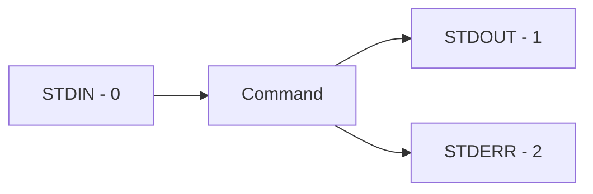
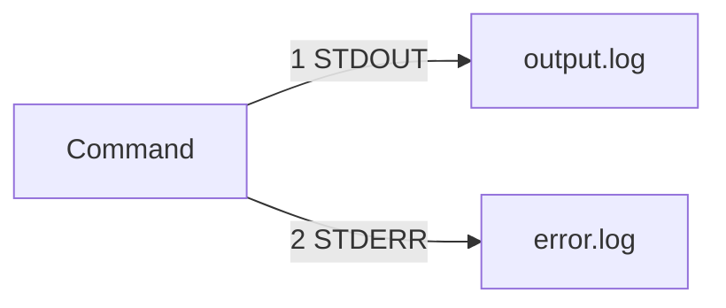

# Bash Input / Output, Streams, Redirects, Heredoc

## Topic Level
**Fundamentals → Scripting for DevOps**

---

## Data Streams in Bash

Every command uses **3 standard data streams**:

| Stream | Purpose | FD | Default Path |
|--------|---------|----|--------------|
| STDIN | Input to a command | 0 | /dev/stdin |
| STDOUT | Normal output | 1 | /dev/stdout |
| STDERR | Error output | 2 | /dev/stderr |

---

## Stream Flow



---

## Key Concept

When you see output in terminal → it came from **STDOUT**.

Errors → from **STDERR**.

---

## Reading Input

### read (from STDIN)

```bash
read name
echo "You entered: $name"
```

---

### Prompted Input

```bash
read -p "Enter username: " user
```

---

### Read from File

```bash
while read line
do
  echo "$line"
done < file.txt
```

`< file.txt` → sends file content to STDIN.

---

## Writing Output

### echo

```bash
echo "Hello World"
```

---

### printf (formatted output)

```bash
printf "Hello, %s!\n" "World"
```

Supports:

* `%s` → string
* `%d` → integer
* `%f` → float
* `\n` → newline
* `\t` → tab

---

## Output Redirection

---

### Redirect STDOUT to File

```bash
./script.sh > output.txt
```

Overwrite file.

---

### Append STDOUT

```bash
./script.sh >> output.txt
```

---

### Redirect STDIN from File

```bash
./script.sh < input.txt
```

---

### Redirect STDERR

```bash
./script.sh 2> error.log
```

---

### Redirect STDOUT and STDERR

```bash
./script.sh > all.log 2>&1
```

Modern syntax (Bash 4+):

```bash
./script.sh &> all.log
```

Meaning:

* `>` → STDOUT → file
* `2>&1` → STDERR → same as STDOUT

---

### Silence Output

```bash
./script.sh > /dev/null 2>&1
```

Or:

```bash
./script.sh &> /dev/null
```

* `/dev/null` → black hole for output

---

### Separate Logs

```bash
./script.sh >> log.txt 2>> error.log
```

* STDOUT → log.txt
* STDERR → error.log

---

## File Descriptors

You can reference streams using FD numbers:

| FD | Meaning |
| -- | ------- |
| 0  | STDIN   |
| 1  | STDOUT  |
| 2  | STDERR  |

Example with explicit FD:

```bash
command 1> output.txt
command 2> error.txt
```

---

## Pipes vs Redirects

| Feature  | Pipe <code>&#124;</code>         | Redirect <code>&gt;</code>      |
|----------|-------------------------------|-----------------------------|
| Purpose  | Pass output to another command | Save output to file         |
| Type     | Process → Process             | Process → File              |
| Example  | <code>ls &#124; grep txt</code> | <code>ls &gt; files.txt</code>  |
| Usage    | Real-time data processing      | Store results for later use |

Example:

```bash
docker ps | grep nginx          # Pipe to another command
docker ps > containers.txt      # Redirect to file
```

---

## Heredoc (Here Document)

Used to pass **multiline input** to a command.

---

## Basic Syntax

```bash
command << DELIMITER
multiline text
DELIMITER
```

Common delimiters: `EOF`, `END`, `HEREDOC`

---

## Example

```bash
cat << EOF
Hello
World
EOF
```

---

## Heredoc to File

```bash
cat << EOF > file.txt
Hello
World
EOF
```

---

## With Variable Expansion

```bash
name="dev"
cat << EOF
Hello $name
Current directory: $PWD
EOF
```

---

## Disable Variable Expansion

Quote the delimiter:

```bash
cat << 'EOF'
$HOME will not expand
$PWD stays as is
EOF
```

---

## Ignore Leading Tabs

```bash
cat <<- EOF
	Hello
	World
EOF
```

`<<-` removes **tabs only**, not spaces.

---

## Practical DevOps Use Cases

---

### Generate Config File

```bash
cat << EOF > nginx.conf
server {
  listen 80;
  server_name localhost;
  root /var/www/html;
}
EOF
```

---

### Create Docker Compose File

```bash
cat << EOF > docker-compose.yml
version: '3'
services:
  web:
    image: nginx
    ports:
      - "80:80"
EOF
```

---

### Silent Command Execution

```bash
docker pull nginx > /dev/null 2>&1
```

---

### Log Only Errors

```bash
docker run nginx 2>> errors.log
```

---

### Read File into Script

```bash
while read container
do
  docker logs "$container"
done < containers.txt
```

---

### Multi-line Docker Command

```bash
docker run -d \
  --name myapp \
  -p 8080:80 \
  nginx << EOF
Configuration data here
EOF
```

---

## Stream Redirection Diagram



---

## Common Patterns

### Redirect Both Streams to Same File

```bash
command > file.log 2>&1    # Traditional
command &> file.log         # Modern (Bash 4+)
```

---

### Redirect Both Streams to Different Files

```bash
command > output.log 2> error.log
```

---

### Append Both Streams

```bash
command >> output.log 2>&1
```

---

### Discard STDOUT, Keep STDERR

```bash
command > /dev/null
```

---

### Discard STDERR, Keep STDOUT

```bash
command 2> /dev/null
```

---

## Best Practices

* Use `printf` for formatted output
* Always separate logs for automation
* Use `/dev/null` to silence noise in CI/CD
* Use heredoc for config generation
* Avoid unnecessary overwrites - use `>>` for logs
* Quote heredoc delimiter to prevent expansion when needed
* Use meaningful delimiter names - `EOF`, `CONFIG`, `SQL`
* Check command exit status when redirecting errors

---

## Quick Revision

* STDIN = input (0)
* STDOUT = normal output (1)
* STDERR = errors (2)
* `>` overwrite, `>>` append
* `2>` redirect errors
* `2>&1` merge error with output
* `&>` modern syntax for both streams
* `/dev/null` discard output
* `read` → input, `echo/printf` → output
* `<<` heredoc → multiline input block
* `<<-` heredoc with tab stripping
* `|` pipe → command to command
* `>` redirect → command to file