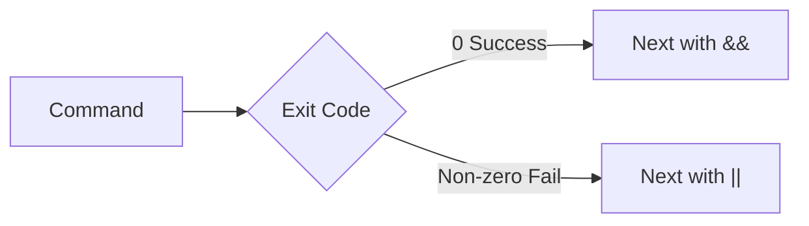

# Bash – Control Flow & Operators

## Topic Level
**Fundamentals**

---

## Special Variables

Special variables provide metadata about script execution and arguments.

| Variable | Meaning |
|----------|---------|
| $0 | Script name |
| $1-$9 | Positional arguments |
| $# | Number of arguments |
| $@ | All arguments - separately quoted |
| $* | All arguments - single string |
| $? | Exit status of last command |
| $$ | Current process ID |
| $! | PID of last background process |

---

## Example

```bash
#!/bin/bash

echo "Script: $0"
echo "First arg: $1"
echo "Total args: $#"
echo "All args: $@"
echo "Exit status: $?"
echo "PID: $$"
```

Run:

```bash
./script.sh hello world
```

---

## Conditional Operators (Test Expressions)

Used inside `[ ]` or `[[ ]]`.

---

## Numeric Comparisons

| Operator | Meaning          |
| -------- | ---------------- |
| -eq      | equal            |
| -ne      | not equal        |
| -gt      | greater than     |
| -lt      | less than        |
| -ge      | greater or equal |
| -le      | less or equal    |

Example:

```bash
if [ $a -gt $b ]; then
  echo "a is greater"
fi
```

---

## String Comparisons

| Operator | Meaning             |
| -------- | ------------------- |
| =        | equal               |
| !=       | not equal           |
| -z       | string is empty     |
| -n       | string is not empty |

```bash
if [ "$name" = "dev" ]; then
  echo "Match"
fi
```

---

## File Test Operators

| Operator | Meaning          |
| -------- | ---------------- |
| -f       | file exists      |
| -d       | directory exists |
| -r       | readable         |
| -w       | writable         |
| -x       | executable       |

```bash
if [ -f file.txt ]; then
  echo "File exists"
fi
```

---

## If Statement

### Basic Syntax

```bash
if [ condition ]; then
  commands
fi
```

---

### If-Else

```bash
if [ $age -ge 18 ]; then
  echo "Adult"
else
  echo "Minor"
fi
```

---

### If-Elif-Else

```bash
if [ $marks -ge 90 ]; then
  echo "Grade A"
elif [ $marks -ge 75 ]; then
  echo "Grade B"
else
  echo "Grade C"
fi
```

---

## Case Statement

Used for multiple conditions (cleaner than many `elif`).

### Syntax

```bash
case $var in
  pattern1)
    commands
    ;;
  pattern2)
    commands
    ;;
  *)
    default commands
    ;;
esac
```

---

### Example

```bash
read -p "Enter option: " opt

case $opt in
  start)
    echo "Starting service"
    ;;
  stop)
    echo "Stopping service"
    ;;
  restart)
    echo "Restarting service"
    ;;
  *)
    echo "Invalid option"
    ;;
esac
```

---

## Pipelines

A pipeline (`|`) passes **STDOUT of one command → STDIN of another**.

```bash
ps aux | grep docker
```


---

## Practical Examples

### Count running containers

```bash
docker ps | wc -l
```

### Find specific process

```bash
ps aux | grep nginx
```

---

## Logical Operators

Used to combine commands.

---

### AND (&&)

Runs second command only if first succeeds.

```bash
mkdir test && cd test
```

---

### OR (||)

Runs second command only if first fails.

```bash
docker ps || echo "Docker not running"
```

---

### Combination

```bash
command1 && command2 || command3
```

Meaning:

* If `command1` fails → run `command3`
* If `command1` succeeds → run `command2`

---

## Exit Status and Logic Flow



---

## Practical Script Example

```bash
#!/bin/bash

if docker ps > /dev/null 2>&1; then
  echo "Docker is running"
else
  echo "Docker is not running"
fi
```

---

## Best Practices

* Use `[[ ]]` for safer conditions
* Quote variables: `"$var"`
* Use `case` for multiple options
* Combine commands with `&&` in automation
* Always check exit codes for DevOps scripts

---

## Quick Revision

* Special vars → `$0`, `$1`, `$#`, `$?`, `$$`
* Numeric → `-eq`, `-gt`, `-lt`
* String → `=`, `!=`, `-z`, `-n`
* File → `-f`, `-d`, `-x`
* `if`, `elif`, `else` for conditions
* `case` for multi-branch logic
* `|` passes output between commands
* `&&` success chaining
* `||` failure fallback