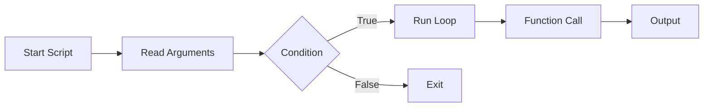

# Bash – Loops, Arguments, I/O, Functions

## Topic Level
**Fundamentals → Advanced Scripting**

---

## For Loop

Used to iterate over a list of values.

---

## Syntax

```bash
for var in list
do
  commands
done
```

---

## Example – Iterate Values

```bash
for i in 1 2 3 4 5
do
  echo "Number: $i"
done
```

---

## Range Syntax

```bash
for i in {1..5}
do
  echo $i
done
```

---

## C-Style For Loop

```bash
for (( i=0; i<5; i++ ))
do
  echo $i
done
```

---

## Loop Through Files

```bash
for file in *.txt
do
  echo "Processing $file"
done
```

---

## While Loop

Executes **while condition is true**.

---

## Syntax

```bash
while [ condition ]
do
  commands
done
```

---

## Example

```bash
count=1

while [ $count -le 5 ]
do
  echo $count
  ((count++))
done
```

---

## Until Loop

Executes **until condition becomes true** (opposite of while).

---

## Syntax

```bash
until [ condition ]
do
  commands
done
```

---

## Example

```bash
count=1

until [ $count -gt 5 ]
do
  echo $count
  ((count++))
done
```

---

## Loop Control Statements

### break

Exit loop immediately.

```bash
for i in {1..5}
do
  if [ $i -eq 3 ]; then
    break
  fi
  echo $i
done
```

---

### continue

Skip current iteration.

```bash
for i in {1..5}
do
  if [ $i -eq 3 ]; then
    continue
  fi
  echo $i
done
```

---

## Positional Arguments

Arguments passed to script:

```bash
./script.sh arg1 arg2
```

---

## Special Variables Recap

| Variable | Meaning          |
| -------- | ---------------- |
| $0       | Script name      |
| $1-$9    | Arguments        |
| $#       | Argument count   |
| $@       | All arguments    |
| $?       | Last exit status |

---

## Example

```bash
#!/bin/bash

echo "Script: $0"
echo "Arg1: $1"
echo "Arg2: $2"
echo "Total: $#"
```

---

## Input / Output

---

## Read User Input

```bash
read -p "Enter name: " name
echo "Hello $name"
```

---

## Silent Input (Passwords)

```bash
read -s -p "Enter password: " pass
echo
```

---

## Reading File Line by Line

```bash
while read line
do
  echo "$line"
done < file.txt
```

---

## Output Formatting

```bash
echo "Simple output"
printf "Name: %s\n" "$name"
```

---

## Input/Output Redirection

### Overwrite Output

```bash
command > file.txt
```

### Append Output

```bash
command >> file.txt
```

### Redirect Error

```bash
command 2> error.log
```

### Redirect Both

```bash
command > output.log 2>&1
```

---

## Functions

Functions allow reusable code blocks.

---

## Syntax

```bash
function_name() {
  commands
}
```

---

## Example

```bash
greet() {
  echo "Hello $1"
}

greet dev
```

---

## Function with Return Code

```bash
check_even() {
  if (( $1 % 2 == 0 )); then
    return 0
  else
    return 1
  fi
}

check_even 4
echo $?
```

---

## Local Variables

```bash
myfunc() {
  local var="inside"
  echo $var
}
```

---

## Practical DevOps Script Example

```bash
#!/bin/bash

if [ $# -eq 0 ]; then
  echo "Usage: $0 <service>"
  exit 1
fi

service=$1

if systemctl is-active --quiet $service; then
  echo "$service is running"
else
  echo "$service is not running"
fi
```

---

## Loop + Docker Example

```bash
for container in $(docker ps -q)
do
  docker logs $container
done
```

---

## Execution Flow Diagram



---

## Best Practices

* Always quote variables → `"$var"`
* Use `local` inside functions
* Validate positional arguments
* Use loops for automation tasks
* Redirect logs for debugging

---

## Quick Revision

* `for` → iterate list/range
* `while` → run while true
* `until` → run until true
* `$1 $2 $# $@` → script arguments
* `read` → user input
* `>` `>>` `2>` → redirection
* Functions → reusable logic
* `break` / `continue` → loop control
* Use loops for Docker & DevOps automation