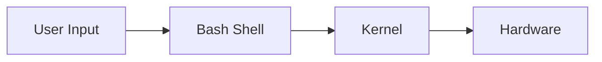
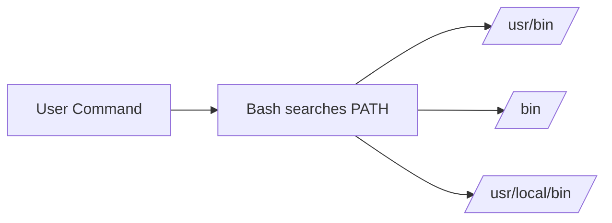

# Bash Fundamentals

## Topic Level
**Beginner → Fundamentals**

---

## What is Bash?

**Bash (Bourne Again SHell)** is:

- A command-line interpreter  
- A scripting language  
- The default shell in most Linux systems  

It allows you to:

- Run commands  
- Automate tasks using scripts  
- Manage files, processes, and environment  

---

## Bash Architecture



Bash acts as a **bridge between user and OS kernel**.

---

## Running Commands in Bash

### Basic Command Syntax

```bash
command [options] [arguments]
```

Example:

```bash
ls -l /home
```

---

## Command Types

### Built-in Commands

Executed directly by Bash:

```bash
cd
echo
export
pwd
```

Check if built-in:

```bash
type cd
```

---

### External Commands

Programs stored in filesystem:

```bash
ls
cat
grep
docker
```

---

## Command Chaining

### Sequential Execution

```bash
command1 ; command2
```

Runs both regardless of success.

---

### Logical AND

```bash
command1 && command2
```

Runs `command2` only if `command1` succeeds.

---

### Logical OR

```bash
command1 || command2
```

Runs `command2` only if `command1` fails.

---

## Pipes

Pass output of one command to another:

```bash
ps aux | grep nginx
```


---

## Redirection

### Output Redirection

```bash
echo "hello" > file.txt
```

Overwrite file.

Append:

```bash
echo "world" >> file.txt
```

---

### Input Redirection

```bash
wc -l < file.txt
```

---

### Error Redirection

```bash
command 2> error.log
```

---

## Bash Scripts

A Bash script is a file containing commands executed sequentially.

---

## Script Structure

```bash
#!/bin/bash

echo "Hello World"
```

### Steps to Run

```bash
chmod +x script.sh
./script.sh
```

---

## Variables in Bash

### Declare Variable

```bash
name="dev"
```

⚠️ No spaces around `=`.

---

### Access Variable

```bash
echo $name
```

---

### Read Input

```bash
read username
echo "Hello $username"
```

---

### Command Substitution

```bash
current_dir=$(pwd)
echo $current_dir
```

---

## Special Variables

| Variable | Meaning                     |
| -------- | --------------------------- |
| $0       | Script name                 |
| $1-$9    | Positional arguments        |
| $#       | Number of arguments         |
| $@       | All arguments               |
| $?       | Exit status of last command |

Example:

```bash
echo "Script name: $0"
echo "First arg: $1"
```

---

## Environment Variables

Environment variables are **global variables** available to the shell and child processes.

---

## View Environment Variables

```bash
printenv
env
```

---

## Common Environment Variables

| Variable | Description             |
| -------- | ----------------------- |
| PATH     | Executable search paths |
| HOME     | User home directory     |
| USER     | Current username        |
| PWD      | Current directory       |
| SHELL    | Current shell           |

---

## Create Environment Variable

Temporary (current session):

```bash
export MY_VAR="hello"
```

Check:

```bash
echo $MY_VAR
```

---

## Persistent Environment Variables

Add to:

```bash
~/.bashrc
~/.profile
```

Example:

```bash
export JAVA_HOME=/usr/lib/jvm/java-17
```

Reload:

```bash
source ~/.bashrc
```

---

## PATH Variable

`PATH` tells Bash where to find executables.

View PATH:

```bash
echo $PATH
```

Add new path:

```bash
export PATH=$PATH:/usr/local/myapp/bin
```

Now you can run:

```bash
myapp
```

from anywhere.

---

## PATH Flow



---

## Control Structures in Bash

### If Statement

```bash
if [ $name = "dev" ]; then
  echo "Hello dev"
else
  echo "Unknown user"
fi
```

---

### For Loop

```bash
for i in 1 2 3
do
  echo $i
done
```

---

### While Loop

```bash
count=1
while [ $count -le 3 ]
do
  echo $count
  ((count++))
done
```

---

## Functions in Bash

```bash
greet() {
  echo "Hello $1"
}

greet dev
```

---

## Exit Codes

Every command returns:

* `0` → success
* non-zero → failure

Check:

```bash
echo $?
```

Used in scripting:

```bash
docker ps || echo "Docker not running"
```

---

## Best Practices

* Use `#!/bin/bash` shebang
* Quote variables: `"$var"`
* Use meaningful variable names
* Check exit codes for automation
* Store env variables in `.bashrc`

---

## Quick Revision

* Bash = shell + scripting language
* Commands → built-in or external
* Use pipes `|` for chaining output
* Use `>` `>>` `<` for redirection
* Variables: `name=value`, access `$name`
* Env vars: `export VAR=value`
* PATH controls executable lookup
* Scripts need `chmod +x`
* `$?` gives last command status