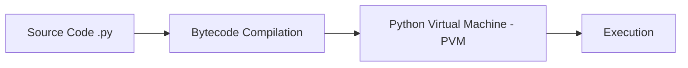

# Python – Intermediate to Advanced Notes

## Topics
- Hello, Python (Execution Model & Runtime)
- Virtual Environments (venv, pip, isolation)
- Datatypes & Core Operations (with internals & performance)

---

## Hello, Python – Beyond Basics

## Execution Model

Python code execution flow:



Steps:

1. `.py` → compiled to **bytecode** (`.pyc`)
2. Bytecode executed by **PVM**
3. Automatic caching in `__pycache__/`

---

## Running Python

### Script Mode

```bash
python main.py
```

### Module Mode

```bash
python -m package.module
```

Used for:

* Running packages
* Proper import resolution

---

## REPL (Interactive)

```bash
python
```

Useful for:

* Quick testing
* Debugging logic

---

## Shebang Execution

```python
#!/usr/bin/env python3
print("Hello")
```

Make executable:

```bash
chmod +x script.py
./script.py
```

---

## Virtual Environments

### Why Virtual Environments?

* Dependency isolation
* Avoid version conflicts
* Reproducible builds
* Required for CI/CD and production

---

## venv vs alternatives

| Tool     | Description                                |
| -------- | ------------------------------------------ |
| venv     | Built-in, standard for most projects       |
| pipenv   | Combines pip + venv with Pipfile           |
| poetry   | Modern dependency management + packaging   |
| conda    | Data science focused, manages non-py deps  |

---

## Create Virtual Environment

```bash
python -m venv venv
```

---

## Activate

### Linux / macOS

```bash
source venv/bin/activate
```

### Windows

```bash
venv\Scripts\activate
```

Prompt changes to show `(venv)` when active.

---

## Deactivate

```bash
deactivate
```

---

## Install Packages

```bash
pip install fastapi
pip install fastapi==0.104.0     # pin version
pip install "fastapi>=0.100.0"   # range
```

---

## Freeze Dependencies

```bash
pip freeze > requirements.txt
```

Reinstall:

```bash
pip install -r requirements.txt
```

---

## pyproject.toml (Modern)

```toml
[project]
name = "myapp"
dependencies = [
    "fastapi>=0.100.0",
    "uvicorn>=0.20.0",
]
```

---

## Best Practices

* Never commit `venv/` → add to `.gitignore`
* Use `requirements.txt` or `pyproject.toml`
* Pin versions for production
* Separate dev and prod dependencies

```bash
pip install -r requirements-dev.txt   # dev
pip install -r requirements.txt       # prod
```

---

## Datatypes and Core Operations

---

## Numeric Types

| Type    | Description                 | Example      |
| ------- | --------------------------- | ------------ |
| int     | Arbitrary precision integer | `a = 10`     |
| float   | Double precision (64-bit)   | `b = 3.14`   |
| complex | Complex numbers             | `c = 2 + 3j` |
| Decimal | Fixed precision             | finance use  |

```python
a = 10
b = 3.14
c = 2 + 3j

# Useful numeric operations
abs(-5)        # 5
round(3.14159, 2)  # 3.14
divmod(10, 3)  # (3, 1)
```

---

## Boolean

```python
flag = True
```

Falsy values:

* `0`, `0.0`
* `None`
* `''`, `[]`, `{}`, `set()`
* `False`

Truthy: anything else.

---

## Strings (Immutable)

```python
s = "Python"
```

---

## Advanced String Operations

### f-strings (recommended)

```python
name = "dev"
score = 98.5
print(f"Hello {name}, score: {score:.2f}")
```

---

### Template literals (multi-line)

```python
msg = """
Hello World
This is multiline
"""
```

---

### String Methods

```python
s.lower()          # lowercase
s.upper()          # uppercase
s.split(",")       # split to list
s.strip()          # remove whitespace
s.replace("a","b") # replace
s.startswith("Py") # bool check
s.join(["a","b"])  # join list
```

---

### Slicing

```python
s = "Python"
s[0:3]     # "Pyt"
s[-3:]     # "hon"
s[::-1]    # "nohtyP" reverse
s[::2]     # "Pto" step
```

---

## Lists (Mutable, Ordered)

```python
lst = [1, 2, 3]
```

Memory efficiency
Understanding whether Python creates a copy or a view is essential for memory management when slicing data structures, especially with large datasets. Know that with built-in lists and strings, Slicing always creates a copy of the original sequence, but with NumPy arrays, slicing creates a view, meaning both the original array and the slice point to the same data in memory. 

In the following code, our slicing operation creates a view of the original NumPy array rather than a copy. This means that both arr and sliced reference the same underlying data in memory. As a result, modifying sliced directly affects arr.


Operations:

```python
lst.append(4)       # add to end
lst.insert(0, 10)   # insert at index
lst.pop()           # remove last
lst.pop(0)          # remove at index
lst.remove(2)       # remove by value
lst.sort()          # sort in place
lst.reverse()       # reverse in place
len(lst)            # length
```

---

## List Comprehension (Pythonic)

```python
squares = [x*x for x in range(10)]
```

With condition:

```python
evens = [x for x in range(10) if x % 2 == 0]
```

Nested:

```python
matrix = [[i*j for j in range(3)] for i in range(3)]
```

---

## Tuples (Immutable, Ordered)

```python
t = (1, 2, 3)
```

Used for:

* Fixed data
* Hashable dict keys
* Multiple return values

```python
# Multiple return
def min_max(lst):
    return min(lst), max(lst)

lo, hi = min_max([3, 1, 4])
```

---

## Sets (Unique, Unordered)

```python
s = {1, 2, 3}
s = set()   # empty set (not {})
```

Operations:

```python
s.add(4)
s.remove(2)      # raises if missing
s.discard(2)     # safe remove
```

Set algebra:

```python
a & b    # intersection
a | b    # union
a - b    # difference
a ^ b    # symmetric difference
```

Use sets for O(1) membership checks:

```python
2 in {1, 2, 3}   # True (fast)
```

---

## Dictionaries (Hash Maps)

```python
d = {"name": "dev", "age": 21}
```

Access:

```python
d["name"]          # KeyError if missing
d.get("age")       # None if missing
d.get("age", 0)    # default value
```

Modify:

```python
d["city"] = "Mumbai"    # add/update
d.pop("age")            # remove key
d.update({"x": 1})      # merge
```

Iterate:

```python
for k, v in d.items():
    print(k, v)

d.keys()    # all keys
d.values()  # all values
```

Dict comprehension:

```python
squared = {x: x**2 for x in range(5)}
```

---

## Mutability vs Immutability

| Mutable | Immutable |
| ------- | --------- |
| list    | tuple     |
| dict    | str       |
| set     | int       |
|         | float     |
|         | frozenset |

Mutable objects → change in place.
Immutable → new object created on each change.

---

## Type Checking

```python
type(x)              # exact type
isinstance(x, int)   # preferred - works with inheritance
isinstance(x, (int, float))   # multiple types
```

---

## Type Hints (Static Typing)

```python
def add(a: int, b: int) -> int:
    return a + b
```

Complex types:

```python
from typing import List, Dict, Optional, Union

def process(items: List[str]) -> Dict[str, int]:
    return {item: len(item) for item in items}

def greet(name: Optional[str] = None) -> str:
    return f"Hello {name or 'World'}"
```

Used with:

* mypy (static type checker)
* IDE linting
* Production code quality

---

## Memory & References

Python uses:

* Object references
* Garbage collection
* Reference counting

```python
a = [1, 2, 3]
b = a           # same reference (shallow)
b.append(4)
print(a)        # [1, 2, 3, 4] - a is affected
```

Shallow copy:

```python
b = a.copy()
b = a[:]
b = list(a)
```

Deep copy (nested structures):

```python
import copy
b = copy.deepcopy(a)
```

---

## Core Operators

---

### Arithmetic

```python
+   # addition
-   # subtraction
*   # multiplication
/   # true division (float)
//  # floor division (int)
%   # modulo
**  # exponentiation
```

---

### Comparison

```python
==  !=  >  <  >=  <=
```

---

### Logical

```python
and  or  not
```

Short-circuit evaluation:

```python
x = None
y = x or "default"   # "default"
```

---

### Membership

```python
in
not in
```

---

### Identity

```python
is       # same object in memory
is not
```

`==` compares value, `is` compares identity:

```python
a = [1, 2]
b = [1, 2]
a == b   # True (same value)
a is b   # False (different objects)
```

---

## Truthy Evaluation

```python
if my_list:
    print("Not empty")

if not my_dict:
    print("Empty dict")
```

---

## Advanced Built-ins

---

### enumerate

```python
for i, val in enumerate(lst):
    print(i, val)

# Start at 1
for i, val in enumerate(lst, start=1):
    print(i, val)
```

---

### zip

```python
for a, b in zip(list1, list2):
    print(a, b)

# Stops at shortest list
# Use zip_longest for full coverage
from itertools import zip_longest
```

---

### map / filter

```python
doubled = list(map(lambda x: x*2, lst))
evens   = list(filter(lambda x: x%2==0, lst))
```

---

### any / all

```python
any([True, False])    # True
all([True, True])     # True
all([True, False])    # False

# Practical use
all(x > 0 for x in lst)   # check all positive
```

---

### sorted / reversed

```python
sorted(lst)                        # new sorted list
sorted(lst, reverse=True)          # descending
sorted(lst, key=lambda x: x[1])   # custom key
lst.sort()                         # in-place sort
```

---

## Performance Notes

* Use **list comprehension** over for-loops
* Use **set** for membership checks (O(1) vs O(n) for list)
* Use **dict** for fast key lookups (O(1))
* Use **generators** for large data (lazy evaluation)
* Avoid unnecessary copies of large objects
* Prefer `in` operator on sets/dicts over lists

```python
# Slow - O(n)
if x in [1, 2, 3, 4, 5]:

# Fast - O(1)
if x in {1, 2, 3, 4, 5}:
```

---

## Generators (Memory Efficient)

```python
# List - loads all into memory
squares = [x**2 for x in range(1000000)]

# Generator - lazy, one at a time
squares = (x**2 for x in range(1000000))

# Generator function
def count_up(n):
    for i in range(n):
        yield i
```

---

## Practical DevOps Use Cases

---

### Read Environment Variables

```python
import os

db_url = os.getenv("DATABASE_URL")
port   = int(os.getenv("PORT", "8000"))   # with default
```

---

### Parse CLI Arguments

```python
import sys

print(sys.argv)          # list of args
script = sys.argv[0]
arg1   = sys.argv[1]

# Better: use argparse
import argparse
parser = argparse.ArgumentParser()
parser.add_argument("--env", default="dev")
args = parser.parse_args()
print(args.env)
```

---

### Work with Files

```python
# Read file
with open("file.txt") as f:
    data = f.read()

# Write file
with open("out.txt", "w") as f:
    f.write("hello")

# Read line by line (memory efficient)
with open("large.txt") as f:
    for line in f:
        process(line)
```

---

### Work with JSON

```python
import json

# Parse JSON string
data = json.loads('{"key": "value"}')

# Serialize to string
text = json.dumps(data, indent=2)

# Read JSON file
with open("config.json") as f:
    config = json.load(f)

# Write JSON file
with open("config.json", "w") as f:
    json.dump(config, f, indent=2)
```

---

### Path Handling

```python
from pathlib import Path

p = Path("/app/config")
p.exists()
p.is_file()
p.is_dir()
p / "settings.json"     # join paths
p.read_text()
p.write_text("data")
```

---

## Quick Revision

* Python → compiled to bytecode → PVM
* Use `venv` for isolation
* Freeze deps with `requirements.txt`
* Mutable: list, dict, set / Immutable: tuple, str, int
* Use list/dict/set comprehensions
* Type hints + mypy for production
* `is` checks identity, `==` checks value
* Use `with` for file handling (auto close)
* Env vars via `os.getenv("VAR", "default")`
* Dict/set → O(1) lookups, list → O(n)
* Use generators for large data
* `copy.deepcopy()` for nested mutable objects