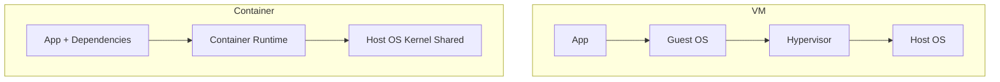

# Containers

## Topic Level
**Beginner → Fundamentals**

---

## What are Containers?

Containers are **standardized units of software** that package:

- Application code  
- Runtime  
- System tools  
- System libraries  
- Configuration  

This ensures the application **runs reliably across environments** (dev → test → prod → cloud).

A **container image** is:

- Lightweight  
- Standalone  
- Executable package  

An **image becomes a container at runtime** when executed by a container runtime such as **Docker Engine**.

---

## Key Definition (Docker)

A **Docker container image** includes everything required to run an application:

- Code  
- Runtime  
- Dependencies  
- OS libraries  
- Environment settings  

Docker containers run:

- Linux  
- Windows  
- On-prem  
- Cloud  
- Serverless platforms  

---

## Container Architecture

---

## Why Containers Are Important

* Package once → run anywhere
* Environment consistency
* Fast startup
* Lightweight execution
* High density on a single host

---

## Docker Containers – Core Characteristics

### Standard

Docker created the **industry standard** container format → portable across platforms.

### Lightweight

* Share host OS kernel
* No guest OS per container
* Lower memory and storage usage

### Secure

* Process isolation using:

  * **Namespaces**
  * **cgroups**
* Strong default isolation

---

## Underlying Linux Concepts

Docker uses:

* **Namespaces** → process, network, filesystem isolation
* **cgroups** → CPU, memory, resource limits

---

## Container Lifecycle

---

## Containers vs Virtual Machines

| Feature        | Containers | Virtual Machines |
| -------------- | ---------- | ---------------- |
| Virtualization | OS-level   | Hardware-level   |
| OS per unit    | No         | Yes              |
| Size           | MBs        | GBs              |
| Startup time   | Seconds    | Minutes          |
| Performance    | High       | Moderate         |
| Density        | High       | Low              |

---

## Containers and VMs Together

Containers often run **inside VMs in cloud environments** to provide:

* Infrastructure isolation (VM)
* Application isolation (Container)

Best practice in cloud platforms.

---

## Benefits of Containers

### Separation of Responsibilities

* Dev → code + dependencies
* Ops → infrastructure + scaling

### Portability

Runs on:

* Linux / Windows
* Local machine
* Data center
* Public cloud

### Application Isolation

Each container has:

* Its own process space
* Network stack
* Filesystem

### Resource Efficiency

* Shared kernel
* Lower licensing and compute cost

### Scalability

* Run multiple containers per host
* Horizontal scaling

### Hybrid & Multi-cloud Ready

Same image across environments.

---

## Common Use Cases

### Microservices

One service per container.

### CI/CD Pipelines

* Reproducible builds
* Consistent environments

### Application Modernization

Wrap legacy apps into containers.

### Batch Processing

Parallel container jobs.

### Serverless Platforms

Many serverless frameworks use container images.

---

## Docker Ecosystem

* Docker Engine (runtime)
* Docker Images
* Docker Hub / Container Registry
* Moby (open-source upstream)

Adopted by:

* Cloud providers
* Data center platforms
* Serverless frameworks

---

## Sample Docker Workflow

---

## Containers in DevOps

* Immutable infrastructure
* Versioned deployments
* Easy rollback
* Faster release cycles
* Environment parity

---

## Quick Revision

* Container = app + dependencies packaged together
* Image → becomes container at runtime
* Uses OS-level virtualization
* Lightweight, fast, portable
* Built on namespaces & cgroups
* MB size vs VM GB size
* Containers + VMs together in cloud
* Core for CI/CD, microservices, and Kubernetes