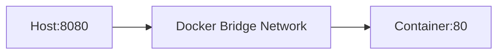
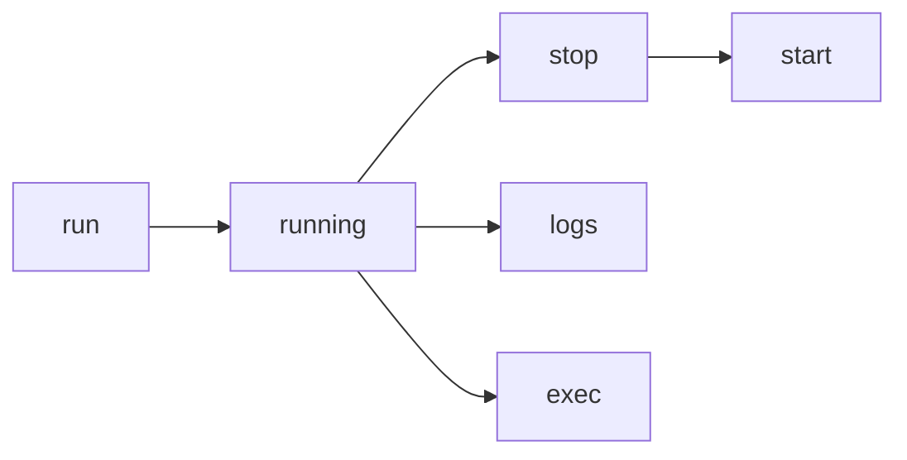

# Docker Basic Commands

## Topic Level
**Beginner**

---

## Image vs Container

| Concept | Description |
|---------|-------------|
| Docker Image | Read-only template - app + dependencies |
| Docker Container | Running instance of an image |

Analogy:

- Image → class  
- Container → object  

---

## Image Versioning and Tags

Format:

```
<image_name>:<tag>
```

Examples:

```bash
nginx:latest
node:18-alpine
redis:7
```

If no tag → defaults to `latest`.

List local images:

```bash
docker image ls
```

---

## Core Docker Commands

### docker pull

Download image from registry (Docker Hub by default).

```bash
docker pull nginx
docker pull node:18-alpine
```

Check downloaded images:

```bash
docker image ls
```

---

### docker run

Creates and starts a container from an image.

**Basic**

```bash
docker run nginx
```

Runs in foreground.

**Detached Mode**

```bash
docker run -d nginx
```

Runs in background.

**Named Container**

```bash
docker run -d --name mynginx nginx
```

---

### docker ps

List running containers:

```bash
docker ps
```

List all containers (including stopped):

```bash
docker ps -a
```

Columns:
* CONTAINER ID
* IMAGE
* STATUS
* PORTS
* NAMES

---

### docker run --options

Common options:

**Port Mapping**

```bash
docker run -d -p 8080:80 nginx
```

Host `8080` → Container `80`.

Access:

```
http://localhost:8080
```

**Interactive Mode**

```bash
docker run -it ubuntu bash
```

Flags:
* `-i` → interactive
* `-t` → terminal

**Environment Variables**

```bash
docker run -e MYSQL_ROOT_PASSWORD=secret mysql
```

**Volume Mount**

```bash
docker run -v mydata:/app/data nginx
```

---

### docker stop

Stop a running container.

```bash
docker stop mynginx
docker stop <container_id>
```

---

### docker start

Start a stopped container.

```bash
docker start mynginx
```

---

### docker port

View mapped ports for a container.

```bash
docker port mynginx
```

Example output:

```
80/tcp -> 0.0.0.0:8080
```

---

## Port Mapping Deep Dive



Multiple mappings:

```bash
docker run -d -p 3000:3000 -p 9229:9229 node
```

---

### docker logs

View container logs.

```bash
docker logs mynginx
docker logs -f mynginx
```

`-f` → follow logs (like tail).

---

### docker exec -it

Run command inside a running container.

```bash
docker exec -it mynginx bash
```

Common use cases:
* Debug container
* Inspect filesystem
* Run admin commands

---

## Container Lifecycle Commands



---

## Typical Workflow Example

```bash
# Pull image
docker pull nginx

# Run container with port mapping
docker run -d -p 8080:80 --name web nginx

# Check running containers
docker ps

# View logs
docker logs web

# Exec into container
docker exec -it web bash

# Stop container
docker stop web

# Start again
docker start web
```

---

## Best Practices

* Always use specific tags (avoid `latest` in production)
* Name containers for easier management
* Use detached mode for services
* Use `docker logs` for debugging
* Use `docker exec` instead of SSH

---

## Quick Revision

* `docker pull` → download image
* `docker run` → create + start container
* `docker ps` → list containers
* `docker stop/start` → manage lifecycle
* `docker logs` → view output
* `docker exec -it` → access container shell
* `-p` → port mapping
* Tags = image versions