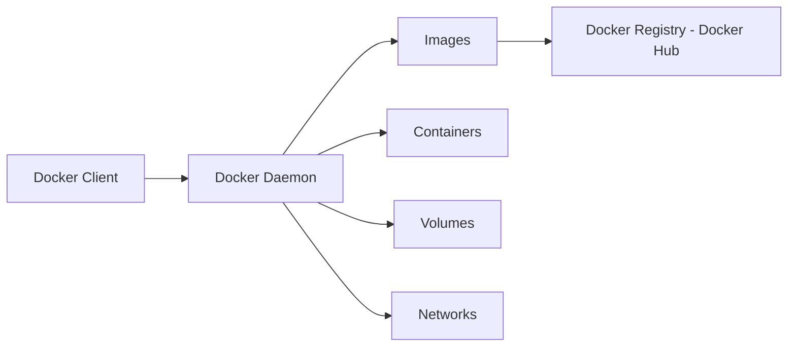
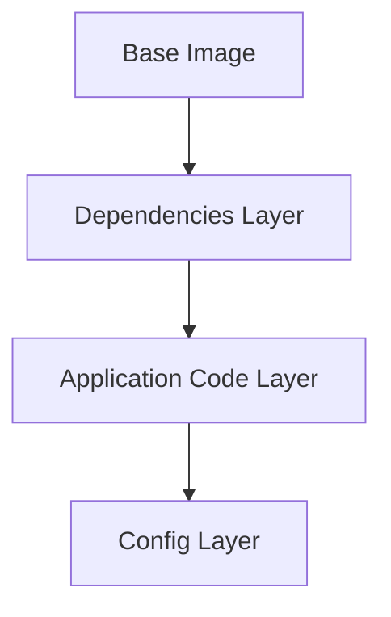

## Topic Level
**Beginner**

---

## What is Docker?

Docker is a **containerization platform** used to:

- Build  
- Package  
- Ship  
- Run  

applications inside **lightweight, portable containers**.

It solves the classic problem:

> "Works on my machine" → by packaging app + dependencies + runtime.

---

## Why Docker?

- Environment consistency  
- Fast startup time  
- Lightweight vs VMs  
- Easy scaling  
- Ideal for CI/CD and microservices  
- layered images

---

## Docker Architecture



### Components

| Component        | Description                                        |
| ---------------- | -------------------------------------------------- |
| Docker Client    | CLI - docker - used to interact with Docker        |
| Docker Daemon    | Background service that builds and runs containers |
| Docker Image     | Read-only template for containers                  |
| Docker Container | Running instance of an image                       |
| Docker Registry  | Stores images - Docker Hub, ACR, ECR               |
| Volumes          | Persistent storage                                 |
| Networks         | Container communication                            |

---

## Docker Workflow


---

## Dockerfile

A **Dockerfile** is a set of instructions to build an image.

### Example

```dockerfile
FROM node:18
WORKDIR /app
COPY package*.json ./
RUN npm install
COPY . .
EXPOSE 3000
CMD ["npm", "start"]
```

### Common Instructions

| Instruction | Purpose                       |
| ----------- | ----------------------------- |
| FROM        | Base image                    |
| WORKDIR     | Set working directory         |
| COPY        | Copy files into image         |
| RUN         | Execute commands during build |
| EXPOSE      | Document container port       |
| CMD         | Default runtime command       |

---

## Docker Image

* Snapshot of application + dependencies
* Immutable - read-only
* Built from Dockerfile
* Stored in registries

### Image Layers



Layer caching → faster builds.

---

## Docker Container

A **container** is a running instance of an image.

Properties:

* Isolated process space
* Own filesystem
* Own network interface
* Shares host kernel

---

## Essential Docker Commands

### Image Management

```bash
docker pull <image>
docker build -t <image_name> .
docker image ls
docker image rm <image>
```

---

### Container Management

```bash
docker run <image>
docker run -d -p 8080:80 --name web nginx
docker container ls
docker container stop <container>
docker container rm <container>
```

---

## Port Mapping

Maps **host port → container port**

```bash
docker run -d -p 8080:80 nginx
```

Access app via:

```
http://localhost:8080
```

---

## Detached Mode

Run container in background:

```bash
docker run -d nginx
```

---

## Interactive Mode

```bash
docker run -it ubuntu bash
```

* `-i` → interactive
* `-t` → terminal

---

## Volumes - Persistent Storage

Containers are **ephemeral** → data lost when removed.

Volumes store data **outside the container**.

```bash
docker volume create mydata
docker run -v mydata:/app/data nginx
```

### Types of Storage

| Type       | Use Case                          |
| ---------- | --------------------------------- |
| Volume     | Persistent Docker-managed storage |
| Bind Mount | Use host filesystem               |
| tmpfs      | In-memory storage                 |

---

## Docker Networking - Basic

Default network: **bridge**

Containers can:

* Communicate via container name
* Expose ports to host

---

## Running a Sample App - Nginx

```bash
docker pull nginx
docker run -d -p 8080:80 --name mynginx nginx
```

Test:

```
http://localhost:8080
```

---

## Container Lifecycle


---

## Sharing Images

Push image to Docker Hub:

```bash
docker login
docker tag myapp username/myapp:v1
docker push username/myapp:v1
```

Pull anywhere:

```bash
docker pull username/myapp:v1
```

---

## Best Practices

* Use small base images - alpine
* Use `.dockerignore`
* One process per container
* Use multi-stage builds
* Avoid running as root

---

## Docker vs VM - Quick Recap

| Feature     | Docker  | VM       |
| ----------- | ------- | -------- |
| Startup     | Seconds | Minutes  |
| Size        | MBs     | GBs      |
| OS          | Shared  | Separate |
| Performance | High    | Moderate |

---

## Quick Revision

* Docker = platform to build/run containers
* Dockerfile → Image → Container
* Use `docker run -p` for port mapping
* Volumes for persistent data
* Images stored in registries
* Containers are ephemeral
* Lightweight vs VMs
* Core for DevOps and CI/CD