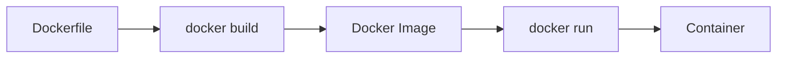
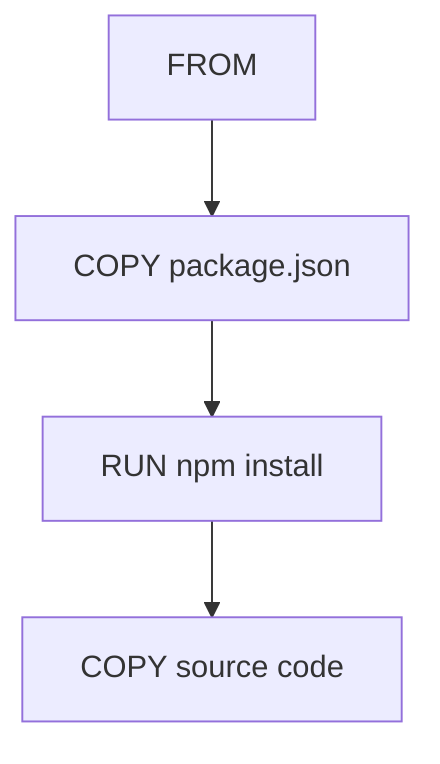

# Dockerfile – From Scratch to Advanced

## Topic Level
**Fundamentals → Advanced**

---

## What is a Dockerfile?

A **Dockerfile** is a text file containing instructions to build a **Docker image**.

Build process:



---

## Basic Dockerfile Structure

```dockerfile
FROM node:18
WORKDIR /app
COPY package*.json ./
RUN npm install
COPY . .
EXPOSE 3000
CMD ["npm", "start"]
```

---

## Core Instructions

| Instruction | Purpose                     |
| ----------- | --------------------------- |
| FROM        | Base image                  |
| WORKDIR     | Set working directory       |
| COPY        | Copy files into image       |
| ADD         | Copy + extract archives/URL |
| RUN         | Execute build commands      |
| ENV         | Set environment variables   |
| EXPOSE      | Document port               |
| CMD         | Default runtime command     |
| ENTRYPOINT  | Fixed executable            |
| VOLUME      | Persistent storage          |
| USER        | Run as non-root             |

---

## FROM

Defines base image.

```dockerfile
FROM ubuntu:22.04
```

Best practice:

* Use official images
* Use minimal variants (`alpine`, `slim`)

---

## WORKDIR

Sets working directory inside container.

```dockerfile
WORKDIR /app
```

Automatically creates directory.

---

## COPY vs ADD

### COPY (Preferred)

```dockerfile
COPY . .
```

### ADD (Use only if needed)

* Extract `.tar`
* Download URL

---

## RUN

Executes commands during build.

```dockerfile
RUN apt-get update && apt-get install -y curl
```

Use **single RUN with chaining** to reduce layers.

---

## CMD

Default command when container starts.

```dockerfile
CMD ["node", "server.js"]
```

Only one CMD allowed (last one wins).

---

## ENTRYPOINT

Used when container should always run a specific executable.

```dockerfile
ENTRYPOINT ["nginx"]
```

Combine with CMD for arguments.

---

## ENV

Set environment variables.

```dockerfile
ENV NODE_ENV=production
```

---

## EXPOSE

Documents container port.

```dockerfile
EXPOSE 3000
```

Does **not** publish port automatically.

---

## USER

Run container as non-root (security best practice).

```dockerfile
USER node
```

---

## VOLUME

Define persistent data location.

```dockerfile
VOLUME /data
```

---

## Layer Caching

Docker caches layers to speed up builds.



Change in source → only last layer rebuilds.

---

## .dockerignore

Exclude unnecessary files from build context.

Example:

```
node_modules
.git
.env
logs
*.log
.DS_Store
```

Improves build speed and security.

---

## Multi-Stage Builds (Advanced)

Used to reduce final image size.

---

## Example – Node.js

```dockerfile
# Build stage
FROM node:18 AS builder
WORKDIR /app
COPY package*.json ./
RUN npm install
COPY . .
RUN npm run build

# Production stage
FROM node:18-alpine
WORKDIR /app
COPY --from=builder /app/dist ./dist
COPY package*.json ./
RUN npm install --only=production
CMD ["node", "dist/server.js"]
```

Result:

* Smaller image
* No build tools in production

---

## Minimal Images

Use:

* `alpine`
* `slim`
* `distroless`

Example:

```dockerfile
FROM node:18-alpine
```

---

## Healthcheck

Monitor container health.

```dockerfile
HEALTHCHECK CMD curl --fail http://localhost:3000 || exit 1
```

Or with parameters:

```dockerfile
HEALTHCHECK --interval=30s --timeout=3s --retries=3 \
  CMD curl --fail http://localhost:3000/health || exit 1
```

---

## ARG vs ENV

| Feature              | ARG | ENV |
| -------------------- | --- | --- |
| Build-time           | Yes | Yes |
| Runtime              | No  | Yes |
| Visible in container | No  | Yes |

Example:

```dockerfile
ARG NODE_VERSION=18
FROM node:${NODE_VERSION}

ENV NODE_ENV=production
```

---

## Production-Grade Dockerfile (Node.js)

```dockerfile
FROM node:18-alpine

WORKDIR /app

# Copy dependency files
COPY package*.json ./

# Install production dependencies
RUN npm ci --only=production

# Copy application code
COPY . .

# Expose port
EXPOSE 3000

# Run as non-root user
USER node

# Start application
CMD ["node", "server.js"]
```

---

## Production-Grade Dockerfile (Python)

```dockerfile
FROM python:3.11-slim

WORKDIR /app

# Copy requirements
COPY requirements.txt .

# Install dependencies
RUN pip install --no-cache-dir -r requirements.txt

# Copy application
COPY . .

# Run application
CMD ["python", "app.py"]
```

---

## Production-Grade Dockerfile (Java)

```dockerfile
FROM eclipse-temurin:17-jdk-alpine

WORKDIR /app

# Copy JAR file
COPY target/app.jar app.jar

# Run application
ENTRYPOINT ["java","-jar","app.jar"]
```

---

## Production-Grade Dockerfile (Go)

```dockerfile
# Build stage
FROM golang:1.21-alpine AS builder
WORKDIR /app
COPY go.* ./
RUN go mod download
COPY . .
RUN go build -o main .

# Production stage
FROM alpine:latest
WORKDIR /app
COPY --from=builder /app/main .
EXPOSE 8080
CMD ["./main"]
```

---

## Best Practices

---

## 1. Use Small Base Images

Prefer:

* alpine
* slim
* distroless

---

## 2. Reduce Layers

Bad:

```dockerfile
RUN apt-get update
RUN apt-get install curl
```

Good:

```dockerfile
RUN apt-get update && apt-get install -y curl
```

---

## 3. Use .dockerignore

Avoid sending unnecessary files.

---

## 4. Non-Root User

```dockerfile
USER appuser
```

---

## 5. Multi-Stage Builds

Keep build tools out of production image.

---

## 6. Cache Optimization

Copy dependency files first:

```dockerfile
COPY package*.json ./
RUN npm install
COPY . .
```

---

## 7. Avoid Latest Tag

Use fixed versions:

```dockerfile
FROM node:18.19-alpine
```

---

## 8. Use HEALTHCHECK

Improves orchestration reliability.

---

## 9. One Process per Container

Do not run multiple services in one container.

---

## 10. Use ENTRYPOINT for Executables

Use CMD for default arguments.

---

## Common Mistakes

* Using `latest` tag
* Running as root
* Large images
* Copying entire project before installing deps
* Storing secrets in Dockerfile
* Not using .dockerignore
* Multiple processes in one container
* Not cleaning up in same RUN layer

---

## Dockerfile Build Command

```bash
docker build -t myapp:v1 .
```

Build with custom Dockerfile name:

```bash
docker build -f Dockerfile.prod -t myapp:v1 .
```

Build with build arguments:

```bash
docker build --build-arg NODE_VERSION=18 -t myapp:v1 .
```

---

## Run Container

```bash
docker run -d -p 3000:3000 myapp:v1
```

With environment variables:

```bash
docker run -d -p 3000:3000 -e NODE_ENV=production myapp:v1
```

---

## Dockerfile Execution Flow


---

## Advanced: Combining ENTRYPOINT and CMD

```dockerfile
ENTRYPOINT ["docker-entrypoint.sh"]
CMD ["nginx", "-g", "daemon off;"]
```

ENTRYPOINT is fixed, CMD can be overridden at runtime.

---

## Security Best Practices

* Use specific version tags
* Run as non-root user
* Don't store secrets in image
* Use .dockerignore
* Scan images for vulnerabilities
* Use minimal base images
* Keep images updated

---

## Quick Revision

* Dockerfile → builds image
* Image → runs as container
* Use small base images (alpine, slim)
* Optimize layer caching
* Use multi-stage builds
* Run as non-root
* Use `.dockerignore`
* One process per container
* Avoid `latest` tag
* Use HEALTHCHECK for production
* COPY dependencies first for caching
* Combine RUN commands to reduce layers