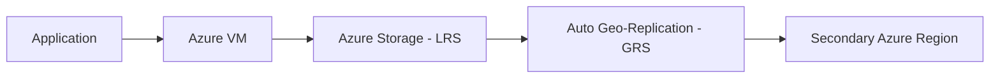
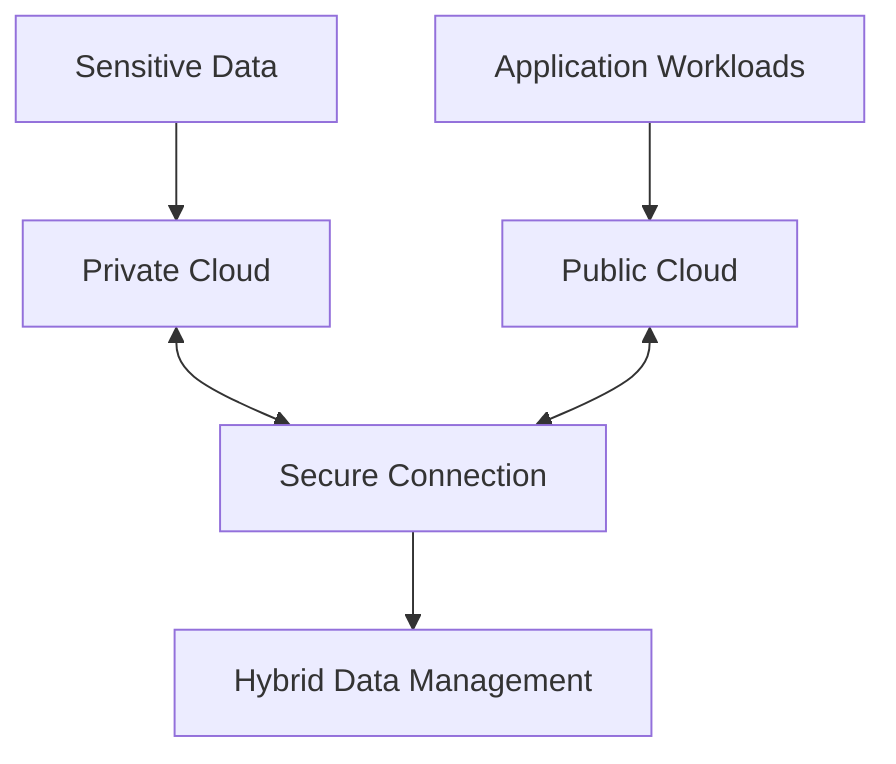

# Data Management in Private Cloud vs Public Cloud

## Interview-Ready Deep Explanation

---

## Overview

Data management differs significantly between Private Cloud and Public Cloud in terms of:

* **Ownership**
* **Control**
* **Security model**
* **Compliance**
* **Scalability**
* **Cost model**
* **Operational responsibility**

Understanding this difference is critical for roles in DevOps, Cloud Architecture, and Security Engineering.

---

## 1️⃣ Data Management in Private Cloud

### Definition

A Private Cloud is infrastructure dedicated to a single organization. It can be:

* On-premises (company datacenter)
* Hosted in a private facility
* Built using platforms like OpenStack, VMware, etc.

---

### 🔐 Data Ownership & Control

**Full control over:**
* Storage systems
* Encryption policies
* Backup strategies
* Network segmentation
* Physical access to hardware (if on-prem)

**Suitable for:**
* Banking
* Government
* Healthcare
* Defense
* Organizations with strict data residency requirements

---

### 🗄️ Storage Architecture

Typically includes:

* **SAN** (Storage Area Network)
* **NAS** (Network Attached Storage)
* **Distributed storage clusters**
* **RAID configurations**
* **Internal backup systems**

⚠️ Data replication must be configured manually.

---

### 🔁 Backup & Disaster Recovery

**Organization responsibilities:**
* Design custom RPO/RTO requirements
* Implement:
  * Offsite backups
  * Secondary datacenter
  * Replication systems

**Common tools:**
* Veeam
* Commvault
* Veritas NetBackup
* Custom DR orchestration

⚠️ Responsibility is fully internal.

---

### 🛡️ Security Model

**Security implemented using:**
* Firewalls
* VLAN segmentation
* IAM/Active Directory
* On-prem SIEM
* Custom encryption policies
* Hardware Security Modules (HSMs)

**Considerations:**
❌ Security depends on internal expertise  
❌ No built-in global redundancy unless configured  
✅ Full control over security policies  
✅ Can meet specific compliance requirements  

---

### 📊 Compliance

**Advantages:**
✅ Easier for strict regulatory requirements  
✅ Data residency laws compliance  
✅ Custom audit controls  
✅ Full control over compliance implementation  

**Challenges:**
❌ High compliance implementation cost  
❌ Requires dedicated compliance team  
❌ Manual certification processes  

---

### 💰 Cost Model

**Characteristics:**
* **CAPEX heavy** (Capital Expenditure)
* Hardware purchase upfront
* Cooling and power costs
* Staff salaries
* Maintenance contracts
* Facility costs

⚠️ Scaling requires buying new hardware - no instant elasticity.

---

## 2️⃣ Data Management in Public Cloud (Azure Example)

### Definition

Public cloud is infrastructure owned and operated by a Cloud Service Provider (CSP).

**Example:** Microsoft Azure

---

### 🔐 Shared Responsibility Model

In public cloud, responsibilities are split:

| Layer | Who Manages |
|-------|-------------|
| Physical hardware | Azure |
| Datacenter | Azure |
| Network backbone | Azure |
| Hypervisor | Azure |
| OS (IaaS) | Customer |
| Data | Customer |
| Identity | Shared |
| Applications | Customer |
| Network controls | Shared |

**Key principle:** You manage data security, Azure manages infrastructure security.

---

### 🗄️ Storage Architecture

**Azure provides managed storage services:**

* **Blob Storage** - object storage
* **Managed Disks** - VM disks
* **Azure Files** - SMB file shares
* **Azure Data Lake** - big data analytics
* **Queue Storage** - messaging
* **Table Storage** - NoSQL

✅ Data replication is automatic and configurable.

---

### 🔁 Built-in Replication

Azure provides automatic replication options:

| Type | Full Name | Copies | Scope | Durability |
|------|-----------|--------|-------|------------|
| LRS | Locally Redundant Storage | 3 | Same datacenter | 11 nines |
| ZRS | Zone Redundant Storage | 3 | Across zones | 12 nines |
| GRS | Geo-Redundant Storage | 6 | Primary + paired region | 16 nines |
| RA-GRS | Read-Access GRS | 6 | GRS + read from secondary | 16 nines |
| GZRS | Geo-Zone Redundant | 6 | Zones + paired region | 16 nines |

✅ Durability is built-in - no manual configuration needed.

---

### 🛡️ Security Features

**Public cloud offers:**

* **Encryption at rest** (default, AES-256)
* **Encryption in transit** (TLS 1.2+)
* **Azure Key Vault** - secrets management
* **RBAC** - role-based access control
* **Managed Identity** - passwordless authentication
* **Microsoft Defender for Cloud** - threat protection
* **DDoS protection** - built-in
* **Azure Firewall** - managed firewall
* **Private Link** - private connectivity
* **Customer-managed keys** - BYOK

✅ Security is standardized and globally certified.

---

### 📊 Compliance

**Azure complies with:**

* ISO 27001, 27017, 27018
* SOC 1, 2, 3
* HIPAA / HITECH
* GDPR
* FedRAMP (High)
* PCI DSS Level 1
* NIST 800-171
* And 90+ other certifications

✅ Cloud providers maintain compliance certifications globally.

---

### 🔄 Scalability

**Public cloud provides:**

* **Elastic storage** - instant scaling
* **Auto-scaling compute** - based on demand
* **Geo-redundancy** - built-in
* **Instant provisioning** - API/portal driven
* **No capacity planning** - provider handles
* **Global regions** - deploy anywhere

✅ No hardware purchase required.

---

### 💰 Cost Model

**Characteristics:**

* **OPEX model** (Operational Expenditure)
* **Pay-as-you-go** - per second/hour billing
* **No upfront cost** - start small
* **Scales with usage** - elastic pricing
* **Reserved instances** - discounts for commitment
* **Spot pricing** - up to 90% off

✅ Better cash flow management.

---

## 🔍 Private vs Public Cloud – Comprehensive Comparison

| Factor | Private Cloud | Public Cloud |
|--------|--------------|--------------|
| **Ownership** | Organization | Cloud Provider |
| **Control** | Full control | Logical control only |
| **Security** | Custom implemented | Built-in + configurable |
| **Scalability** | Limited by hardware | Elastic and instant |
| **Durability** | Must configure manually | Built-in replication |
| **Compliance** | Fully customizable | Pre-certified |
| **Cost** | CAPEX (upfront) | OPEX (pay-as-you-go) |
| **Operational Overhead** | High | Reduced |
| **Provisioning Time** | Days to weeks | Minutes |
| **Global Reach** | Limited | 60+ regions |
| **Disaster Recovery** | Manual setup | Built-in options |
| **Expertise Required** | High | Medium |
| **Innovation Speed** | Slower | Faster |

---

## 🧠 Interview Insight Answer

**If asked:**
> "How is data managed differently in private vs public cloud?"

**You should say:**

*"In a private cloud, the organization has **full control** over infrastructure, storage architecture, encryption, backup, and disaster recovery. However, this also means **full operational responsibility** and **CAPEX-heavy investment**.*

*In a public cloud like Azure, infrastructure management, physical security, and replication are handled by the provider under a **shared responsibility model**. The customer focuses on **data classification, access control, and encryption policies** while benefiting from **built-in durability, scalability, and compliance certifications**.*

*The key difference is the **trade-off between control and operational overhead**. Private cloud offers maximum control but requires significant expertise and investment. Public cloud provides **elasticity, resilience, and reduced operational burden** while maintaining strong security and compliance.*

*In practice, many enterprises use a **hybrid approach** - keeping sensitive data in private cloud while leveraging public cloud for scalability and innovation."*

---

## 🏗️ Architecture Comparison

### Private Cloud Model

**All layers managed internally.**

**Characteristics:**
* Manual replication setup
* Custom backup scripts
* Internal network only
* Requires dedicated team

---

### Public Cloud Model

**Infrastructure handled by Azure.**

**Characteristics:**
* Automatic replication
* Managed backups
* Global network
* Provider-managed

---

## 🚀 DevOps Perspective

### Private Cloud DevOps

**Tools & Practices:**
* Infrastructure provisioning via **VMware vSphere / OpenStack**
* Manual backup pipelines
* Custom monitoring stacks (Prometheus, Grafana)
* Self-hosted CI/CD (Jenkins, GitLab)
* Manual capacity planning
* Script-based automation

**Challenges:**
❌ Slower provisioning  
❌ Manual scaling  
❌ Limited elasticity  
❌ Higher maintenance  

---

### Public Cloud DevOps

**Tools & Practices:**
* **Infrastructure as Code** (ARM, Bicep, Terraform)
* Managed backups (Azure Backup, ASR)
* **Azure Monitor & Log Analytics**
* Native CI/CD (Azure DevOps, GitHub Actions)
* Auto-scaling built-in
* Serverless options

**Advantages:**
✅ Faster deployment  
✅ Elastic scaling  
✅ DevOps-native integration  
✅ Global availability  

---

## 📋 Data Management Tasks Comparison

| Task | Private Cloud | Public Cloud |
|------|--------------|--------------|
| **Create Storage** | Configure SAN/NAS | Click or API call |
| **Setup Replication** | Manual RAID/clustering | Select replication type |
| **Backup** | Install Veeam, configure | Enable Azure Backup |
| **Disaster Recovery** | Setup secondary datacenter | Configure ASR |
| **Encryption** | Implement custom | Enabled by default |
| **Access Control** | AD/LDAP setup | Azure RBAC |
| **Monitoring** | Install monitoring tools | Built-in metrics |
| **Scaling** | Buy hardware | Increase quota |
| **Compliance Audit** | Manual documentation | Download compliance reports |

---

## 🎯 Use Case Scenarios

### When to Use Private Cloud

✅ **Financial Services**
- Need complete data control
- Custom compliance requirements
- High-frequency trading (latency)

✅ **Government/Defense**
- National security data
- Data sovereignty laws
- Air-gapped networks

✅ **Healthcare (Specific Cases)**
- Patient data with strict controls
- Legacy systems integration
- Specific regulatory requirements

---

### When to Use Public Cloud

✅ **Startups**
- No upfront investment
- Fast scaling
- Global reach

✅ **E-commerce**
- Seasonal traffic spikes
- Global customer base
- Rapid deployment

✅ **SaaS Applications**
- Multi-tenant architecture
- Auto-scaling needs
- Global availability

✅ **Big Data / AI**
- Massive compute needs
- Elastic workloads
- Pay-per-use model

---

## 🔄 Hybrid Cloud - Best of Both Worlds

Many organizations use **hybrid architecture:**

**Example Scenarios:**
* Core banking data in private cloud
* Customer-facing apps in public cloud
* DR in public cloud for private workloads
* Data analytics in public cloud

**Connection Methods:**
* VPN
* Azure ExpressRoute
* AWS Direct Connect
* Dedicated fiber

---

## 🎓 Final Interview Takeaway

**Private Cloud:**
* **Maximum Control** + **Maximum Responsibility**
* Best for: Strict compliance, data sovereignty, legacy systems
* Cost: High CAPEX, lower long-term OPEX

**Public Cloud:**
* **Shared Responsibility** + **Built-in Resilience** + **Elasticity**
* Best for: Innovation, scalability, global reach
* Cost: Low/no CAPEX, OPEX scales with usage

**Hybrid Cloud:**
* **Combines benefits** of both
* **Gradual migration** path
* **Flexibility** for different workload types

**Key Message:** 
*Both models can coexist in hybrid architectures, allowing organizations to optimize for control, cost, and agility based on specific workload requirements.*

---

## 💡 Additional Interview Questions to Prepare

1. **"How would you migrate data from private to public cloud?"**
2. **"What are the security considerations in public cloud?"**
3. **"How do you ensure data residency compliance in public cloud?"**
4. **"Explain the shared responsibility model in detail."**
5. **"How would you architect a hybrid cloud solution?"**
6. **"What are the cost optimization strategies in public cloud?"**