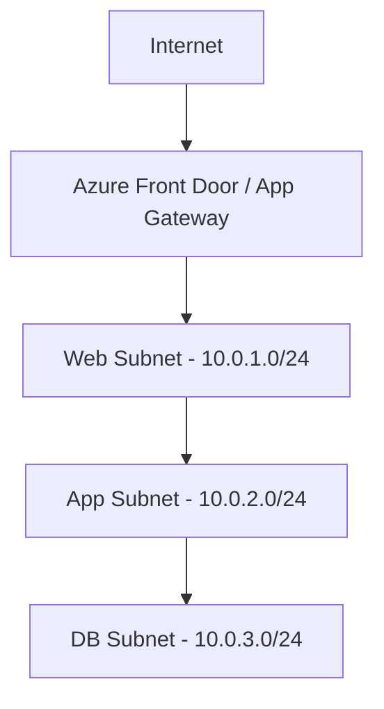
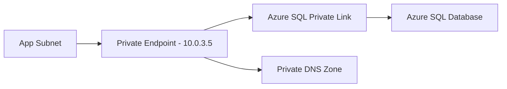
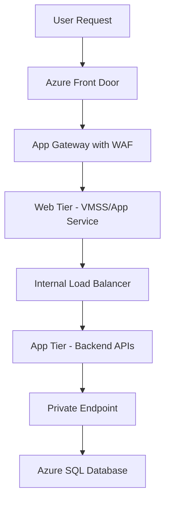
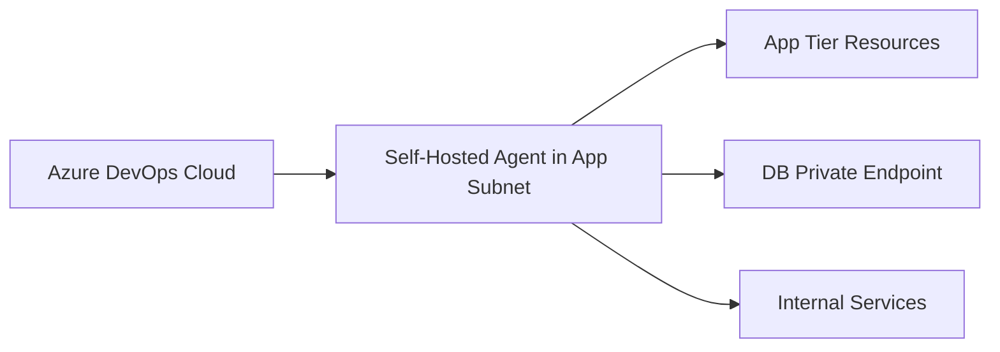
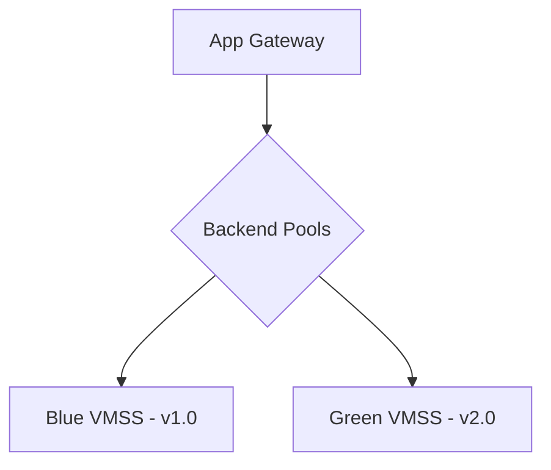
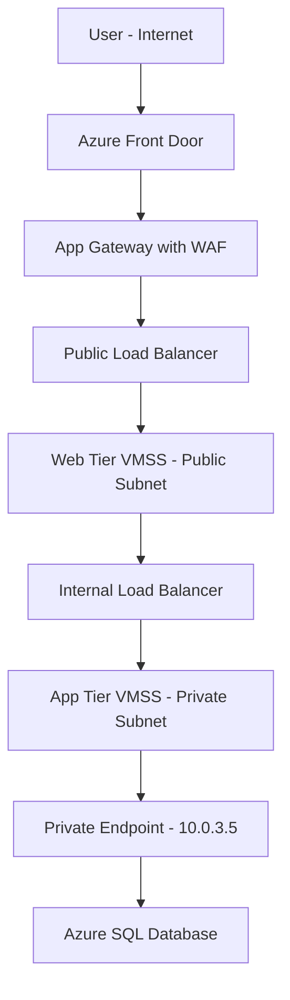

# Deploying a 3-Tier Application Using Azure DevOps (Networking Perspective)

## Interview-Ready Deep Explanation

---

## 🧱 What is a 3-Tier Architecture?

A 3-tier application consists of:

1. **Presentation Tier** → Frontend (Web App / UI)
2. **Application Tier** → Backend APIs / Business Logic
3. **Data Tier** → Database

### Why Separate Tiers?

Each tier is isolated for:

* **Security** - blast radius containment
* **Scalability** - scale tiers independently
* **Fault tolerance** - failures don't cascade
* **Maintainability** - update tiers independently
* **Performance** - optimize each layer separately

---

## ☁️ Azure Services Mapping

| Tier | Azure Service | Network Placement | Accessibility |
|------|--------------|-------------------|---------------|
| **Presentation** | App Service / VMSS / AKS Ingress / Static Web Apps | Public Subnet | Internet-facing |
| **Application** | App Service (internal) / AKS / VMSS / Container Apps | Private Subnet | Internal only |
| **Data** | Azure SQL / PostgreSQL / Cosmos DB / Managed Instance | Private Subnet | No public access |

---

## 🌐 Networking Architecture

### VNet Design

Create a **Virtual Network (VNet)** with 3 subnets:



---

### Detailed Subnet Design

```
VNet: 10.0.0.0/16

├── Web Subnet: 10.0.1.0/24
│   ├── Purpose: Frontend / Presentation
│   ├── Internet: Inbound allowed via App Gateway
│   └── Protection: NSG + WAF
│
├── App Subnet: 10.0.2.0/24
│   ├── Purpose: Backend / APIs
│   ├── Internet: No public IP
│   └── Access: Only from Web subnet
│
└── DB Subnet: 10.0.3.0/24
    ├── Purpose: Database
    ├── Internet: Completely isolated
    └── Access: Only from App subnet
```

---

### Subnet Segmentation Details

#### Web Subnet (Public)

**Characteristics:**
* Hosts frontend applications
* Has inbound internet access
* Protected by NSG + WAF
* May have public IPs (via Load Balancer or App Gateway)

**Typical Resources:**
* App Service (public)
* VMSS with public load balancer
* AKS Ingress Controller
* Static Web Apps

---

#### App Subnet (Private)

**Characteristics:**
* No public IP addresses
* Only accessible from Web tier
* Uses internal load balancer
* Service endpoints for Azure services

**Typical Resources:**
* App Service (VNet-integrated)
* VMSS with internal load balancer
* AKS worker nodes
* Container Instances

---

#### DB Subnet (Private)

**Characteristics:**
* No internet access whatsoever
* Only backend subnet can reach
* Uses private endpoint
* Private DNS zone integration

**Typical Resources:**
* Azure SQL with Private Endpoint
* PostgreSQL/MySQL with Private Endpoint
* Cosmos DB with Private Endpoint
* Managed Instance

---

## 🔐 Network Security

### Network Security Groups (NSG)

| Subnet | Inbound Rules | Outbound Rules |
|--------|--------------|----------------|
| **Web Subnet** | Internet → 80/443 (via App Gateway)<br>Azure Load Balancer → 80/443<br>Deny all else | App Subnet → API ports<br>Azure services<br>Deny all else |
| **App Subnet** | Web Subnet → 8080/3000<br>DevOps Agent → 22/3389<br>Deny all else | DB Subnet → 1433/5432<br>Azure services<br>Deny all else |
| **DB Subnet** | App Subnet → 1433/5432<br>Deny all else | Azure services only<br>Deny internet |

**Default Deny Rule:** Everything else → **Deny**

---

### NSG Rule Example (Web Subnet)

```json
{
  "name": "Allow-Internet-HTTPS",
  "priority": 100,
  "direction": "Inbound",
  "access": "Allow",
  "protocol": "Tcp",
  "sourceAddressPrefix": "Internet",
  "sourcePortRange": "*",
  "destinationAddressPrefix": "10.0.1.0/24",
  "destinationPortRange": "443"
}
```

---

### Private Endpoints

**Database should use:**

* **Private Endpoint** - provides private IP in VNet
* **Private DNS Zone** - resolves to private IP
* **Service Endpoint** - alternative for some services

**Benefits:**
✅ Traffic stays inside Azure backbone  
✅ No public IP exposure  
✅ Integration with on-premises via VPN/ExpressRoute  
✅ NSG rules apply  

---

### Private Endpoint Architecture



**DNS Resolution:**
```
mydb.database.windows.net → 10.0.3.5 (private IP)
```

---

## 🌍 Ingress & Traffic Management

### Azure Application Gateway (Layer 7)

**Features:**
✅ SSL/TLS termination  
✅ Web Application Firewall (WAF)  
✅ Path-based routing  
✅ URL rewrite  
✅ Session affinity  
✅ Health probes  

**Configuration:**
```yaml
Frontend: Public IP
Backend Pool: Web Tier VMs/App Services
HTTP Settings: Port 80/443
Routing Rules: Path-based
WAF: OWASP 3.2
```

---

### Azure Front Door (Global)

**Use when:**
* Multi-region deployment
* Global load balancing
* DDoS protection
* CDN integration

**Features:**
* Edge locations worldwide
* Intelligent routing
* WAF at edge
* SSL offload

---

### Traffic Flow Diagram



---

## ⚙️ Azure DevOps Deployment Flow

### Pipeline Overview

Azure DevOps handles:

* **CI (Continuous Integration)** → Build artifacts
* **CD (Continuous Deployment)** → Deploy to each tier
* **IaC (Infrastructure as Code)** → Provision networking

---

### Pipeline Stages (Network-Aware)

#### Stage 1 – Infrastructure Provisioning

**Tools:** Terraform / Bicep / ARM Templates

**Resources Created:**
* Virtual Network (VNet)
* Subnets (Web, App, DB)
* Network Security Groups (NSGs)
* Private endpoints
* Private DNS zones
* Application Gateway
* Load Balancers
* VMSS / App Services

**Pipeline YAML:**

```yaml
- stage: Infrastructure
  displayName: 'Provision Network Infrastructure'
  jobs:
    - job: TerraformDeploy
      pool:
        vmImage: 'ubuntu-latest'
      steps:
        - task: TerraformInstaller@0
        - task: TerraformTaskV3@3
          inputs:
            command: 'init'
        - task: TerraformTaskV3@3
          inputs:
            command: 'apply'
            environmentServiceNameAzureRM: 'AzureServiceConnection'
```

---

#### Stage 2 – Deploy Web Tier

**Deployment Target:**
* App Service (public)
* or VMSS in Web Subnet
* or Static Web Apps

**Network Configuration:**
* Attach to Web Subnet
* Configure public endpoint
* Setup App Gateway backend pool

**Pipeline YAML:**

```yaml
- stage: DeployWeb
  displayName: 'Deploy Web Tier'
  dependsOn: Infrastructure
  jobs:
    - deployment: WebDeploy
      environment: 'Production-Web'
      strategy:
        runOnce:
          deploy:
            steps:
              - task: AzureWebApp@1
                inputs:
                  azureSubscription: 'AzureServiceConnection'
                  appName: 'myapp-web'
                  package: '$(Pipeline.Workspace)/web-artifact'
```

---

#### Stage 3 – Deploy App Tier

**Deployment Target:**
* App Service (VNet-integrated)
* VMSS in App Subnet
* AKS deployment

**Network Configuration:**
* No public exposure
* VNet integration
* Internal Load Balancer
* Private endpoints for dependencies

**Pipeline YAML:**

```yaml
- stage: DeployApp
  displayName: 'Deploy Application Tier'
  dependsOn: DeployWeb
  jobs:
    - deployment: AppDeploy
      pool:
        name: 'SelfHostedPool'  # Self-hosted agent in VNet
      environment: 'Production-App'
      strategy:
        runOnce:
          deploy:
            steps:
              - task: AzureWebApp@1
                inputs:
                  azureSubscription: 'AzureServiceConnection'
                  appName: 'myapp-api'
                  package: '$(Pipeline.Workspace)/api-artifact'
```

---

#### Stage 4 – Database Migration

**Actions:**
* Run database migrations
* Update schemas
* Seed data

**Network Configuration:**
* Access via Private Endpoint only
* Firewall restricts public access
* Use Managed Identity for auth

**Pipeline YAML:**

```yaml
- stage: DatabaseMigration
  displayName: 'Deploy Database Changes'
  dependsOn: DeployApp
  jobs:
    - job: DBMigration
      pool:
        name: 'SelfHostedPool'  # Must be in VNet
      steps:
        - task: SqlAzureDacpacDeployment@1
          inputs:
            azureSubscription: 'AzureServiceConnection'
            authenticationType: 'servicePrincipal'
            serverName: 'mydb.database.windows.net'
            databaseName: 'MyAppDB'
            sqlFile: '$(Pipeline.Workspace)/migrations/schema.sql'
```

---

## 🔁 Networking Controls in CI/CD

### Service Connections

Azure DevOps integrates with Azure via:

* **Service Principal** (SPN) with RBAC
* **Managed Identity**
* **Key Vault** for secrets

**Required Permissions:**
* Network Contributor (for VNet/NSG)
* Contributor (for resources)
* Key Vault Secrets User

---

### Self-Hosted Agent for Private Resources

**Why needed:**
👉 Microsoft-hosted agents **cannot access private subnets**

**Solution:** Deploy self-hosted agent inside VNet

**Architecture:**



---

### Self-Hosted Agent Setup

**Deployment:**
1. Create VM in App Subnet
2. Install Azure DevOps agent
3. Configure agent pool
4. Assign to pipelines

**Agent Configuration:**

```bash
# Install agent
./config.sh \
  --unattended \
  --url https://dev.azure.com/myorg \
  --auth pat \
  --token $(PAT) \
  --pool SelfHostedPool \
  --agent myagent-01 \
  --work _work

# Run as service
sudo ./svc.sh install
sudo ./svc.sh start
```

**Network Access:**
* Can reach private subnets
* Can access private endpoints
* Can deploy to internal resources

---

## 📡 Internal Communication

### Service-to-Service Communication

**App Tier → Database:**
* Use Private Endpoint
* Private DNS resolution
* Managed Identity authentication

**Web Tier → App Tier:**
* Internal Load Balancer
* Private IP addresses
* NSG rules allow specific ports

---

### Load Balancing Configuration

**Public Load Balancer (Web Tier):**
```
Frontend: Public IP
Backend Pool: Web Tier VMs
Health Probe: HTTP /health
Rule: 443 → 443
```

**Internal Load Balancer (App Tier):**
```
Frontend: Private IP (10.0.2.10)
Backend Pool: App Tier VMs
Health Probe: HTTP /api/health
Rule: 8080 → 8080
```

---

### Service Endpoints vs Private Endpoints

| Feature | Service Endpoint | Private Endpoint |
|---------|-----------------|------------------|
| **IP** | Public IP (restricted) | Private IP in VNet |
| **Traffic** | Microsoft backbone | Fully private |
| **DNS** | Public DNS | Private DNS |
| **Cost** | Free | Paid per endpoint |
| **On-prem Access** | No | Yes (via VPN/ExpressRoute) |

**Recommendation:** Use **Private Endpoints** for production databases

---

## 🛡️ Zero Trust Security Principles

### Defense in Depth

**Layer 1: Perimeter**
* Azure Front Door / App Gateway
* DDoS Protection
* WAF (Web Application Firewall)

**Layer 2: Network**
* NSG rules
* No public IPs on backend
* Private endpoints

**Layer 3: Application**
* Managed Identity
* Key Vault for secrets
* RBAC

**Layer 4: Data**
* Encryption at rest (TDE)
* Encryption in transit (TLS)
* Database firewall

---

### Security Checklist

✅ No public DB access  
✅ Backend has no public IP  
✅ Only WAF exposes frontend  
✅ Secrets stored in Key Vault  
✅ Managed Identity (no connection strings)  
✅ NSG deny-by-default  
✅ Private endpoints for all PaaS  
✅ TLS 1.2+ everywhere  

---

## 🔄 Blue-Green / Canary Deployment (Network-Aware)

### Blue-Green Deployment

**Setup:**
1. Deploy new version to separate VMSS (Green)
2. Keep old version running (Blue)
3. Update App Gateway backend pool
4. Gradually shift traffic
5. Monitor and rollback if needed

**Network Configuration:**



**Traffic Split:**
```
Blue (v1.0): 100% → 50% → 0%
Green (v2.0): 0% → 50% → 100%
```

---

### Canary Deployment

**Setup:**
1. Deploy to small percentage
2. Monitor metrics
3. Gradually increase traffic
4. Full rollout or rollback

**App Gateway Configuration:**
```yaml
Backend Pools:
  - name: production-stable
    weight: 90
  - name: production-canary
    weight: 10
```

---

## 📊 Monitoring & Observability

### Network-Aware Monitoring

**NSG Flow Logs:**
* Capture allowed/denied traffic
* Send to Log Analytics
* Query for security insights

**Application Gateway Metrics:**
* Request count
* Response time
* Failed requests
* Backend health

**Application Insights:**
* Dependency tracking
* Performance monitoring
* Custom metrics

**Log Analytics Queries:**

```kusto
// NSG Flow Logs - Denied Traffic
AzureNetworkAnalytics_CL
| where SubType_s == "FlowLog"
| where FlowStatus_s == "D"  // Denied
| project TimeGenerated, SrcIP_s, DestIP_s, DestPort_d
| top 100 by TimeGenerated desc
```

---

## 🚀 Complete End-to-End Traffic Flow

### Production Traffic Path



**Network Hops:**
1. User → Front Door (Global CDN/WAF)
2. Front Door → App Gateway (Regional WAF)
3. App Gateway → Web Tier (Public Subnet)
4. Web Tier → Internal LB (within VNet)
5. Internal LB → App Tier (Private Subnet)
6. App Tier → Private Endpoint (DB Subnet)
7. Private Endpoint → Azure SQL (Private connection)

---

## 🔑 Interview Key Points

### Question:
> "Explain how you would deploy a 3-tier application using Azure DevOps from a networking perspective."

### Structured Answer:

**1. Architecture Overview**
*"I would design a 3-tier architecture with isolated network segments for security and scalability. This includes:*
- *VNet with three subnets: Web (public), App (private), Database (private)*
- *Each tier in its own subnet for network isolation"*

**2. Network Security**
*"Network security is enforced through:*
- *NSG rules that allow only necessary traffic between tiers*
- *Web tier accessible only through App Gateway with WAF*
- *App tier has no public IP and is only accessible from web tier*
- *Database uses private endpoints with no public access"*

**3. Ingress Control**
*"For ingress traffic:*
- *Azure Application Gateway serves as the entry point with WAF enabled*
- *SSL termination happens at the gateway*
- *Path-based routing directs traffic to appropriate backend pools"*

**4. DevOps Integration**
*"The Azure DevOps pipeline handles:*
- *Infrastructure provisioning via Terraform/Bicep in Stage 1*
- *Web tier deployment to public subnet in Stage 2*
- *App tier deployment to private subnet in Stage 3*
- *Database migrations via self-hosted agent in Stage 4"*

**5. Self-Hosted Agent**
*"For deploying to private resources:*
- *Self-hosted agent is deployed within the App subnet*
- *This agent can access private endpoints and internal resources*
- *Microsoft-hosted agents cannot access private subnets"*

**6. Internal Communication**
*"Communication between tiers:*
- *Web tier communicates with app tier via internal load balancer*
- *App tier accesses database via private endpoint (private IP)*
- *All communication stays within the VNet backbone"*

**7. Zero Trust**
*"Following zero trust principles:*
- *No public exposure beyond the frontend*
- *Managed Identity for authentication (no connection strings)*
- *Secrets stored in Azure Key Vault*
- *Least privilege RBAC on all resources"*

---

## 🧾 DevOps Best Practices

### Infrastructure as Code

✅ **Version control** all network configurations  
✅ **Terraform/Bicep** for declarative infra  
✅ **Modular design** - separate modules for network, compute, database  
✅ **Environment parity** - same code for dev/staging/prod  

---

### Security

✅ **Private endpoints** for all PaaS services  
✅ **Managed Identity** instead of connection strings  
✅ **Key Vault** integration in pipelines  
✅ **NSG flow logs** enabled  
✅ **Just-in-Time VM access**  

---

### Deployment Strategy

✅ **Staged pipelines** - infra → web → app → db  
✅ **Health checks** at each stage  
✅ **Automated rollback** on failure  
✅ **Blue-green** for zero downtime  
✅ **Approval gates** for production  

---

### Monitoring

✅ **NSG flow logs** to Log Analytics  
✅ **Application Insights** for app performance  
✅ **Azure Monitor** alerts for network issues  
✅ **Dashboard** for real-time visibility  

---

## 🧠 Quick Revision

### Network Design
* **3 subnets** → Web (public), App (private), DB (private)
* **Address space** → 10.0.0.0/16
* **Subnet sizes** → /24 for each tier

### Security
* **NSGs** enforce tier-to-tier communication
* **WAF/App Gateway** handles ingress
* **Private endpoints** for database
* **Zero public exposure** except frontend

### DevOps
* **IaC** for all network resources
* **Self-hosted agent** required for private deployments
* **Staged pipeline** - infra → web → app → db
* **Managed Identity** for Azure resource access

### Load Balancing
* **Public LB** for web tier (internet-facing)
* **Internal LB** for app tier (private)
* **App Gateway** for Layer 7 routing

### Key Components
* **VNet** - 10.0.0.0/16
* **NSG** - firewall rules
* **Private Endpoint** - private IP for PaaS
* **App Gateway** - WAF + SSL + routing
* **Self-Hosted Agent** - deploy to private subnets

---

## 📚 Additional Interview Questions

### Follow-up Questions to Prepare:

1. **"How would you handle database connection from the app tier?"**
   - Use Managed Identity
   - Private endpoint connection
   - No connection strings in code

2. **"What if you need to deploy during business hours?"**
   - Blue-green deployment
   - Traffic shifting via App Gateway
   - Zero downtime strategy

3. **"How do you secure secrets in the pipeline?"**
   - Azure Key Vault
   - Variable groups
   - Managed Identity
   - Never in source control

4. **"What about disaster recovery?"**
   - Geo-redundant database
   - Multi-region deployment
   - Traffic Manager / Front Door
   - Automated failover

5. **"How do you handle network troubleshooting?"**
   - NSG flow logs
   - Network Watcher
   - Connection Monitor
   - Packet capture

---