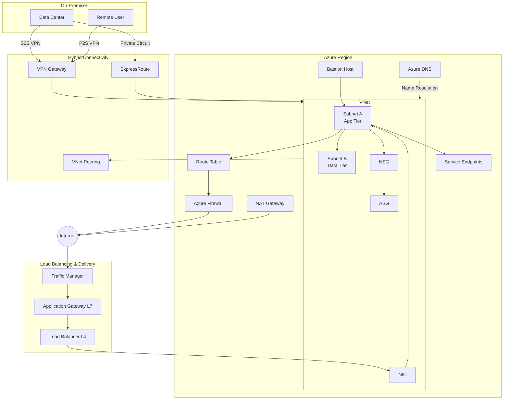

# Azure Networking — Master Index

> **TL;DR:** Azure Networking is a full-stack cloud networking platform covering virtual networks, security, routing, load balancing, hybrid connectivity, DNS, and application delivery. This index maps every major topic to its dedicated reference file.

---

## 📁 File Map

| # | File | Topics Covered |
|---|------|---------------|
| 01 | `01_vnets_subnets.md` | VNets, Subnets, NIC |
| 02 | `02_nsg_asg.md` | NSG, ASG |
| 03 | `03_routing.md` | Route Tables, UDR, System Routes |
| 04 | `04_service_endpoints_firewall.md` | Service Endpoints, Azure Firewall, Firewall Manager |
| 05 | `05_bastion_nat.md` | Azure Bastion, NAT Gateway |
| 06 | `06_dns.md` | Azure DNS, Private DNS |
| 07 | `07_load_balancer.md` | Azure Load Balancer (L4) |
| 08 | `08_application_gateway.md` | Application Gateway (L7), WAF |
| 09 | `09_traffic_manager.md` | Traffic Manager (DNS-based global LB) |
| 10 | `10_expressroute.md` | ExpressRoute, ExpressRoute Direct |
| 11 | `11_vpn_gateway.md` | VPN Gateway, S2S, P2S |
| 12 | `12_vnet_peering_transit.md` | VNet Peering, Gateway Transit |

---

## 🗺️ Azure Networking — Big Picture

---

## ⚡ Cheatsheet — Service Selection Guide

| Scenario | Azure Service |
|----------|--------------|
| Isolate workloads in Azure | VNet + Subnets |
| Control inbound/outbound traffic at NIC/Subnet | NSG |
| Group VMs for NSG rules without IPs | ASG |
| Custom routing between subnets | Route Table (UDR) |
| Secure PaaS access without public internet | Service Endpoints / Private Endpoints |
| Layer 7 stateful firewall | Azure Firewall |
| Manage firewalls across subscriptions | Firewall Manager |
| Secure RDP/SSH without public IPs | Azure Bastion |
| Outbound internet for private VMs | NAT Gateway |
| Azure-hosted DNS zones | Azure DNS |
| Private DNS resolution in VNet | Azure Private DNS |
| Internal/external L4 load balancing | Azure Load Balancer |
| L7 load balancing + WAF + SSL termination | Application Gateway |
| Global DNS-based traffic routing | Traffic Manager |
| Dedicated private circuit to Azure | ExpressRoute |
| Encrypted tunnel over internet to Azure | VPN Gateway (S2S) |
| Remote user VPN to Azure | VPN Gateway (P2S) |
| Connect two VNets (same/different region) | VNet Peering |
| Use hub VNet's VPN gateway from spoke | Gateway Transit |
