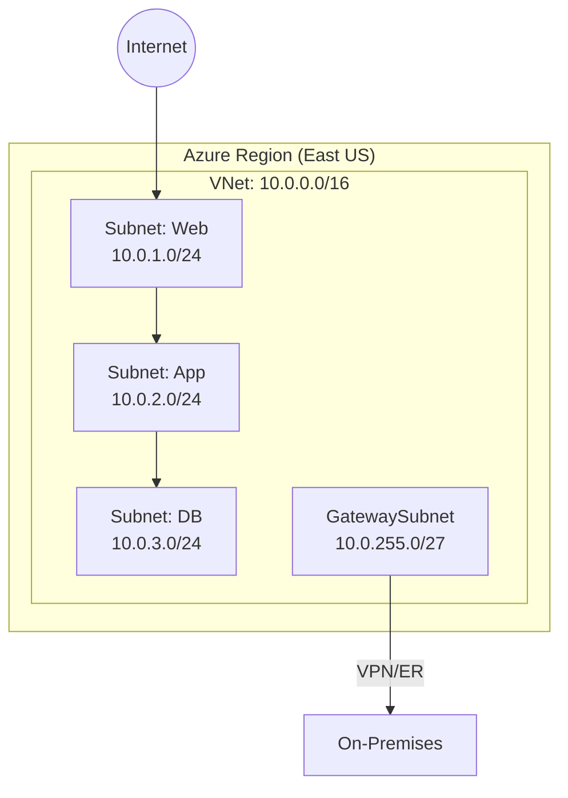
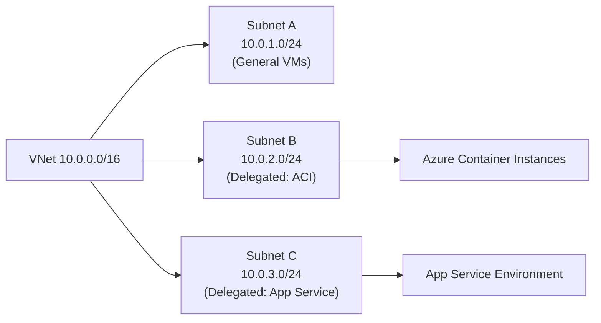
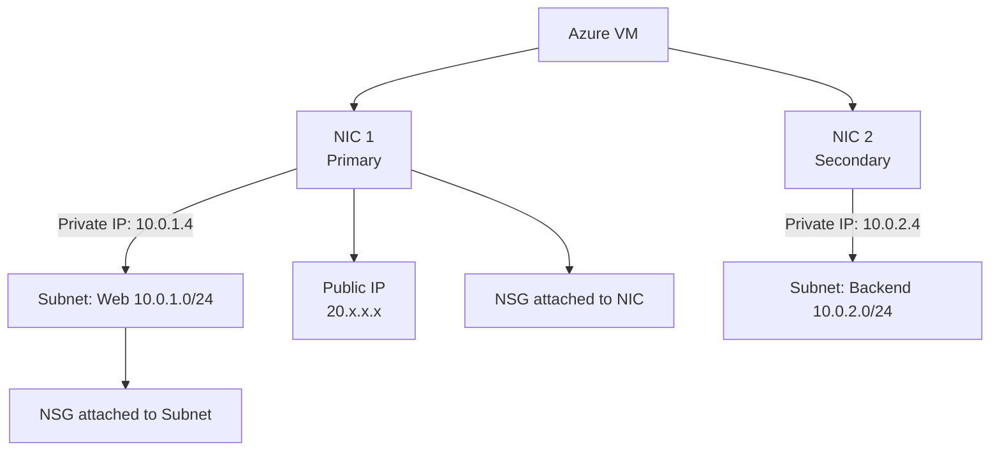

# 01 — VNets, Subnets & Network Interface Cards (NIC)

> **TL;DR:** A Virtual Network (VNet) is Azure's private isolated network. Subnets segment the VNet. NICs connect VMs to subnets. Everything in Azure networking starts here.

---

## 1.1 Azure Virtual Network (VNet)

### Definition
A VNet is a logically isolated, software-defined network within an Azure region. It is the fundamental building block for private networking in Azure — equivalent to an on-premises data center network, but in the cloud.

### Key Concepts
- Scoped to a **single Azure region** (not global)
- Scoped to a **single subscription**
- Can span **multiple Availability Zones** within that region
- Supports **IPv4** (required) and **IPv6** (optional dual-stack)
- Address space defined using **CIDR notation** (e.g., `10.0.0.0/16`)
- Multiple address spaces can be added to one VNet
- VNets are **free**; you pay for gateways, peering traffic, etc.

### How It Works (Step-by-Step)
1. Define an address space (e.g., `10.0.0.0/16`) — up to 65,536 IPs
2. Create one or more subnets within that space
3. Deploy Azure resources (VMs, App Services, etc.) into subnets
4. Azure automatically handles routing within the VNet
5. Control external traffic via NSGs, Firewalls, and Route Tables

### Architecture



### Best Practices / Pitfalls
- **Plan address space carefully** — overlapping CIDRs prevent VNet peering
- Use **large address spaces** (e.g., `/16`) even if you start small; resizing is disruptive
- Do **not** use `192.168.0.0/16` if peering with on-premises networks using that range
- Reserved Azure ranges: `168.63.129.16`, `169.254.169.254` — never block these in NSGs
- Avoid `100.64.0.0/10` (Azure carrier-grade NAT range)

### Interview Notes
- VNet peering requires **non-overlapping** address spaces
- VNet is **regional** — use peering or VPN for cross-region connectivity
- Azure reserves **5 IPs per subnet**: `.0` (network), `.1` (gateway), `.2-.3` (DNS), `.255` (broadcast)

---

## 1.2 Subnets

### Definition
A subnet is a range of IP addresses within a VNet. Resources deployed into a subnet share that IP space. Subnets are used to segment workloads, apply security boundaries, and delegate services.

### Key Concepts
- Every resource in a VNet must be in a subnet
- Subnets **cannot overlap** within the same VNet
- Minimum subnet size: `/29` (8 IPs, 3 usable after Azure reserves 5)
- Special subnets:
  - `GatewaySubnet` — required for VPN/ExpressRoute gateways (min `/27` recommended)
  - `AzureFirewallSubnet` — required for Azure Firewall (min `/26`)
  - `AzureBastionSubnet` — required for Bastion (min `/26`)
  - `AzureRouteServerSubnet` — for Route Server (min `/27`)
- Subnet delegation: assign a subnet exclusively to a PaaS service (e.g., Azure Container Instances)

### Subnet Reserved IPs Example

| IP Address | Reserved For |
|-----------|-------------|
| `10.0.1.0` | Network address |
| `10.0.1.1` | Default gateway |
| `10.0.1.2` | Azure DNS |
| `10.0.1.3` | Azure DNS (future) |
| `10.0.1.255` | Broadcast |

### Subnet Delegation



### Best Practices / Pitfalls
- Use separate subnets for **web**, **app**, and **data** tiers — enables granular NSG rules
- Reserve a dedicated subnet for each gateway type (VPN, ExpressRoute, Bastion, Firewall)
- Don't make subnets too small — you cannot resize without redeployment
- Use subnet delegation only when the PaaS service requires it

### Interview Notes
- Azure reserves **5 IPs** per subnet (not 2 like AWS)
- `GatewaySubnet` name is **case-sensitive and mandatory** for VPN/ER gateways
- A subnet can have **only one NSG and one Route Table** associated at a time
- Service Endpoints are enabled **per subnet per service**

---

## 1.3 Network Interface Card (NIC)

### Definition
A NIC is the virtual network adapter that connects a VM to a subnet. It holds the private IP, optional public IP, DNS settings, and security group associations.

### Key Concepts
- Every VM requires **at least one NIC**
- Each NIC belongs to **exactly one subnet**
- A VM can have **multiple NICs** (depends on VM SKU/size)
- NIC holds:
  - **Private IP** (static or dynamic from subnet DHCP)
  - **Public IP** (optional, separately assigned resource)
  - **DNS servers** (override VNet-level DNS)
  - **NSG** (can be applied at NIC level OR subnet level, or both)
  - **Accelerated Networking** flag (SR-IOV for high throughput)
- NICs can be detached and reattached across VMs (within same region)

### NIC Architecture



### IP Configuration
Each NIC can have **multiple IP configurations** (primary + secondary). Each IP config has a private IP and optionally a public IP. Useful for hosting multiple websites on one VM.

```bash
# Azure CLI: Add a secondary IP config to a NIC
az network nic ip-config create \
  --resource-group myRG \
  --nic-name myNIC \
  --name ipconfig2 \
  --private-ip-address 10.0.1.10 \
  --subnet mySubnet \
  --vnet-name myVNet
```

### Accelerated Networking
- Bypasses host via **SR-IOV** — lower latency, less CPU overhead
- Requires: supported VM SKU (D/E/F/M series, 2+ vCPUs), supported OS
- Enabled at NIC creation; cannot toggle on running NICs (requires deallocation)

### Best Practices / Pitfalls
- Use **static private IPs** for servers, gateways, and any resource referenced by DNS
- Apply NSGs at the **subnet level** for easier management; use NIC-level NSG for VM-specific rules
- Enable **Accelerated Networking** for production workloads — significant performance gain
- Detach a NIC before moving it to another VM
- Multi-NIC VMs: traffic is **asymmetric** by default — configure OS-level routing if needed

### Summary Table

| Property | VNet | Subnet | NIC |
|---------|------|--------|-----|
| Scope | Region | Within VNet | Within Subnet |
| IP Range | CIDR (e.g., /16) | Sub-CIDR (e.g., /24) | Single IP from subnet |
| Security | — | NSG, Route Table | NSG |
| Limit | 1000/sub (default) | 3000/VNet | Per VM SKU |
| Cost | Free | Free | Free (PIP charged separately) |

### Interview Notes
- NSG on NIC is evaluated **before** NSG on Subnet for inbound; **after** for outbound
- You can assign a **static public IP** to a NIC via a separate Public IP resource
- Removing a NIC from a VM requires the VM to be **stopped (deallocated)**
- Accelerated Networking is **transparent to the OS** — no driver changes needed for supported distros
