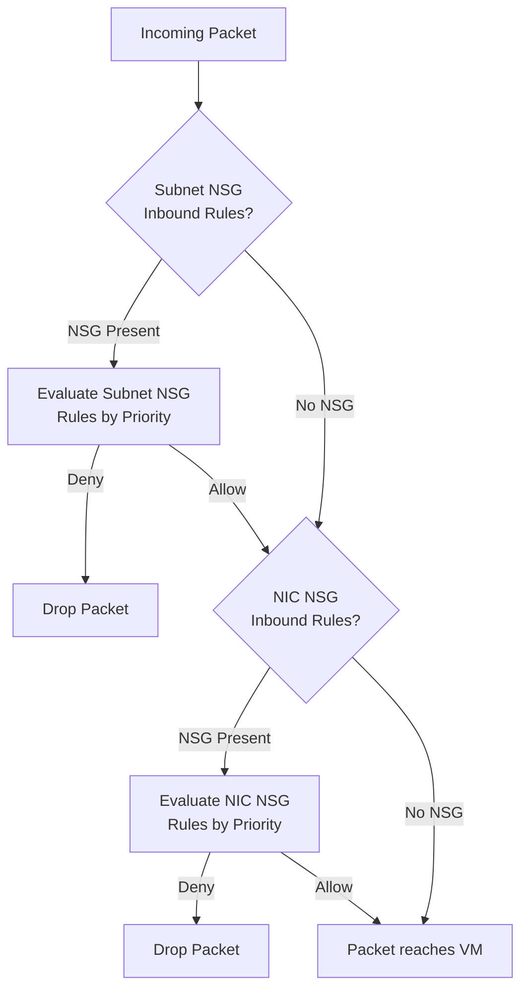
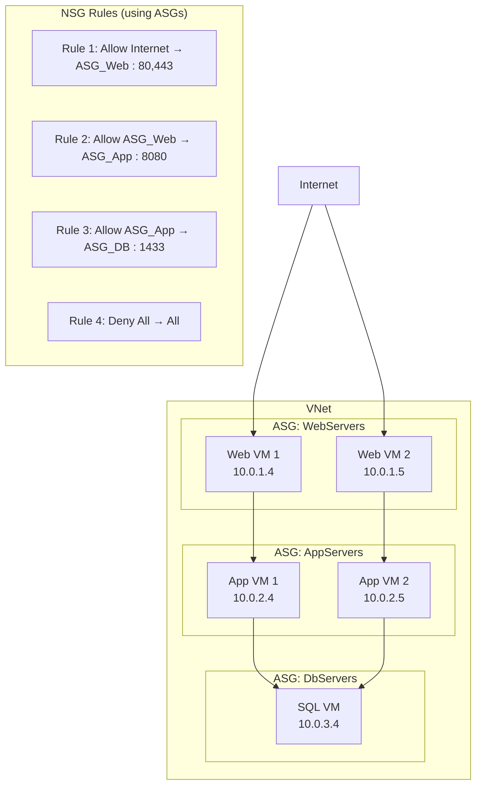

# 02 — Network Security Groups (NSG) & Application Security Groups (ASG)

> **TL;DR:** NSGs are Azure's virtual firewall — stateful L3/L4 rules on subnets or NICs. ASGs are logical groupings of NICs that let you write NSG rules referencing app roles (e.g., "WebServers") instead of IP addresses.

---

## 2.1 Network Security Group (NSG)

### Definition
An NSG is a stateful packet filter that controls inbound and outbound network traffic to Azure resources. It contains **security rules** evaluated by priority. NSGs operate at Layer 3/4 (IP + port).

### Key Concepts
- Contains **inbound** and **outbound** rule sets
- Each rule has: Priority, Source, Source Port, Destination, Destination Port, Protocol, Action (Allow/Deny)
- **Stateful**: if inbound traffic is allowed, the return traffic is automatically permitted
- Can be associated with:
  - **Subnets** (applies to all NICs in the subnet)
  - **NICs** (applies to that specific VM's interface)
- One NSG can be associated with **multiple** subnets/NICs
- A subnet or NIC can have **only one** NSG
- Default rules (cannot be deleted, only overridden with lower priority numbers):

| Priority | Name | Direction | Action |
|---------|------|-----------|--------|
| 65000 | AllowVnetInBound | Inbound | Allow |
| 65001 | AllowAzureLoadBalancerInBound | Inbound | Allow |
| 65500 | DenyAllInBound | Inbound | Deny |
| 65000 | AllowVnetOutBound | Outbound | Allow |
| 65001 | AllowInternetOutBound | Outbound | Allow |
| 65500 | DenyAllOutBound | Outbound | Deny |

### How NSG Rules Are Evaluated



**Inbound**: Subnet NSG → NIC NSG → VM  
**Outbound**: VM → NIC NSG → Subnet NSG

### NSG Rule Example

```bash
# Allow HTTP from internet to web subnet
az network nsg rule create \
  --resource-group myRG \
  --nsg-name myNSG \
  --name Allow-HTTP-Inbound \
  --priority 100 \
  --direction Inbound \
  --access Allow \
  --protocol Tcp \
  --source-address-prefixes Internet \
  --source-port-ranges '*' \
  --destination-address-prefixes 10.0.1.0/24 \
  --destination-port-ranges 80 443

# Deny all other inbound (priority must be > 100 and < 65000)
az network nsg rule create \
  --resource-group myRG \
  --nsg-name myNSG \
  --name Deny-All-Inbound \
  --priority 4000 \
  --direction Inbound \
  --access Deny \
  --protocol '*' \
  --source-address-prefixes '*' \
  --source-port-ranges '*' \
  --destination-address-prefixes '*' \
  --destination-port-ranges '*'
```

### Service Tags
Named groups of IP prefixes for Azure services — managed by Microsoft and updated automatically.

| Service Tag | Meaning |
|------------|---------|
| `Internet` | All public internet IPs |
| `VirtualNetwork` | VNet address space + peered VNets |
| `AzureLoadBalancer` | Azure Load Balancer probe IPs |
| `Storage` | Azure Storage public endpoints |
| `Sql` | Azure SQL public endpoints |
| `AppService` | App Service outbound IPs |
| `AzureMonitor` | Azure Monitor IPs |

### Best Practices / Pitfalls
- Use **Service Tags** instead of hardcoding Azure service IPs
- Always allow `AzureLoadBalancer` tag for health probes when using a Load Balancer
- Use **lower priority numbers** for more specific/important rules (100 beats 200)
- Avoid associating the same NSG to both a NIC and its subnet — it applies **twice**
- Enable **NSG Flow Logs** (via Network Watcher) for traffic auditing
- Test rules with **IP Flow Verify** in Network Watcher before applying

### Interview Notes
- NSG is **stateful** (unlike ACLs on-premises which may be stateless)
- NSG rules evaluate in **priority order** — first match wins
- You **cannot** create a rule with the same priority as another rule in the same direction
- Deny rules should have **higher priority numbers** (evaluated last) unless you want them early
- NSG does **not** inspect packet payloads (Layer 7) — use Azure Firewall for that

---

## 2.2 Application Security Group (ASG)

### Definition
An ASG is a logical container for NICs (VMs) that lets you use **application-role names** as source/destination in NSG rules, instead of IP addresses or subnets. This eliminates the need to update NSG rules when VM IPs change.

### Key Concepts
- ASGs contain **NICs**, not VMs directly — a NIC is added to an ASG
- A NIC can belong to **multiple ASGs**
- ASGs must be in the **same region** as the VNet
- Referenced in NSG rules as source or destination
- ASGs do **not** span subscriptions

### Architecture — 3-Tier App with ASG



### NSG Rule Using ASG

```bash
# Create ASGs
az network asg create --resource-group myRG --name WebServers
az network asg create --resource-group myRG --name AppServers
az network asg create --resource-group myRG --name DbServers

# Assign a NIC to an ASG
az network nic update \
  --resource-group myRG \
  --name myWebNIC \
  --application-security-groups WebServers

# NSG Rule: Allow WebServers to reach AppServers on port 8080
az network nsg rule create \
  --resource-group myRG \
  --nsg-name myNSG \
  --name Allow-Web-to-App \
  --priority 200 \
  --direction Inbound \
  --access Allow \
  --protocol Tcp \
  --source-asgs WebServers \
  --destination-asgs AppServers \
  --destination-port-ranges 8080
```

### NSG vs ASG — Comparison

| Feature | NSG | ASG |
|---------|-----|-----|
| Purpose | Define traffic rules | Group VMs by role |
| Contains | Security rules | NICs |
| Applied to | Subnet or NIC | Referenced inside NSG rules |
| IP-based | Yes (or Service Tags) | No — role-based |
| Reduces complexity | Yes | Yes (especially at scale) |
| Standalone useful | Yes | No — needs NSG |

### Best Practices / Pitfalls
- Use ASGs whenever you have **multiple VMs per tier** — avoids IP enumeration in rules
- ASGs are **not a replacement for NSGs** — they work together
- A NIC can be in **multiple ASGs** (e.g., a VM that is both a WebServer and an AppServer during migration)
- When you add a new VM to an ASG, the **NSG rules apply automatically** — no rule changes needed
- ASG names should reflect **application roles**, not infrastructure (use `WebFrontend` not `Subnet1VMs`)

### Summary Table

| Property | NSG | ASG |
|---------|-----|-----|
| Layer | L3/L4 | Logical grouping |
| Scope | Region | Region |
| Stateful | Yes | N/A |
| Max rules | 1000 per NSG | N/A (referenced in NSG rules) |
| Max ASGs per NIC | N/A | 20 |
| Cost | Free | Free |

### Interview Notes
- ASG simplifies rule management for **auto-scaling** scenarios — VMs join/leave without rule changes
- NSG with ASG is evaluated the **same way** as NSG with IPs — ASG is just an alias
- You **cannot** use ASG and IP address as source in the same rule
- ASGs require all NICs to be in the **same VNet** as the NSG's subnet association
