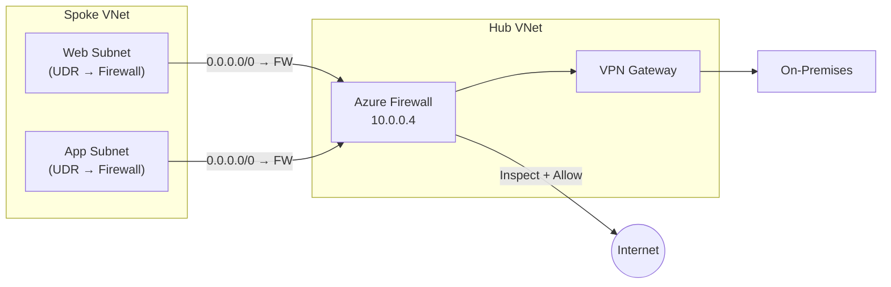
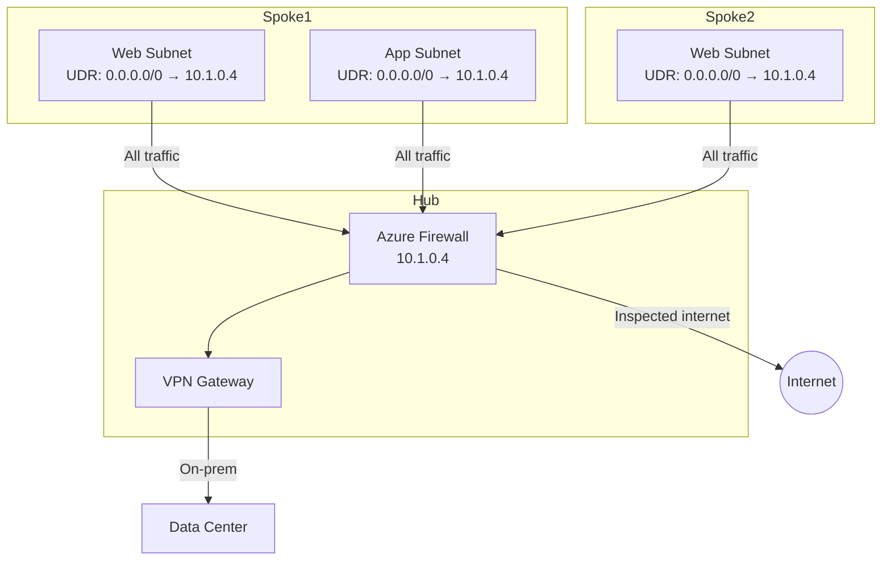

# 03 — Route Tables & User-Defined Routes (UDR)

> **TL;DR:** Azure auto-creates system routes for VNet, peered VNets, and internet. User-Defined Routes (UDRs) override these to force traffic through a firewall, NVA, or VPN gateway. Essential for hub-spoke architectures.

---

## 3.1 Azure Routing Fundamentals

### Definition
Azure automatically handles routing within and between subnets in a VNet using **system routes**. You can override or extend these routes with **User-Defined Routes (UDRs)** in a **Route Table** resource.

### Key Concepts
- Every subnet has an **effective route table** (combination of system + user-defined routes)
- Each route has: Address Prefix (destination CIDR) and Next Hop Type
- **Longest prefix match** determines which route is used when multiple routes match
- Next hop types:
  - `VirtualNetwork` — stay within VNet
  - `Internet` — send to public internet via Azure
  - `VirtualNetworkGateway` — send to VPN/ER gateway
  - `VirtualAppliance` — send to an IP (NVA, Azure Firewall)
  - `None` — drop traffic (black hole)

### System Routes (Auto-Created)

| Source | Address Prefix | Next Hop |
|--------|---------------|----------|
| Default | VNet address space | VirtualNetwork |
| Default | `0.0.0.0/0` | Internet |
| Default | `10.0.0.0/8`, `172.16.0.0/12`, `192.168.0.0/16` | None (RFC 1918 not in VNet) |
| VNet Peering | Peered VNet range | VirtualNetworkPeering |
| VPN/ER | On-prem prefixes | VirtualNetworkGateway |

---

## 3.2 User-Defined Routes (UDR) & Route Tables

### Definition
A Route Table is an Azure resource containing custom routes (UDRs) that override system routes for subnets it's associated with. Used to force-tunnel traffic through firewalls, NVAs, or gateways.

### Common Patterns



### How UDR Works (Step-by-Step)
1. Create a Route Table resource in your resource group
2. Add routes (destination prefix + next hop type + next hop IP if VirtualAppliance)
3. Associate the Route Table with one or more subnets
4. Azure merges UDRs with system routes; **UDRs take precedence** over system routes for the same prefix

### Route Table Configuration

```bash
# Create route table (disable BGP propagation to block VPN routes on subnet)
az network route-table create \
  --resource-group myRG \
  --name myRouteTable \
  --disable-bgp-route-propagation false

# Add UDR: Force all internet traffic through Azure Firewall
az network route-table route create \
  --resource-group myRG \
  --route-table-name myRouteTable \
  --name Force-Internet-to-Firewall \
  --address-prefix 0.0.0.0/0 \
  --next-hop-type VirtualAppliance \
  --next-hop-ip-address 10.0.0.4

# Associate route table with subnet
az network vnet subnet update \
  --resource-group myRG \
  --vnet-name myVNet \
  --name WebSubnet \
  --route-table myRouteTable
```

### BGP Route Propagation
- When enabled (default), VPN gateway routes are **automatically propagated** to the subnet's route table
- Disable (`--disable-bgp-route-propagation true`) to prevent gateway routes from overriding your UDRs
- Required when using Azure Firewall + VPN Gateway in hub-spoke — disable on spoke subnets

### Route Priority (Longest Prefix Match + Source Priority)

| Priority | Source |
|---------|--------|
| 1 (highest) | User-defined routes |
| 2 | BGP routes (from gateway) |
| 3 | System routes |

When two routes have the same prefix length, priority above applies. When prefixes differ, longest prefix match wins first.

### Effective Routes

```bash
# View effective routes for a specific NIC
az network nic show-effective-route-table \
  --resource-group myRG \
  --name myNIC \
  --output table
```

### Hub-Spoke with Force Tunneling



### Best Practices / Pitfalls
- Never put a UDR on the **GatewaySubnet** pointing to an NVA — breaks gateway routing
- Always ensure the **NVA/Firewall has IP forwarding enabled** on its NIC
- Use `None` as next hop to **black hole** specific traffic (security isolation)
- Be careful with `0.0.0.0/0` UDRs — they block all internet unless the NVA provides NAT/forwarding
- For Azure Firewall: add a route `AzureFirewallSubnet → Internet` to allow firewall's own internet traffic

### Summary Table

| Property | System Routes | UDR |
|---------|--------------|-----|
| Created by | Azure automatically | User |
| Editable | No | Yes |
| Override-able | Yes (by UDR) | N/A |
| Scope | Per subnet (auto) | Route Table → Subnet |
| Max routes/table | N/A | 400 |
| Cost | Free | Free |

### Interview Notes
- **Longest prefix match** always wins regardless of route source
- UDR with `VirtualAppliance` requires the NVA VM to have **IP Forwarding enabled** on NIC
- Disabling BGP propagation on a subnet prevents learning VPN gateway routes — use when firewall is the gateway
- `None` next hop = silent drop (useful for blocking RFC 1918 or other traffic)
