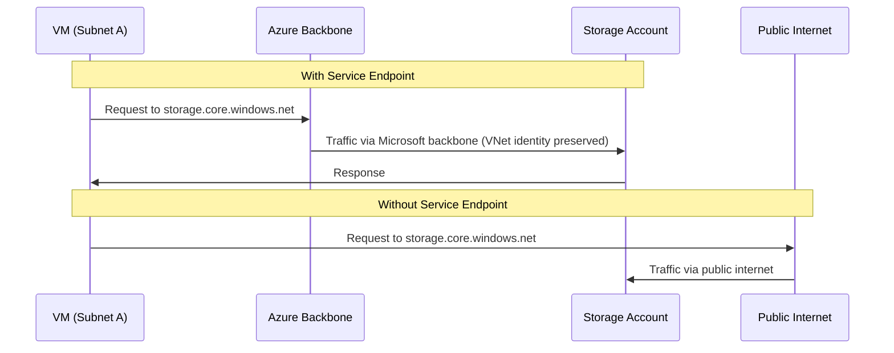
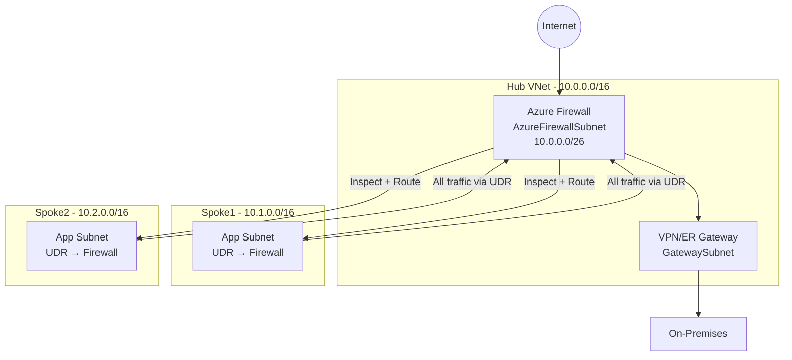
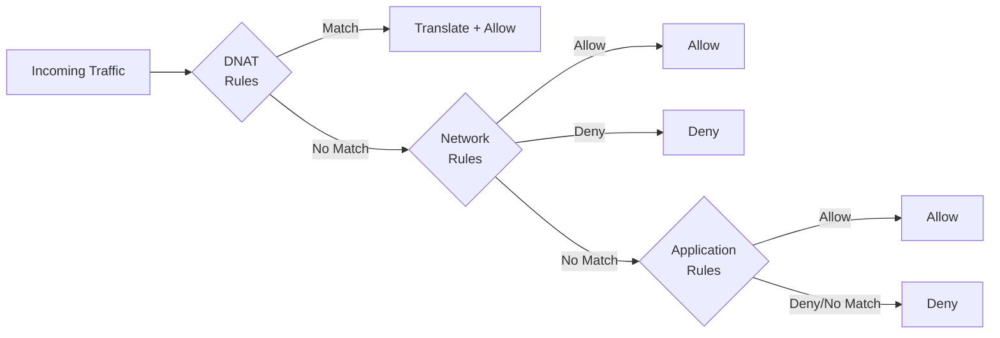
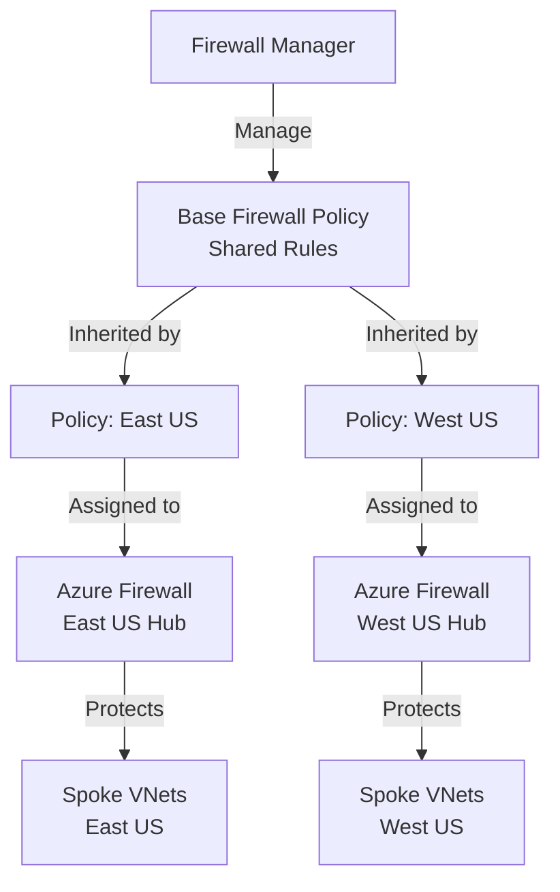

# 04 — Service Endpoints, Azure Firewall & Firewall Manager

> **TL;DR:** Service Endpoints extend VNet identity to PaaS services over Microsoft's backbone. Azure Firewall is a managed, stateful L4/L7 firewall for your VNet. Firewall Manager centralizes policy across multiple firewalls.

---

## 4.1 Service Endpoints

### Definition
A Service Endpoint extends the VNet's private address space identity to Azure PaaS services (Storage, SQL, Key Vault, etc.) over the **Microsoft backbone network**, without requiring a public IP or private endpoint.

### Key Concepts
- Enabled **per subnet per service** (e.g., `Microsoft.Storage` on `WebSubnet`)
- Traffic to the PaaS service travels over **Microsoft backbone** (not the public internet)
- The PaaS service sees the **VNet subnet as source** — can restrict access to VNet only
- The PaaS endpoint is still a **public IP address** (unlike Private Endpoints)
- Supported services: Storage, SQL, CosmosDB, KeyVault, ServiceBus, EventHub, AppService, ContainerRegistry, CognitiveServices

### How It Works (Step-by-Step)
1. Enable service endpoint on a subnet (`Microsoft.Storage`)
2. Azure adds a more-specific route to the subnet's effective routes pointing to the service
3. Traffic from subnet to Storage exits via the backbone (not `0.0.0.0/0` internet route)
4. Configure the PaaS service's **firewall rules** to allow only your subnet



### Service Endpoint vs Private Endpoint

| Feature | Service Endpoint | Private Endpoint |
|---------|-----------------|-----------------|
| Traffic path | Microsoft backbone | Fully private (VNet IP) |
| PaaS endpoint | Still public IP | Private IP in VNet |
| Cost | Free | Charged per hour + data |
| DNS changes needed | No | Yes |
| On-prem access | No (subnet only) | Yes (via VPN/ER) |
| Data exfiltration risk | Higher | Lower |
| NSG support | Limited | Full NSG support |

### Configuration

```bash
# Enable service endpoint on subnet
az network vnet subnet update \
  --resource-group myRG \
  --vnet-name myVNet \
  --name WebSubnet \
  --service-endpoints Microsoft.Storage Microsoft.Sql

# Restrict Storage Account to subnet only
az storage account network-rule add \
  --resource-group myRG \
  --account-name myStorageAccount \
  --vnet-name myVNet \
  --subnet WebSubnet
```

### Best Practices / Pitfalls
- Service Endpoints do **not** provide on-premises connectivity — on-prem traffic still goes over internet
- Use **Private Endpoints** when you need full network isolation or on-prem access to PaaS
- Enable endpoint on **all subnets** that need PaaS access, not just one
- Combine with **PaaS firewall rules** to deny public access entirely

---

## 4.2 Azure Firewall

### Definition
Azure Firewall is a managed, cloud-native, stateful firewall-as-a-service with built-in high availability, auto-scaling, and L4–L7 inspection capabilities. It protects resources in your VNet.

### Key Concepts
- Deployed in a **dedicated subnet** named `AzureFirewallSubnet` (min `/26`)
- Uses a **public IP** (or multiple, up to 250) for outbound SNAT
- **Stateful** — tracks connections, allows return traffic automatically
- Three rule collection types (evaluated in order):
  1. **DNAT Rules** — Destination NAT (inbound, port-forward to private IPs)
  2. **Network Rules** — L3/L4 (IP, port, protocol)
  3. **Application Rules** — L7 (FQDNs, URLs, TLS inspection)
- **FQDN Tags** — pre-built groups (e.g., `WindowsUpdate`, `AzureKubernetesService`)
- **Threat Intelligence** — block known malicious IPs/FQDNs
- Supports **Azure Firewall Policy** (recommended) or classic rules

### SKUs

| Feature | Basic | Standard | Premium |
|---------|-------|---------|---------|
| Fixed throughput | 250 Mbps | Auto-scale | Auto-scale |
| Network/App rules | ✅ | ✅ | ✅ |
| Threat intelligence | Alert only | Alert+Deny | Alert+Deny |
| IDPS | ❌ | ❌ | ✅ |
| TLS Inspection | ❌ | ❌ | ✅ |
| URL Filtering | ❌ | ❌ | ✅ |
| Web Categories | ❌ | ❌ | ✅ |

### Architecture — Hub-Spoke with Azure Firewall



### Rule Evaluation Order



### Firewall Policy Configuration

```bash
# Create Firewall Policy
az network firewall policy create \
  --resource-group myRG \
  --name myFirewallPolicy \
  --sku Standard \
  --threat-intel-mode Deny

# Add network rule collection
az network firewall policy rule-collection-group create \
  --resource-group myRG \
  --policy-name myFirewallPolicy \
  --name NetworkRules \
  --priority 100

# Add rule: allow spoke-to-spoke
az network firewall policy rule-collection-group collection add-filter-collection \
  --resource-group myRG \
  --policy-name myFirewallPolicy \
  --rule-collection-group-name NetworkRules \
  --name Allow-Spoke-to-Spoke \
  --collection-priority 100 \
  --action Allow \
  --rule-name Allow-Internal \
  --rule-type NetworkRule \
  --protocols TCP \
  --source-addresses 10.1.0.0/16 10.2.0.0/16 \
  --destination-addresses 10.1.0.0/16 10.2.0.0/16 \
  --destination-ports 443 8080
```

### DNAT Example (Expose Internal Server)

```bash
# Allow inbound RDP to internal VM via Firewall public IP
az network firewall policy rule-collection-group collection add-nat-collection \
  --resource-group myRG \
  --policy-name myFirewallPolicy \
  --rule-collection-group-name NATRules \
  --name DNAT-RDP \
  --collection-priority 100 \
  --rule-name Allow-RDP \
  --rule-type NatRule \
  --source-addresses '*' \
  --destination-addresses <FirewallPublicIP> \
  --destination-ports 3389 \
  --translated-address 10.1.0.4 \
  --translated-port 3389 \
  --protocols TCP
```

### Best Practices / Pitfalls
- Always use **Firewall Policy** (not classic rules) — enables Firewall Manager and inheritance
- Deploy in the **hub VNet**, not spoke VNets
- Add UDR `0.0.0.0/0 → Firewall` on all spoke subnets
- Do **not** put UDR on `GatewaySubnet` or `AzureFirewallSubnet`
- Enable **Diagnostic Logs** (to Log Analytics) — Firewall logs are essential for troubleshooting
- Use **IP Groups** to manage sets of IPs used across multiple rules

---

## 4.3 Azure Firewall Manager

### Definition
Firewall Manager is a centralized security management service for Azure Firewall. It manages firewall policies, protected virtual hubs (vWAN), and partner security services across multiple subscriptions and regions.

### Key Concepts
- Manages **Azure Firewall Policies** at scale (parent + child policy inheritance)
- Integrates with **Azure Virtual WAN** (managed hub) and **Hub VNets** (custom hub)
- Supports **partner security providers** (e.g., Zscaler, Check Point, iboss) for internet traffic
- **Policy inheritance**: Base policy (shared rules) → Child policies (region/team-specific rules)
- Centralized **DDoS** and **network security** posture view

### Architecture — Multi-Region with Firewall Manager



### Best Practices / Pitfalls
- Use **base policy** for organization-wide rules (threat intel, logging, IDPS)
- Use **child policies** for team or region-specific rules
- Child policies **cannot** override base policy deny rules
- Firewall Manager works best with **Azure Virtual WAN** for automated spoke connectivity

### Summary Table

| Service | Layer | Stateful | Cost Model | Use Case |
|---------|-------|---------|-----------|---------|
| NSG | L3/L4 | Yes | Free | Subnet/NIC traffic filter |
| Azure Firewall | L3–L7 | Yes | Per hour + data | Central inspection, FQDN filtering, IDPS |
| Firewall Manager | Management plane | N/A | Free service | Multi-firewall policy management |
| Service Endpoint | Network routing | N/A | Free | PaaS access over backbone |
| Private Endpoint | Private IP for PaaS | N/A | Charged | Full isolation for PaaS |

### Interview Notes
- Azure Firewall **SNATs** outbound traffic to its public IP(s) — internal IPs are hidden
- Azure Firewall **DNATs** inbound traffic — maps public IP:port to private IP:port
- Firewall Manager supports both **Hub VNet** (DIY) and **Secured Virtual Hub** (vWAN managed)
- Application rules support **TLS inspection** only in Premium SKU
- Service Endpoints are **free**; Private Endpoints are **charged per hour**
