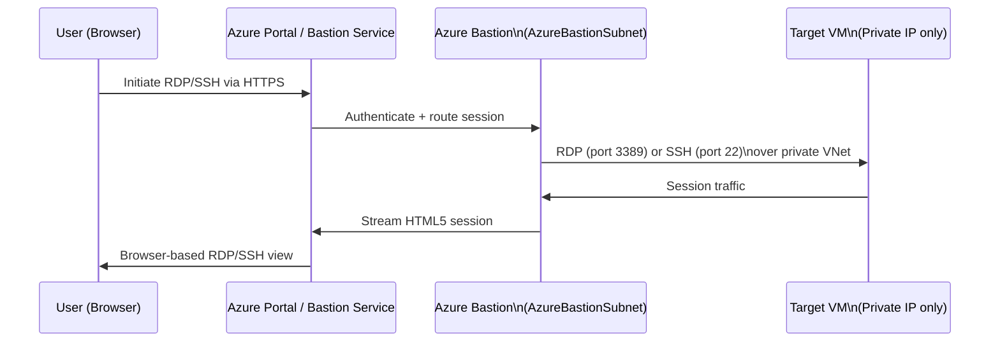
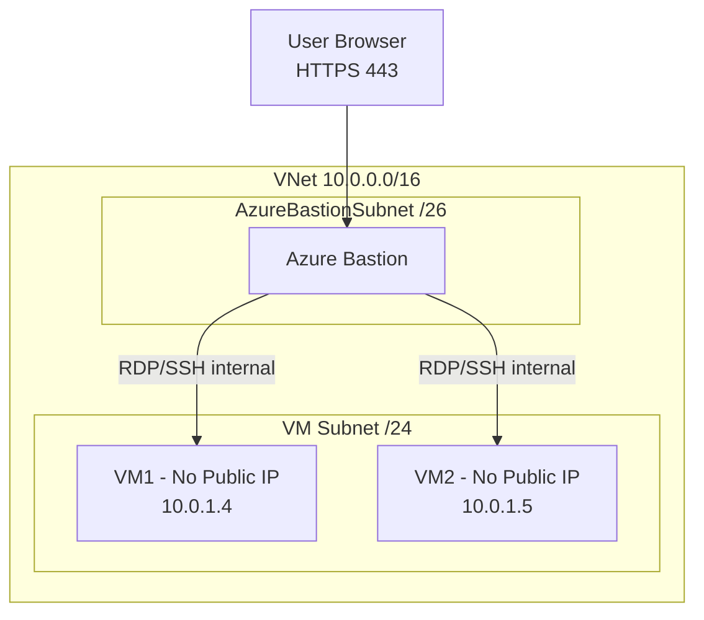
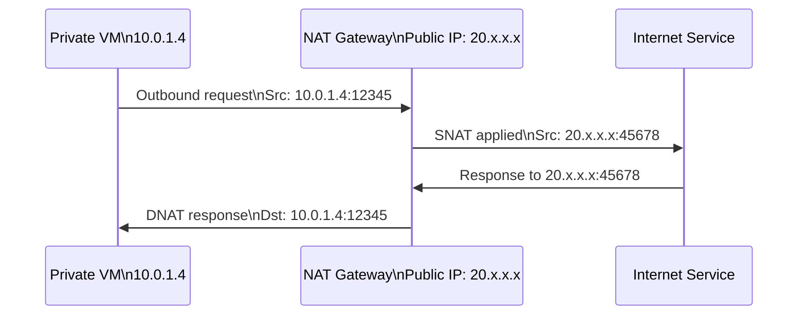
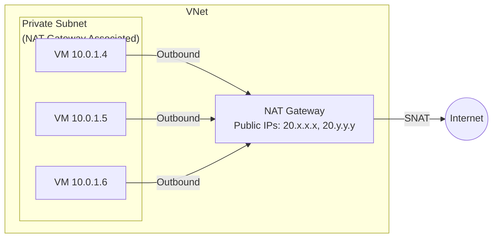

# 05 — Azure Bastion & NAT Gateway

> **TL;DR:** Azure Bastion provides secure browser-based RDP/SSH to VMs without public IPs. NAT Gateway provides scalable, reliable outbound internet for private VMs without exposing inbound ports.

---

## 5.1 Azure Bastion

### Definition
Azure Bastion is a managed PaaS service that provides secure and seamless RDP/SSH connectivity to VMs directly from the Azure Portal over TLS, without requiring a public IP on the VM or a jump server.

### Key Concepts
- Deployed in a dedicated subnet: **`AzureBastionSubnet`** (min `/26`, no NSG required for basic operation)
- Connects via **HTTPS (port 443)** from browser — no VPN or client software needed
- VM requires **no public IP** — Bastion proxies the connection
- Supports: Windows (RDP), Linux (SSH), and Kerberos auth
- **SKUs:**
  - **Basic**: Single session, no tunneling, fixed 2 instances
  - **Standard**: Concurrent sessions, native client support, IP-based tunneling, scaling to 50 instances
  - **Developer**: Lightweight, no dedicated subnet required (shared), single VM at a time (Preview)

### How It Works (Step-by-Step)



1. User opens Azure Portal → selects VM → Connect → Bastion
2. Portal authenticates via Azure AD
3. Bastion service establishes RDP/SSH to VM over VNet (private)
4. Session is proxied to user's browser via HTTPS (no client needed)

### Architecture



### NSG Requirements for AzureBastionSubnet

| Direction | Protocol | Source | Destination | Port | Action |
|-----------|----------|--------|------------|------|--------|
| Inbound | TCP | Internet | AzureBastionSubnet | 443 | Allow |
| Inbound | TCP | GatewayManager | AzureBastionSubnet | 443, 4443 | Allow |
| Inbound | TCP | AzureLoadBalancer | AzureBastionSubnet | 443 | Allow |
| Outbound | TCP | AzureBastionSubnet | VirtualNetwork | 3389, 22 | Allow |
| Outbound | TCP | AzureBastionSubnet | AzureCloud | 443 | Allow |

### Configuration

```bash
# Create AzureBastionSubnet
az network vnet subnet create \
  --resource-group myRG \
  --vnet-name myVNet \
  --name AzureBastionSubnet \
  --address-prefix 10.0.255.0/26

# Create Public IP for Bastion (Standard SKU required)
az network public-ip create \
  --resource-group myRG \
  --name BastionPublicIP \
  --sku Standard \
  --allocation-method Static

# Deploy Bastion
az network bastion create \
  --resource-group myRG \
  --name myBastion \
  --public-ip-address BastionPublicIP \
  --vnet-name myVNet \
  --location eastus \
  --sku Standard
```

### Bastion vs Alternatives

| Approach | Public IP on VM | Jump Server | VPN | Azure Bastion |
|---------|----------------|-------------|-----|---------------|
| VM needs Public IP | Yes | No | No | No |
| Requires client software | No | Depends | Yes | No |
| Management overhead | Low | High | Medium | Low |
| Cost | Public IP only | VM + IP | Gateway + IP | Bastion service |
| Security posture | Lower | Medium | High | High |

### Best Practices / Pitfalls
- Subnet must be named exactly **`AzureBastionSubnet`** (case-sensitive)
- Use **Standard SKU** for production — Basic has no IP-based connection or native client support
- Bastion does **not** require NSGs on the VM subnet (but you should still have them)
- Enable **Bastion Shareable Links** (Standard) to share sessions without portal access
- A single Bastion can reach VMs in **peered VNets** (Standard SKU)

### Interview Notes
- Bastion eliminates the "jump server" (bastion host VM) pattern — fully managed
- Bastion subnet minimum: `/26` for Standard, `/27` for Basic
- Bastion has its own **public IP** but VMs do not need one
- Sessions are **HTML5 rendered** — clipboard, file transfer via Standard SKU

---

## 5.2 NAT Gateway

### Definition
Azure NAT Gateway is a managed, zonal, outbound-only network address translation service. It provides reliable, scalable outbound internet connectivity for resources in private subnets without exposing them to inbound connections.

### Key Concepts
- Provides **outbound SNAT** for private VMs using 1 or more public IPs or public IP prefixes
- **Port Allocation**: Each public IP provides 64,512 SNAT ports; scalable to 16 IPs = ~1M ports
- **Stateful** — tracks outbound connections, allows return traffic
- Configured at **subnet level** — all VMs in the subnet use it for outbound
- **Zonal** — tied to one Availability Zone (or zone-redundant if no zone specified)
- Replaces SNAT via Load Balancer or instance-level public IPs

### Outbound SNAT Comparison

| Method | Port Exhaustion Risk | Predictable IP | On-demand Scaling | Recommended |
|--------|---------------------|---------------|------------------|-------------|
| VM Public IP | Low | Yes | No | Small scale |
| Load Balancer SNAT | High (at scale) | Yes | Limited | Medium scale |
| NAT Gateway | Very Low | Yes | Yes | ✅ Production |
| Default (SNAT via Azure) | High | No | No | Dev/test only |

### How It Works



### Architecture



### Configuration

```bash
# Create Public IP for NAT Gateway
az network public-ip create \
  --resource-group myRG \
  --name NATPublicIP \
  --sku Standard \
  --allocation-method Static \
  --zone 1

# Create NAT Gateway
az network nat gateway create \
  --resource-group myRG \
  --name myNATGateway \
  --public-ip-addresses NATPublicIP \
  --idle-timeout 10 \
  --zone 1

# Associate NAT Gateway with subnet
az network vnet subnet update \
  --resource-group myRG \
  --vnet-name myVNet \
  --name PrivateSubnet \
  --nat-gateway myNATGateway
```

### SNAT Port Exhaustion
- Each TCP/UDP flow uses one SNAT port
- NAT Gateway tracks and reuses ports efficiently
- Default idle timeout: **4 minutes** TCP, **4 minutes** UDP (configurable up to 120 min)
- Use **Public IP Prefixes** for predictable, contiguous outbound IPs (useful for allowlisting)

### NAT Gateway + Load Balancer Interaction
- NAT Gateway **takes precedence** over Load Balancer outbound rules on the same subnet
- When both are present: NAT Gateway handles outbound, Load Balancer handles inbound
- Recommended: Use NAT Gateway for outbound, Load Balancer for inbound

### Best Practices / Pitfalls
- Use NAT Gateway for any subnet with many VMs making outbound connections (avoid SNAT exhaustion)
- Associate a **Public IP Prefix** instead of individual IPs for easier allowlisting by partners
- NAT Gateway does **not** support inbound connections — it is outbound-only
- One NAT Gateway per subnet; one subnet can have only one NAT Gateway
- NAT Gateway must use **Standard SKU** public IPs

### Summary Table

| Feature | Azure Bastion | NAT Gateway |
|---------|--------------|------------|
| Direction | Inbound (management) | Outbound only |
| VM needs Public IP | No | No |
| Protocol | HTTPS (RDP/SSH proxy) | Any TCP/UDP |
| Subnet requirement | AzureBastionSubnet | Any private subnet |
| Availability Zone | Zone-redundant | Zonal or no-zone |
| Cost | Per hour + data | Per hour + data processed |
| Use case | Secure admin access | Scalable outbound NAT |

### Interview Notes
- NAT Gateway solves **SNAT port exhaustion** — common issue with Load Balancer SNAT at scale
- Bastion replaces the need for a **jump box VM** — fully managed, no VM to patch
- NAT Gateway uses **Static outbound IPs** — predictable for partner IP allowlisting
- Bastion Standard supports **native RDP/SSH client** (not just browser)
