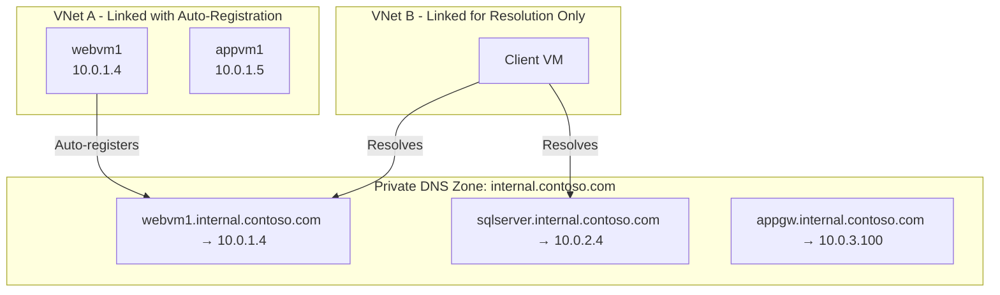
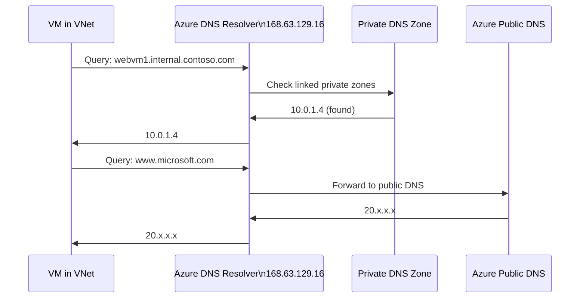
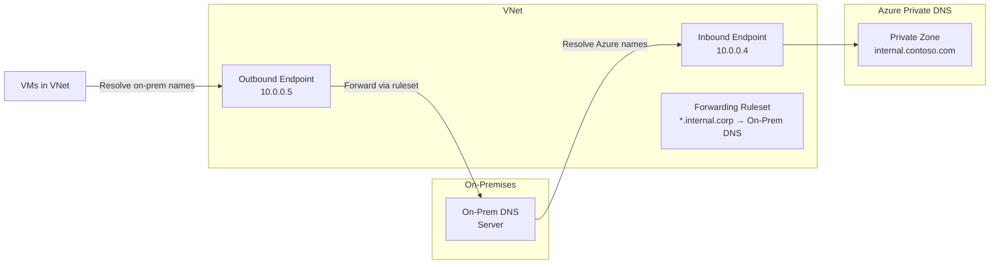

# 06 — Azure DNS

> **TL;DR:** Azure DNS hosts your DNS zones on Azure infrastructure. Public DNS serves internet queries. Private DNS resolves names within VNets. Both are fully managed, HA, and integrated with Azure RBAC.

---

## 6.1 Azure DNS Overview

### Definition
Azure DNS is a managed hosting service for DNS domains using Microsoft's global anycast network. It provides name resolution for both public (internet-facing) and private (VNet-internal) DNS zones.

### Two Zone Types

| Feature | Public DNS Zone | Private DNS Zone |
|---------|----------------|-----------------|
| Resolves for | Internet (anyone) | Linked VNets only |
| Hosted on | Azure global anycast | Azure internal resolvers |
| Record types | All standard types | All standard types |
| Auto-registration | No | Yes (for VM NICs) |
| Custom domain | Yes | Yes |
| Accessible from | Anywhere | VNet + peered VNets |

---

## 6.2 Azure Public DNS

### Key Concepts
- Delegates a domain (e.g., `contoso.com`) to Azure name servers
- Azure name servers are **anycast** — globally distributed for low latency
- Supports all standard DNS record types: A, AAAA, CNAME, MX, NS, PTR, SOA, SRV, TXT, CAA
- Supports **alias records** — point DNS records directly to Azure resources (Public IP, Traffic Manager, CDN, Front Door)
- SLA: 100% availability

### DNS Record Types Quick Reference

| Type | Purpose | Example |
|------|---------|---------|
| A | IPv4 address | `www → 20.1.2.3` |
| AAAA | IPv6 address | `www → 2001:db8::1` |
| CNAME | Alias to another name | `www → contoso.azurewebsites.net` |
| MX | Mail server | `@ → mail.contoso.com` |
| TXT | Text data (SPF, DKIM, verification) | `@ → "v=spf1 include:..."` |
| NS | Name servers for zone | Auto-created |
| SOA | Start of Authority | Auto-created |
| SRV | Service location | `_sip._tcp → sip.contoso.com:5061` |
| PTR | Reverse DNS (IP → name) | `4.3.2.1 → server.contoso.com` |
| CAA | Certificate Authority auth | `@ → letsencrypt.org` |

### Alias Records
Alias records are Azure-specific — they track the underlying Azure resource's IP automatically, preventing stale DNS entries.

```bash
# Create alias record pointing to a Public IP
az network dns record-set a create \
  --resource-group myRG \
  --zone-name contoso.com \
  --name www \
  --target-resource /subscriptions/.../publicIPAddresses/myPublicIP
```

### Configuration

```bash
# Create a public DNS zone
az network dns zone create \
  --resource-group myRG \
  --name contoso.com

# Add A record
az network dns record-set a add-record \
  --resource-group myRG \
  --zone-name contoso.com \
  --record-set-name www \
  --ipv4-address 20.1.2.3

# View NS records (to delegate from registrar)
az network dns zone show \
  --resource-group myRG \
  --name contoso.com \
  --query nameServers
```

---

## 6.3 Azure Private DNS

### Definition
Azure Private DNS provides DNS resolution within VNets using custom domain names (e.g., `internal.contoso.com`), without the need to manage a custom DNS server.

### Key Concepts
- Hosted entirely within Azure — no public exposure
- **Link a VNet** to a private zone to enable resolution
- **Auto-registration**: Azure automatically creates DNS records for VMs when their NICs get IPs
  - Format: `<vm-name>.<zone-name>` (e.g., `webserver1.internal.contoso.com`)
- A single private zone can be linked to **1000 VNets**
- A single VNet can link to **1000 private zones**
- Supports **split-horizon DNS**: same name resolves differently from internet vs VNet

### Private DNS Architecture



### How Resolution Works



### Private DNS for PaaS Services
Azure PaaS services (Storage, SQL, KeyVault) have Private Endpoints that need private DNS resolution.

| Service | Private DNS Zone Name |
|---------|----------------------|
| Storage (blob) | `privatelink.blob.core.windows.net` |
| Storage (file) | `privatelink.file.core.windows.net` |
| Azure SQL | `privatelink.database.windows.net` |
| Key Vault | `privatelink.vaultcore.azure.net` |
| ACR | `privatelink.azurecr.io` |
| AKS | `privatelink.<region>.azmk8s.io` |

### Configuration

```bash
# Create private DNS zone
az network private-dns zone create \
  --resource-group myRG \
  --name "internal.contoso.com"

# Link VNet (with auto-registration enabled)
az network private-dns link vnet create \
  --resource-group myRG \
  --zone-name "internal.contoso.com" \
  --name myVNetLink \
  --virtual-network myVNet \
  --registration-enabled true

# Add a static record
az network private-dns record-set a add-record \
  --resource-group myRG \
  --zone-name "internal.contoso.com" \
  --record-set-name sqlserver \
  --ipv4-address 10.0.2.4
```

---

## 6.4 Azure DNS Private Resolver

### Definition
Azure DNS Private Resolver enables **conditional DNS forwarding** between on-premises and Azure without deploying custom DNS VMs. It provides inbound (on-prem → Azure) and outbound (Azure → on-prem) resolution endpoints.

### Architecture



### Best Practices / Pitfalls
- Use **168.63.129.16** as DNS for VMs — Azure's magic IP for built-in DNS; never block it in NSGs
- For hybrid scenarios, use **Azure DNS Private Resolver** instead of custom DNS VMs
- Auto-registration requires the VNet to be the **registration VNet** — only one per zone per VNet
- Private DNS zones work across **peered VNets** if linked
- Use **split-horizon**: same zone name for public and private zones, different records

### Summary Table

| Feature | Public DNS | Private DNS | DNS Private Resolver |
|---------|-----------|------------|---------------------|
| Scope | Internet | VNet (linked) | Cross-environment |
| Auto-registration | No | Yes | No |
| Custom DNS server needed | No | No | No |
| Hybrid resolution | No | No | Yes |
| Cost | Per zone + queries | Per zone + queries | Per endpoint |

### Interview Notes
- Azure's built-in DNS resolver IP: **`168.63.129.16`** — must not be blocked
- Private DNS auto-registration works for **Azure VMs only** (not on-prem or containers)
- Alias records prevent the "apex domain CNAME" problem — point `@` directly to Azure resources
- DNS Private Resolver replaces the need for DNS forwarder VMs in hub-spoke architectures
