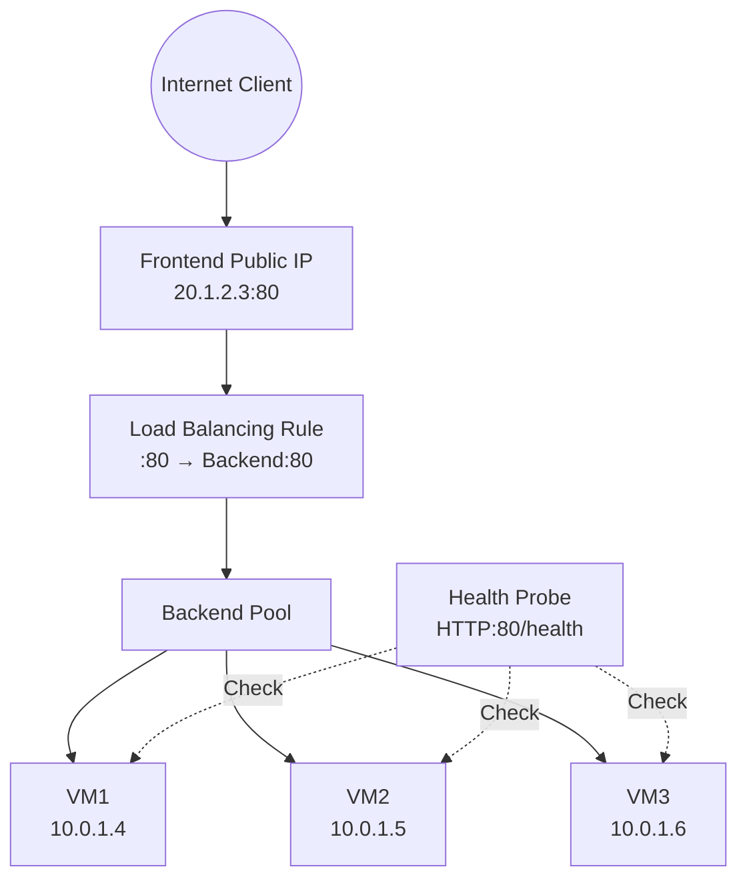
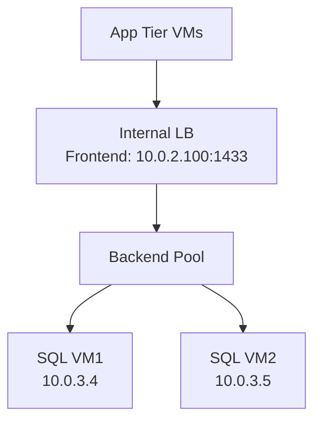

# 07 — Azure Load Balancer (L4)

> **TL;DR:** Azure Load Balancer is a high-performance, ultra-low-latency Layer 4 (TCP/UDP) load balancer. It distributes inbound flows to backend VMs using hash-based or session persistence. Available in Public and Internal flavors.

---

## 7.1 Azure Load Balancer Overview

### Definition
Azure Load Balancer operates at Layer 4 (Transport layer) and distributes inbound TCP/UDP traffic across healthy backend instances. It does not inspect packet contents — purely IP/port/protocol based.

### Key Concepts
- **SKUs:** Basic (legacy, avoid) and **Standard** (recommended — HA, zone-redundant, SLA 99.99%)
- **Types:**
  - **Public Load Balancer** — external-facing, has public IP, distributes internet traffic
  - **Internal (Private) Load Balancer** — internal-facing, private IP, for internal services
- Components:
  - **Frontend IP Configuration** — public or private IP that clients connect to
  - **Backend Pool** — set of VMs/VMSS or IP addresses that receive traffic
  - **Health Probe** — TCP, HTTP, or HTTPS probe to determine backend health
  - **Load Balancing Rules** — map frontend IP:port → backend pool:port
  - **Inbound NAT Rules** — map frontend IP:port → specific backend VM:port (for RDP/SSH)
  - **Outbound Rules** — configure SNAT for outbound internet from backend pool

### Load Balancing Algorithm
- **Default**: 5-tuple hash (Source IP, Source Port, Destination IP, Destination Port, Protocol)
- Ensures same client goes to same backend for the duration of a flow
- **Session Persistence** options:
  - `None` (default) — 5-tuple hash
  - `Client IP` — 2-tuple hash (src IP + dst IP) — same client always same backend
  - `Client IP and Protocol` — 3-tuple hash

---

## 7.2 Architecture

### Public Load Balancer



### Internal Load Balancer



### Zone-Redundant vs Zonal

| Mode | Frontend IP | Description |
|------|------------|-------------|
| Zone-Redundant | Zone-redundant Standard IP | Survives any zone failure |
| Zonal | Zonal Standard IP | Pinned to specific AZ |
| No Zone | Regional IP | No AZ guarantee |

---

## 7.3 Components Deep-Dive

### Health Probes

| Type | Protocol | Notes |
|------|---------|-------|
| TCP | TCP | Checks if port is open |
| HTTP | HTTP GET | Expects 200 response |
| HTTPS | HTTPS GET | Expects 200 response (Standard only) |

```bash
# HTTP health probe
az network lb probe create \
  --resource-group myRG \
  --lb-name myLB \
  --name myHealthProbe \
  --protocol Http \
  --port 80 \
  --path /health \
  --interval 15 \
  --threshold 2
```

### Load Balancing Rules

```bash
# Create LB rule: frontend port 80 → backend port 80
az network lb rule create \
  --resource-group myRG \
  --lb-name myLB \
  --name myHTTPRule \
  --protocol Tcp \
  --frontend-port 80 \
  --backend-port 80 \
  --frontend-ip-name myFrontendIP \
  --backend-pool-name myBackendPool \
  --probe-name myHealthProbe \
  --load-distribution Default \
  --idle-timeout 4 \
  --enable-tcp-reset true
```

### HA Ports (Internal LB Only)
- Special rule: **Protocol=All, Frontend Port=0, Backend Port=0**
- Load balances ALL protocols and ports in a single rule
- Used for NVA (firewalls, routers) to handle any traffic type

```bash
# HA Ports rule for NVA
az network lb rule create \
  --resource-group myRG \
  --lb-name myNVALB \
  --name HAPortsRule \
  --protocol All \
  --frontend-port 0 \
  --backend-port 0 \
  --frontend-ip-name myFrontend \
  --backend-pool-name myBackend \
  --probe-name myProbe
```

### Inbound NAT Rules

```bash
# Port forward: LB_IP:50001 → VM1:3389 (RDP)
az network lb inbound-nat-rule create \
  --resource-group myRG \
  --lb-name myLB \
  --name RDP-VM1 \
  --protocol Tcp \
  --frontend-port 50001 \
  --backend-port 3389 \
  --frontend-ip-name myFrontend
```

### Outbound Rules (Standard SKU)

```bash
# Outbound rule: give backend pool outbound internet via LB public IP
az network lb outbound-rule create \
  --resource-group myRG \
  --lb-name myLB \
  --name myOutboundRule \
  --frontend-ip-configs myFrontend \
  --protocol All \
  --outbound-ports 10000 \
  --address-pool myBackendPool
```

---

## 7.4 Full Setup Example

```bash
# 1. Create Public IP
az network public-ip create --resource-group myRG --name myLBPublicIP \
  --sku Standard --allocation-method Static --zone 1 2 3

# 2. Create Load Balancer
az network lb create --resource-group myRG --name myLB --sku Standard \
  --frontend-ip-name myFrontend --public-ip-address myLBPublicIP \
  --backend-pool-name myBackendPool

# 3. Create health probe
az network lb probe create --resource-group myRG --lb-name myLB \
  --name myProbe --protocol Http --port 80 --path /health

# 4. Create LB rule
az network lb rule create --resource-group myRG --lb-name myLB \
  --name myHTTPRule --protocol Tcp --frontend-port 80 --backend-port 80 \
  --frontend-ip-name myFrontend --backend-pool-name myBackendPool \
  --probe-name myProbe

# 5. Add VMs to backend pool
az network nic ip-config address-pool add \
  --resource-group myRG --nic-name myVM1NIC \
  --ip-config-name ipconfig1 \
  --lb-name myLB --address-pool myBackendPool
```

---

## 7.5 Load Balancer vs Application Gateway vs Traffic Manager

| Feature | Load Balancer | Application Gateway | Traffic Manager |
|---------|--------------|--------------------|-----------------|
| Layer | L4 (TCP/UDP) | L7 (HTTP/HTTPS) | DNS (Global) |
| Routing | Hash/port | URL, host, cookie | DNS policy |
| SSL termination | No | Yes | No |
| WAF | No | Yes | No |
| Scope | Regional | Regional | Global |
| Health checks | TCP/HTTP | HTTP/HTTPS | HTTP/HTTPS/TCP |
| Backend types | VMs, VMSS, IPs | VMs, VMSS, App Service, IPs | Any endpoint |

### Best Practices / Pitfalls
- Always allow **`AzureLoadBalancer`** service tag in NSG — health probes come from this IP
- Use **Standard SKU** — Basic is deprecated and lacks zone-redundancy
- Use **TCP Reset (`--enable-tcp-reset`)** on idle connections to avoid hanging sessions
- For internal LB, ensure NSG on backend subnet allows the **health probe source** (168.63.129.16)
- Don't mix Standard and Basic SKU resources

### Summary Table

| Property | Basic LB | Standard LB |
|---------|---------|------------|
| SLA | None | 99.99% |
| Backend pool | VMs in availability set | Any VM, VMSS, IP |
| Availability Zones | No | Yes |
| HA Ports | No | Yes (internal only) |
| HTTPS probe | No | Yes |
| Outbound rules | No | Yes |
| Secure by default | No | Yes (blocked until NSG opened) |
| Cost | Free | Charged per rule + data |

### Interview Notes
- Standard LB is **secure by default** — all inbound blocked until NSG explicitly allows
- Health probe source IP: **168.63.129.16** — must be allowed in NSGs
- Basic LB is being **retired** — always use Standard in new deployments
- Load Balancer **does not terminate connections** — it passes packets (unlike Application Gateway which is a proxy)
- HA Ports is **only available on Internal Standard LB** — not public
