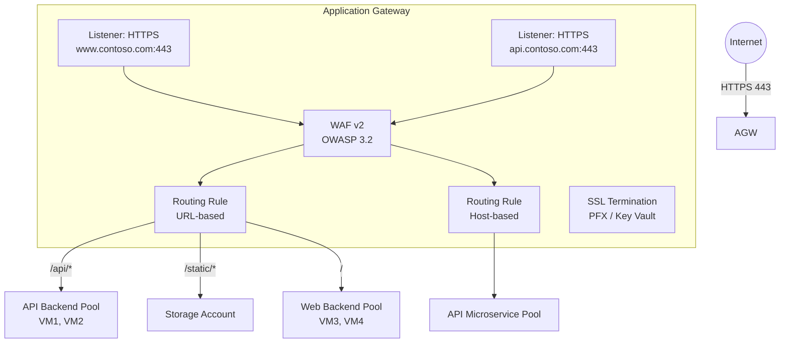
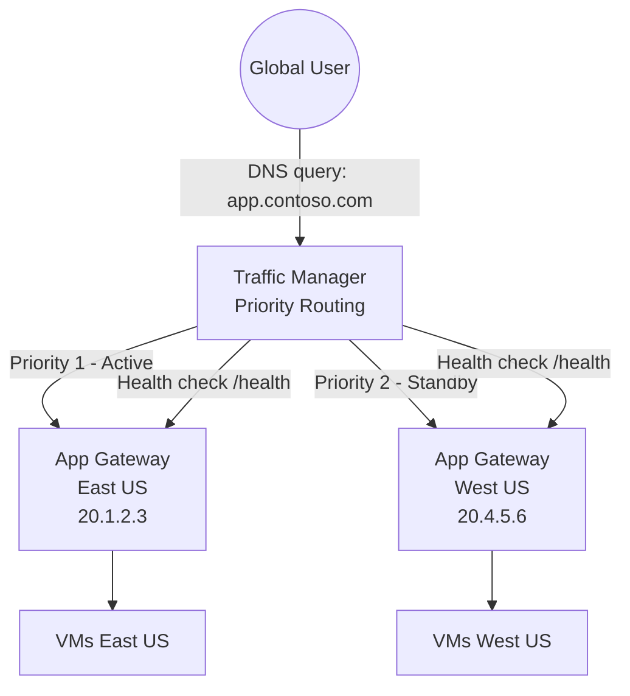
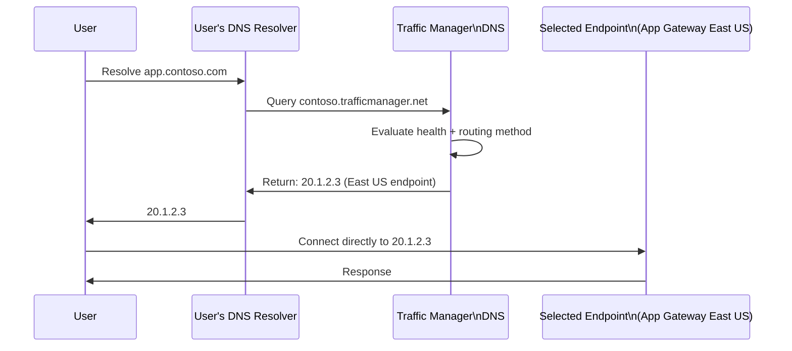
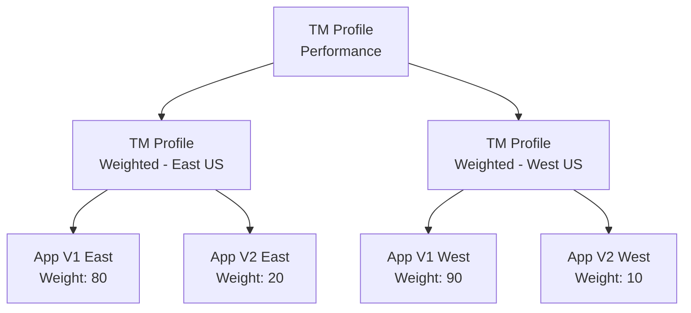

# 08 — Application Gateway & Traffic Manager

> **TL;DR:** Application Gateway is a regional L7 load balancer with WAF, SSL termination, and URL routing. Traffic Manager is a global DNS-based load balancer for multi-region routing.

---

## 8.1 Azure Application Gateway

### Definition
Azure Application Gateway is a managed Layer 7 (HTTP/HTTPS) regional load balancer and application delivery controller. It acts as a **reverse proxy** — it terminates client connections and establishes new ones to backend servers.

### Key Concepts
- **Regional service** — not global (use Traffic Manager or Front Door for global)
- Operates at Layer 7 — can inspect HTTP headers, URLs, cookies
- **Terminates TLS/SSL** at the gateway (reduces backend compute)
- **WAF (Web Application Firewall)** — OWASP rule set, custom rules (WAF SKU)
- SKUs:
  - **Standard v2** — autoscaling, zone-redundant, up to 125 instances
  - **WAF v2** — all Standard features + WAF (recommended for production)
- Components:
  - **Listener** — port/hostname that the gateway listens on
  - **Routing Rule** — maps listener to backend pool + HTTP settings
  - **Backend Pool** — VMs, VMSS, App Services, IP addresses, FQDNs
  - **HTTP Settings** — port, protocol, session affinity, timeout for backend
  - **Health Probe** — custom or default, checks backend health
  - **SSL Certificate** — uploaded PFX or Key Vault reference

### Architecture



### Routing Rule Types

| Type | Description | Example |
|------|-------------|---------|
| Basic | All traffic to one backend pool | Default catch-all |
| Path-based | Route by URL path | `/api/*` → API pool, `/images/*` → CDN |
| Multi-site | Route by hostname (host header) | `www.site.com` → web pool, `api.site.com` → API pool |
| Redirect | 301/302 redirect | HTTP → HTTPS redirect |
| Rewrite | Modify headers or URLs | Strip `/v1` prefix, add X-Forwarded-For |
| Custom error pages | Return custom HTML for 4xx/5xx | Branded error pages |

### Session Affinity (Cookie-Based)
Application Gateway inserts a cookie (`ApplicationGatewayAffinity`) to route a client to the same backend for the session lifetime.

### WAF Features
- **OWASP Core Rule Set** (CRS 3.0, 3.1, 3.2) — blocks SQLi, XSS, LFI, etc.
- **Custom rules** — IP allow/deny, geo-filtering, rate limiting
- **Modes:**
  - `Detection` — log threats, don't block
  - `Prevention` — actively block threats
- **WAF Policy** — attach one policy to multiple App Gateways

### SSL/TLS Configuration
- **SSL Termination at Gateway**: client → HTTPS → gateway → HTTP → backend (backend offloaded)
- **End-to-End SSL**: client → HTTPS → gateway → HTTPS → backend (backend must have valid cert)
- Supports **Key Vault integration** — auto-renew certs from Key Vault

### Configuration Example

```bash
# Create Application Gateway (simplified - use Bicep/ARM for production)
az network application-gateway create \
  --resource-group myRG \
  --name myAppGateway \
  --sku WAF_v2 \
  --capacity 2 \
  --vnet-name myVNet \
  --subnet AppGWSubnet \
  --frontend-port 443 \
  --http-settings-port 80 \
  --http-settings-protocol Http \
  --routing-rule-type Basic \
  --priority 100 \
  --cert-file ./cert.pfx \
  --cert-password myPassword \
  --public-ip-address myAppGWPublicIP

# Add path-based routing
az network application-gateway url-path-map create \
  --resource-group myRG \
  --gateway-name myAppGateway \
  --name myPathMap \
  --paths /api/* \
  --address-pool APIPool \
  --http-settings APISettings \
  --default-address-pool WebPool \
  --default-http-settings WebSettings
```

### Subnet Requirements
- Application Gateway requires a **dedicated subnet** (no other resources)
- Minimum subnet size: `/26` (recommended `/24` for scaling room)
- NSG on AppGW subnet must allow:
  - `GatewayManager` service tag: ports 65200–65535 (management traffic)
  - Client traffic: ports 80/443 from Internet
  - `AzureLoadBalancer` tag: 65200–65535

### Health Probes

```bash
# Custom health probe
az network application-gateway probe create \
  --resource-group myRG \
  --gateway-name myAppGateway \
  --name myProbe \
  --protocol Http \
  --host-name-from-http-settings true \
  --path /health \
  --interval 30 \
  --timeout 30 \
  --threshold 3
```

### Best Practices / Pitfalls
- Use **WAF v2** in production — Standard v2 has no WAF
- WAF in **Detection mode** first — analyze logs before switching to Prevention
- Use **Key Vault** for certificate management — auto-rotation
- Backend health issues are often **NSG blocking health probe** from AppGW subnet CIDR
- Application Gateway requires at least **2 instances** for production (or autoscale with min=0)
- Use **Private IP listener** for internal workloads, public IP for internet-facing
- Set `--host-name-from-http-settings true` in probes to match SNI of backend

---

## 8.2 Azure Traffic Manager

### Definition
Azure Traffic Manager is a DNS-based global traffic routing service. It directs users to the most appropriate endpoint based on routing method and endpoint health.

### Key Concepts
- **DNS-based routing** — returns the IP of the selected endpoint in DNS response
- Traffic Manager does **not proxy traffic** — client connects directly to the endpoint
- Global, not regional — designed for multi-region architectures
- Endpoint types: Azure endpoints, External endpoints, Nested profiles
- **DNS TTL**: configurable (default 60 seconds) — impacts failover speed

### Routing Methods

| Method | Description | Use Case |
|--------|-------------|---------|
| **Priority** | Route to primary; failover to secondary | Active-passive DR |
| **Weighted** | Distribute by weight (1–1000) | Canary/blue-green deployments |
| **Performance** | Route to lowest latency region | Global user base |
| **Geographic** | Route by user's DNS location | Data sovereignty, compliance |
| **Multivalue** | Return multiple healthy endpoints | DNS-based load balancing |
| **Subnet** | Route by client IP range | Testing, migration |

### Architecture — Multi-Region Active-Passive



### How DNS Routing Works



### Configuration

```bash
# Create Traffic Manager profile
az network traffic-manager profile create \
  --resource-group myRG \
  --name myTMProfile \
  --routing-method Priority \
  --unique-dns-name myapp-global \
  --monitor-protocol HTTPS \
  --monitor-port 443 \
  --monitor-path /health \
  --ttl 30

# Add primary endpoint (Azure App Gateway)
az network traffic-manager endpoint create \
  --resource-group myRG \
  --profile-name myTMProfile \
  --name EastUSEndpoint \
  --type azureEndpoints \
  --target-resource-id /subscriptions/.../publicIPAddresses/AppGW-EastUS-IP \
  --priority 1

# Add secondary endpoint
az network traffic-manager endpoint create \
  --resource-group myRG \
  --profile-name myTMProfile \
  --name WestUSEndpoint \
  --type azureEndpoints \
  --target-resource-id /subscriptions/.../publicIPAddresses/AppGW-WestUS-IP \
  --priority 2
```

### Nested Profiles
Combine routing methods — e.g., Performance routing at top level, then Weighted routing within each region.



### Traffic Manager vs Application Gateway vs Load Balancer vs Front Door

| Feature | Traffic Manager | Application Gateway | Load Balancer | Front Door |
|---------|-----------------|--------------------|---------------|------------|
| Layer | DNS | L7 HTTP | L4 TCP/UDP | L7 Global |
| Scope | Global | Regional | Regional | Global |
| SSL Termination | No | Yes | No | Yes |
| WAF | No | Yes | No | Yes |
| Caching/CDN | No | No | No | Yes |
| Path routing | No | Yes | No | Yes |
| Cost | Per queries | Per hour + rules | Per rules + data | Per rules + data |

### Best Practices / Pitfalls
- Traffic Manager is **DNS-based** — not suitable for very fast failover (DNS TTL delay)
- Use **Azure Front Door** when you need L7 global load balancing with WAF and caching
- Set **low TTL** (30–60 seconds) for faster failover at the cost of more DNS queries
- Health probe URL must return **2xx** for endpoint to be considered healthy
- Geographic routing uses **DNS resolver location** (not actual user IP) — VPN users may get wrong region
- Endpoints must have **unique DNS names** or public IPs for Traffic Manager to resolve

### Summary Table

| Component | App Gateway | Traffic Manager |
|-----------|------------|-----------------|
| Layer | L7 | DNS |
| Regional/Global | Regional | Global |
| Routing basis | URL/header/cookie | DNS + health |
| Traffic proxied | Yes (reverse proxy) | No (DNS redirect) |
| WAF | Yes | No |
| SSL termination | Yes | No |
| Failover speed | Seconds (health probe) | TTL-dependent (60s+) |

### Interview Notes
- Traffic Manager **does not touch data plane** — it only responds to DNS queries
- Application Gateway **terminates TCP connections** — it's a full reverse proxy
- For sub-second global failover with WAF, use **Azure Front Door** instead of Traffic Manager + App Gateway
- Traffic Manager Geographic routing is based on **EDNS0 client subnet** or resolver location — not user's actual IP
- App Gateway v2 supports **autoscaling** from 0 to 125 instances — cost-efficient
