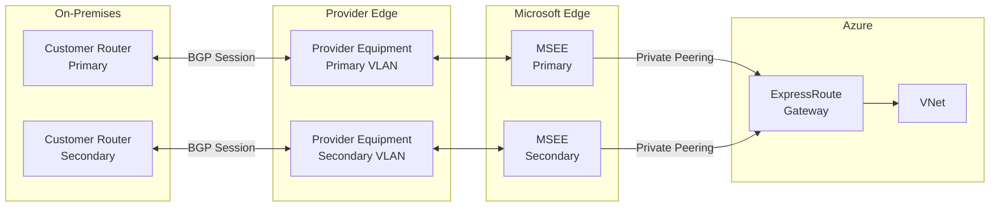
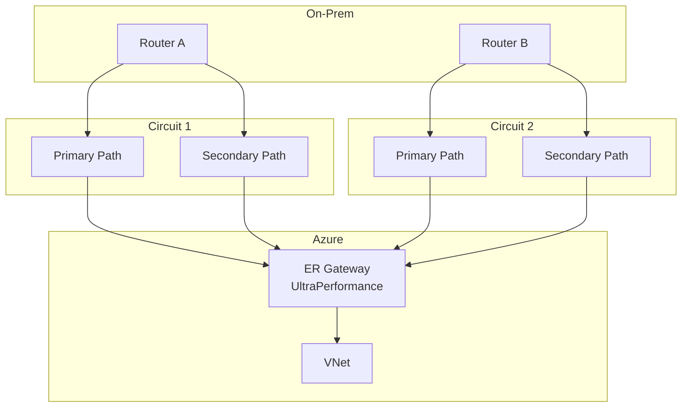
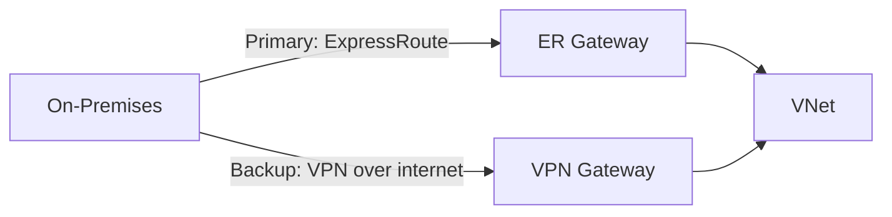

# 09 — Azure ExpressRoute

> **TL;DR:** ExpressRoute provides a dedicated private circuit between your on-premises network and Azure — not over the internet. Offers guaranteed bandwidth, lower latency, and higher security than VPN. Connects via connectivity providers or ExpressRoute Direct.

---

## 9.1 ExpressRoute Overview

### Definition
ExpressRoute is a private, dedicated network connection between your on-premises infrastructure (or co-location facility) and Microsoft Azure/Microsoft 365. Traffic travels over a **private circuit** — not the public internet.

### Key Concepts
- **Private** — traffic does not traverse the internet
- **Dedicated** — bandwidth is not shared with other internet traffic
- Connects to Azure via **connectivity providers** (AT&T, Equinix, Verizon, etc.) at exchange points
- Or via **ExpressRoute Direct** — connect directly to Microsoft's routers (10/100 Gbps)
- **BGP** (Border Gateway Protocol) is used for route exchange
- Two BGP peering types:
  - **Private Peering** — reach Azure VNets (IaaS, PaaS in VNet)
  - **Microsoft Peering** — reach Microsoft 365, Dynamics, Azure public services

### ExpressRoute vs VPN Gateway

| Feature | ExpressRoute | VPN Gateway |
|---------|-------------|------------|
| Transport | Private circuit | Internet (encrypted) |
| Bandwidth | 50 Mbps – 100 Gbps | Up to 10 Gbps (UltraPerformance) |
| Latency | Very low, predictable | Variable (internet-dependent) |
| SLA | 99.95% | 99.9%–99.95% |
| Setup time | Weeks (provider provisioning) | Minutes |
| Cost | Higher | Lower |
| Encryption | No (add MACsec/IPsec if needed) | Yes (IPsec) |
| Use case | Production, compliance, large data | Smaller scale, backup, dev |

---

## 9.2 ExpressRoute Circuit

### Definition
An ExpressRoute circuit represents the logical connection between your on-premises and Microsoft edge. It is provisioned with a specific bandwidth and redundancy.

### Bandwidth Options
50 Mbps, 100 Mbps, 200 Mbps, 500 Mbps, 1 Gbps, 2 Gbps, 5 Gbps, 10 Gbps (Standard)
Up to 100 Gbps via **ExpressRoute Direct**

### Circuit SKUs

| SKU | Reach | Use Case |
|-----|-------|---------|
| **Local** | Same metro region only | Cost-efficient for single-region |
| **Standard** | One geopolitical region | Typical enterprise |
| **Premium** | Global (all Azure regions) | Multi-region, M365, global routing |

### Circuit Redundancy
ExpressRoute circuits are **always dual** — primary + secondary physical connections. Both must be connected to separate provider equipment for true redundancy.

### Architecture



---

## 9.3 ExpressRoute Gateway

### Definition
An ExpressRoute Gateway connects your VNet to the ExpressRoute circuit. Deployed in the `GatewaySubnet`.

### Gateway SKUs

| SKU | Max Circuits | Max Throughput | Zone-Redundant |
|-----|-------------|---------------|----------------|
| Standard | 4 | 1 Gbps | No |
| HighPerformance | 4 | 2 Gbps | No |
| UltraPerformance | 16 | 10 Gbps | No |
| ErGw1Az | 4 | 1 Gbps | Yes |
| ErGw2Az | 8 | 2 Gbps | Yes |
| ErGw3Az | 16 | 10 Gbps | Yes |

### Configuration

```bash
# Create ExpressRoute circuit
az network express-route create \
  --resource-group myRG \
  --name myERCircuit \
  --location eastus \
  --bandwidth 1000 \
  --peering-location "Silicon Valley" \
  --provider "Equinix" \
  --sku-family MeteredData \
  --sku-tier Standard

# Get service key (share with connectivity provider)
az network express-route show \
  --resource-group myRG \
  --name myERCircuit \
  --query serviceKey

# Create ER Gateway in GatewaySubnet
az network vnet-gateway create \
  --resource-group myRG \
  --name myERGateway \
  --vnet myVNet \
  --gateway-type ExpressRoute \
  --sku ErGw1Az \
  --public-ip-addresses myERGatewayIP

# Link VNet to ER Circuit
az network vpn-connection create \
  --resource-group myRG \
  --name myERConnection \
  --vnet-gateway1 myERGateway \
  --express-route-circuit2 myERCircuit
```

---

## 9.4 Peering Types

### Private Peering
- Reach: Azure VNet resources (VMs, internal load balancers, etc.)
- IP range: Customer-provided `/30` subnets for BGP sessions (primary + secondary)
- Routes exchanged: VNet address prefixes ↔ on-premises prefixes

### Microsoft Peering
- Reach: Microsoft public services (Microsoft 365, Azure Storage public, Azure SQL public, etc.)
- Requires public IP ranges (owned by customer or provider)
- Route filter needed to select which services to access

### Peering Comparison

| Peering | Reach | BGP IPs | Route Filter |
|---------|-------|---------|-------------|
| Private | Azure VNets | Private /30 CIDRs | Not needed |
| Microsoft | M365, Azure Public | Public IPs required | Required |

---

## 9.5 ExpressRoute Direct

### Definition
ExpressRoute Direct provides a direct physical connection to Microsoft's global network at **10 Gbps or 100 Gbps** peering points — bypassing connectivity providers.

### Key Differences from Standard ExpressRoute

| Feature | ExpressRoute (Provider) | ExpressRoute Direct |
|---------|------------------------|---------------------|
| Bandwidth | 50 Mbps–10 Gbps | 10 Gbps, 100 Gbps |
| Provider | Required | Not needed |
| Colocation | At provider PoP | At Microsoft PoP |
| MACsec | No | Yes |
| Multiple circuits | Per provider | Multiple on one port pair |
| Cost | Lower | Higher |

### MACsec on ExpressRoute Direct
- **MACsec** (IEEE 802.1AE) encrypts traffic at Layer 2 on Direct connections
- Ensures encryption between your routers and Microsoft's routers
- Managed via Azure Key Vault for key rotation

---

## 9.6 High Availability Patterns

### Active-Active (Recommended)



- Two circuits in different peering locations
- Both active — traffic load-shares across circuits
- Maximizes bandwidth and resilience

### ExpressRoute + VPN Failover



- ExpressRoute is primary
- Site-to-Site VPN as backup if ER circuit fails
- Requires **both gateways coexist** in the VNet (use `--gateway-type Vpn` + `--gateway-type ExpressRoute` in same VNet)

### Best Practices / Pitfalls
- Always provision circuits with **dual paths** (primary + secondary) to a provider
- Use **two ER circuits** in different peering locations for zone-level redundancy
- Enable **BFD (Bidirectional Forwarding Detection)** on private peering for faster failover
- ExpressRoute Gateway is a **single point of failure** unless using zone-redundant SKUs (`ErGw1Az` etc.)
- Standard circuit has **inbound unlimited** data — metered billing is outbound only (depends on SKU)

### Summary Table

| Concept | Detail |
|---------|--------|
| Circuit bandwidth | 50 Mbps to 10 Gbps (Standard), 10/100 Gbps (Direct) |
| Peering types | Private (VNets), Microsoft (M365/Public Azure) |
| BGP | Mandatory — used for route exchange |
| Redundancy | Dual paths per circuit (primary + secondary) |
| Gateway subnet | GatewaySubnet — same as VPN Gateway |
| Coexistence | Can coexist with VPN Gateway in same VNet |
| Global Reach | Connect two on-premises via Microsoft backbone |

### Interview Notes
- ExpressRoute circuits have a **service key** — given to provider to provision the circuit
- ExpressRoute is **not encrypted by default** — use MACsec (Direct) or IPsec (overlay) if needed
- **Global Reach**: Connect two on-premises locations via two ER circuits through the Microsoft backbone
- Standard circuit is limited to one **geopolitical region** — Premium enables global routing
- Circuit provisioning by provider can take **2–8 weeks** — plan ahead
