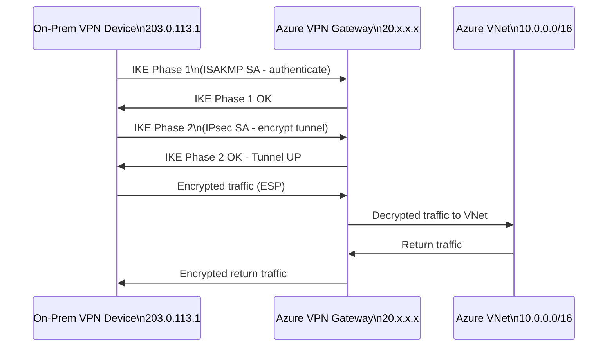
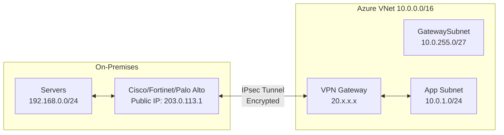
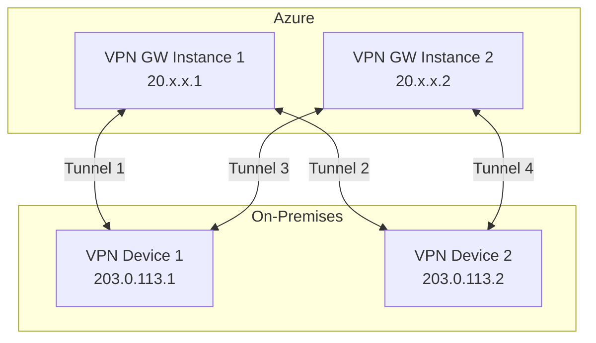
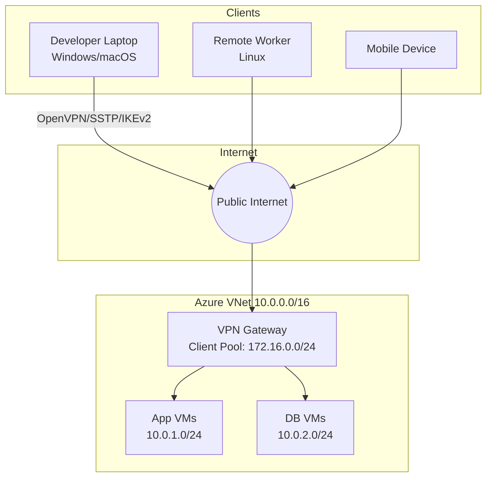
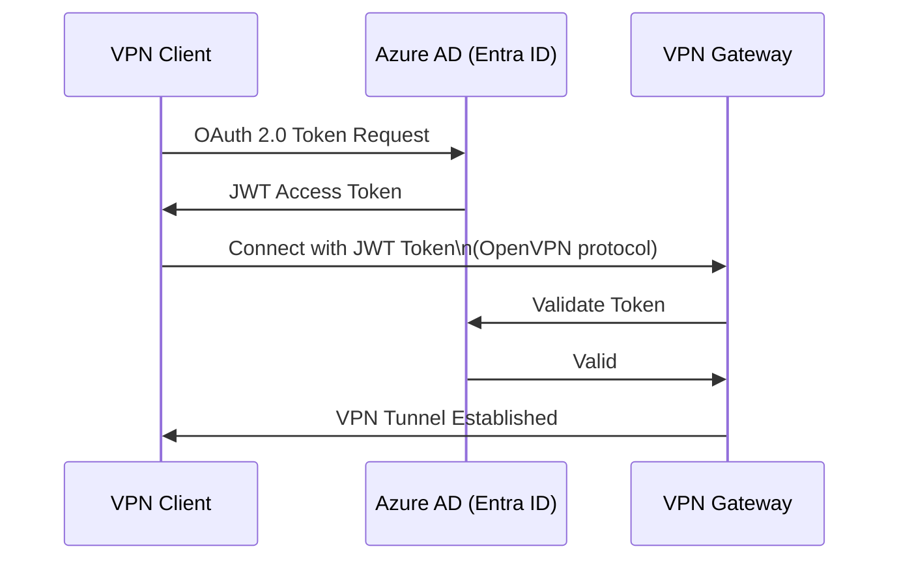

# 10 — Azure VPN Gateway (S2S & P2S)

> **TL;DR:** VPN Gateway creates encrypted IPsec tunnels between Azure VNets and on-premises networks (S2S) or individual devices (P2S). It runs in the GatewaySubnet and is the most common hybrid connectivity solution.

---

## 10.1 VPN Gateway Overview

### Definition
Azure VPN Gateway is a managed virtual network gateway that sends encrypted traffic between an Azure VNet and on-premises networks or other VNets over the public internet using IPsec/IKE protocols.

### Key Concepts
- Deployed in the **`GatewaySubnet`** (min `/27`, recommend `/26`)
- Supports two modes:
  - **Route-Based** (recommended): Uses routing table to direct traffic, supports IKEv2, SSTP, OpenVPN
  - **Policy-Based** (legacy): Uses static policies, only IKEv1, one tunnel only
- **Active-Active mode**: Two gateway instances for HA (recommended for production)
- **Active-Standby mode**: Default — one active, one standby (auto-failover ~90 seconds)
- Requires a **Public IP address** (standard SKU)
- Generates and manages IPsec/IKE parameters automatically

### Gateway SKUs

| SKU | Throughput | Tunnels (S2S) | P2S Connections | Zone Redundant |
|-----|-----------|--------------|----------------|----------------|
| Basic | 100 Mbps | 10 | 128 | No |
| VpnGw1 | 650 Mbps | 30 | 250 | No |
| VpnGw2 | 1 Gbps | 30 | 500 | No |
| VpnGw3 | 1.25 Gbps | 30 | 1000 | No |
| VpnGw1AZ | 650 Mbps | 30 | 250 | Yes |
| VpnGw2AZ | 1 Gbps | 30 | 500 | Yes |
| VpnGw3AZ | 1.25 Gbps | 30 | 1000 | Yes |
| VpnGw4 | 5 Gbps | 100 | 5000 | No |
| VpnGw5 | 10 Gbps | 100 | 10000 | No |

---

## 10.2 Site-to-Site (S2S) VPN

### Definition
S2S VPN creates a persistent IPsec/IKE encrypted tunnel between Azure VPN Gateway and your on-premises VPN device. Used for branch-to-Azure or datacenter-to-Azure connectivity.

### Prerequisites
- Azure: VPN Gateway in GatewaySubnet, Local Network Gateway, Connection resource
- On-Premises: Compatible VPN device with public IP, IKEv2/IKEv1 support
- Non-overlapping address spaces between Azure VNet and on-premises

### How It Works



### S2S Architecture



### Configuration

```bash
# 1. Create GatewaySubnet
az network vnet subnet create \
  --resource-group myRG --vnet-name myVNet \
  --name GatewaySubnet --address-prefix 10.0.255.0/27

# 2. Create Public IP for VPN Gateway
az network public-ip create \
  --resource-group myRG --name VPNGatewayIP \
  --sku Standard --allocation-method Static --zone 1 2 3

# 3. Create VPN Gateway (takes 30-45 minutes)
az network vnet-gateway create \
  --resource-group myRG --name myVPNGateway \
  --vnet myVNet --gateway-type Vpn --vpn-type RouteBased \
  --sku VpnGw1AZ --public-ip-address VPNGatewayIP \
  --no-wait

# 4. Create Local Network Gateway (represents on-premises)
az network local-gateway create \
  --resource-group myRG --name myLocalGateway \
  --gateway-ip-address 203.0.113.1 \
  --local-address-prefixes 192.168.0.0/24 10.10.0.0/16

# 5. Create S2S Connection
az network vpn-connection create \
  --resource-group myRG --name myS2SConnection \
  --vnet-gateway1 myVPNGateway \
  --local-gateway2 myLocalGateway \
  --shared-key "MyStrongSharedKey123!" \
  --connection-type IPsec

# 6. Check connection status
az network vpn-connection show \
  --resource-group myRG --name myS2SConnection \
  --query connectionStatus
```

### IPsec/IKE Parameters
Azure supports custom or default IKE/IPsec parameters.

```bash
# Custom IPsec policy
az network vpn-connection ipsec-policy add \
  --resource-group myRG --connection-name myS2SConnection \
  --ike-encryption AES256 --ike-integrity SHA256 \
  --dh-group DHGroup14 \
  --ipsec-encryption AES256 --ipsec-integrity SHA256 \
  --pfs-group PFS14 --sa-lifetime 3600 --sa-datasize 102400000
```

### Active-Active Configuration



Active-Active requires 2 public IPs on the gateway and 2 VPN devices on-premises (4 tunnels).

---

## 10.3 Point-to-Site (P2S) VPN

### Definition
P2S VPN allows individual client devices (laptops, workstations) to securely connect to an Azure VNet from anywhere over the internet. Each client establishes its own VPN tunnel.

### Key Concepts
- No on-premises VPN device required
- **Protocols supported:**
  - **OpenVPN** (TCP 443 or UDP 1194) — cross-platform, works through firewalls
  - **SSTP** (SSL/TLS port 443) — Windows only
  - **IKEv2** — Windows, macOS, Linux
- **Authentication methods:**
  - **Azure Certificate** — self-signed or CA-signed client cert
  - **Azure Active Directory (Entra ID)** — OAuth 2.0 (OpenVPN only)
  - **RADIUS** — integrate with on-premises AD/NPS
- Client IP pool: specify a CIDR (e.g., `172.16.0.0/24`) for VPN client IPs
- Max P2S clients: up to 10,000 (VpnGw5 SKU)

### P2S Architecture



### P2S Configuration

```bash
# Configure P2S on VPN Gateway (certificate-based)
az network vnet-gateway update \
  --resource-group myRG --name myVPNGateway \
  --client-protocol OpenVPN \
  --address-prefixes 172.16.0.0/24

# Upload root certificate (base64 encoded CER)
az network vnet-gateway root-cert create \
  --resource-group myRG --gateway-name myVPNGateway \
  --name MyRootCert \
  --public-cert-data "$(cat rootcert.cer | base64 -w 0)"

# Download VPN client configuration
az network vnet-gateway vpn-client generate \
  --resource-group myRG --name myVPNGateway \
  --authentication-method EAPTLS
```

### Azure AD (Entra ID) Authentication for P2S



### Certificate Generation (Quick Reference)

```powershell
# PowerShell: Create self-signed root cert
$cert = New-SelfSignedCertificate -Type Custom -KeySpec Signature `
  -Subject "CN=AzureVPNRoot" -KeyExportPolicy Exportable `
  -HashAlgorithm sha256 -KeyLength 2048 `
  -CertStoreLocation "Cert:\CurrentUser\My" `
  -KeyUsageProperty Sign -KeyUsage CertSign

# Create client cert signed by root
New-SelfSignedCertificate -Type Custom -DnsName P2SChildCert `
  -KeySpec Signature -Subject "CN=AzureVPNClient" `
  -KeyExportPolicy Exportable -HashAlgorithm sha256 -KeyLength 2048 `
  -CertStoreLocation "Cert:\CurrentUser\My" `
  -Signer $cert -TextExtension @("2.5.29.37={text}1.3.6.1.5.5.7.3.2")
```

---

## 10.4 VPN Gateway — Summary & Comparison

| Feature | S2S | P2S |
|---------|-----|-----|
| Use case | Branch/DC to Azure | Remote users to Azure |
| Device | On-prem VPN appliance | Client software |
| Persistent connection | Yes | On-demand |
| Encryption | IPsec/IKE | SSL/TLS or IKEv2 |
| Max bandwidth | Gateway SKU limit | Per-client limited |
| Authentication | PSK or certificate | Certificate, AAD, RADIUS |
| Routing | Dynamic (BGP) or static | Static client pool |

### Best Practices / Pitfalls
- Never put UDRs on `GatewaySubnet` — it breaks routing to the gateway
- Use **Active-Active** mode for production S2S connections
- Use **BGP** for S2S when possible — enables dynamic routing and failover
- **VPN Gateway SKU cannot be resized** — must delete and recreate to change SKU
- Gateway creation takes **30–45 minutes** — plan deployments accordingly
- Use **zone-redundant SKUs** (`VpnGw1AZ`) in production for AZ-level HA
- P2S client IP pool must **not overlap** with VNet or on-premises address spaces

### Interview Notes
- VPN Gateway supports up to **100 S2S tunnels** (VpnGw4/5) and **10,000 P2S clients**
- **BGP** requires ASN assignment — Azure default ASN is **65515**
- S2S requires on-premises device to have a **static public IP** (or dynamic with IKEv2)
- P2S with **Azure AD auth** requires an Enterprise App registration in Entra ID
- VPN and ExpressRoute gateways can **coexist** in the same VNet for failover scenarios
