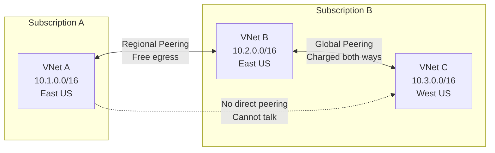
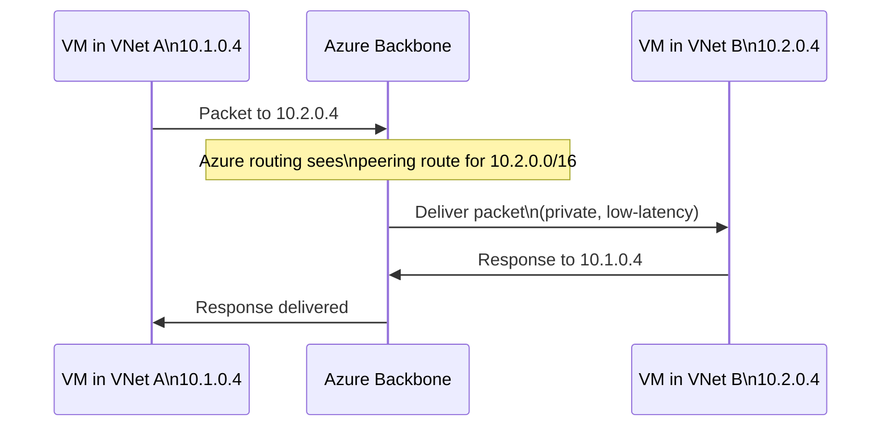
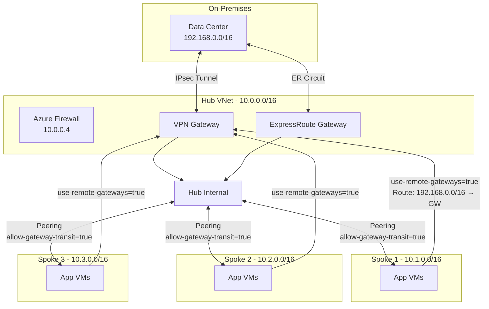
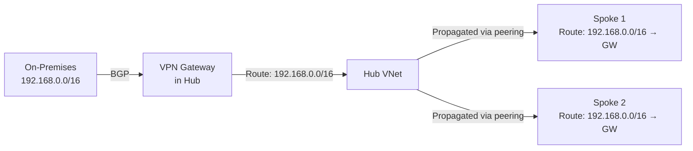
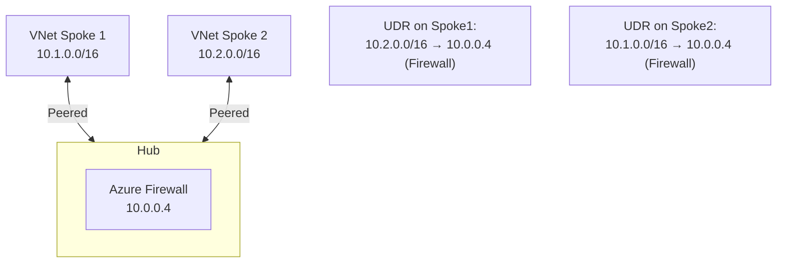

# 11 — VNet Peering & Gateway Transit

> **TL;DR:** VNet Peering connects two VNets with low-latency, high-bandwidth private traffic over the Microsoft backbone — no gateways needed. Gateway Transit lets spoke VNets use the hub's VPN/ER gateway, enabling hub-spoke connectivity at scale.

---

## 11.1 VNet Peering

### Definition
VNet Peering connects two Azure Virtual Networks so resources in each VNet can communicate with each other using private IP addresses. Traffic flows over the Azure backbone network — not the internet.

### Key Concepts
- **Non-transitive**: VNet A peered with B, and B peered with C — A and C cannot talk unless A-C also peered (without gateway transit)
- **Bidirectional**: Requires a peering from **each side** — A→B and B→A
- **Low latency**: Same as intra-VNet traffic (uses Azure backbone)
- **No gateway required** (unless using Gateway Transit for on-premises connectivity)
- Two types:
  - **Regional Peering**: Same Azure region — free egress (charged ingress)
  - **Global Peering**: Different Azure regions — charged both directions
- Peered VNets can be in **different subscriptions** and **different Azure AD tenants**

### VNet Peering Requirements
- VNet address spaces must **not overlap**
- Peering is **not transitive** by default
- Resources in peered VNets can access each other's subnets (NSG rules permitting)
- Cannot be created for VNets in **different Azure environments** (e.g., Azure China vs Azure Global)

### Peering Architecture



### How Peering Works



### Configuration

```bash
# Peer VNet A → VNet B
az network vnet peering create \
  --resource-group RG-A \
  --name A-to-B \
  --vnet-name VNetA \
  --remote-vnet /subscriptions/<sub-b-id>/resourceGroups/RG-B/providers/Microsoft.Network/virtualNetworks/VNetB \
  --allow-vnet-access \
  --allow-forwarded-traffic \
  --allow-gateway-transit false \
  --use-remote-gateways false

# Peer VNet B → VNet A (required - peering is not automatic)
az network vnet peering create \
  --resource-group RG-B \
  --name B-to-A \
  --vnet-name VNetB \
  --remote-vnet /subscriptions/<sub-a-id>/resourceGroups/RG-A/providers/Microsoft.Network/virtualNetworks/VNetA \
  --allow-vnet-access \
  --allow-forwarded-traffic \
  --allow-gateway-transit false \
  --use-remote-gateways false
```

### Peering Flags

| Flag | Direction | Description |
|------|-----------|-------------|
| `--allow-vnet-access` | Both | Allow traffic between VNets |
| `--allow-forwarded-traffic` | Both | Allow traffic from other VNets forwarded through this VNet |
| `--allow-gateway-transit` | Hub side | Allow spoke to use hub's gateway |
| `--use-remote-gateways` | Spoke side | Use remote (hub) VNet's gateway |

---

## 11.2 Gateway Transit

### Definition
Gateway Transit is a VNet Peering configuration that allows spoke VNets to route on-premises-bound traffic through the **hub VNet's VPN or ExpressRoute gateway**. Spokes don't need their own gateways.

### Key Concepts
- Hub VNet has: VPN Gateway or ExpressRoute Gateway
- Spoke VNets have: VNet peering to hub, **no gateway**
- Hub enables `--allow-gateway-transit true` on its peering to spokes
- Spokes enable `--use-remote-gateways true` on their peering to hub
- On-premises routes (BGP-learned) are **propagated to spokes** automatically
- Spokes can reach on-premises without their own gateway — huge cost savings

### Hub-Spoke with Gateway Transit



### Gateway Transit Configuration

```bash
# HUB SIDE: Enable gateway transit on hub→spoke peering
az network vnet peering update \
  --resource-group Hub-RG \
  --vnet-name HubVNet \
  --name Hub-to-Spoke1 \
  --set allowGatewayTransit=true

# SPOKE SIDE: Enable use-remote-gateways on spoke→hub peering
az network vnet peering update \
  --resource-group Spoke1-RG \
  --vnet-name Spoke1VNet \
  --name Spoke1-to-Hub \
  --set useRemoteGateways=true
```

> **Important:** `useRemoteGateways=true` can only be set if the remote (hub) VNet has a gateway AND `allowGatewayTransit=true` is set on the hub side first.

### Route Propagation with Gateway Transit

When Gateway Transit is configured:
1. VPN Gateway learns on-premises routes via BGP
2. These routes are propagated to the hub VNet's route table
3. Routes are **automatically propagated** to spoke VNets via peering
4. No UDRs needed on spokes for on-premises traffic routing



---

## 11.3 Transitivity & Workarounds

### Non-Transitive Problem

```mermaid
flowchart LR
    A[VNet A] <-->|Peered| B[VNet B]
    B <-->|Peered| C[VNet C]
    A -.-x|Cannot communicate\n(no transitive routing)| C
```

### Solutions for Transitive Routing

| Solution | How | Trade-offs |
|---------|-----|-----------|
| Direct peering | Peer A-C directly | Scales poorly (N² peerings) |
| Hub-spoke + UDR | Route A→Hub→C via NVA/Firewall | Adds latency, hub is bottleneck |
| Azure Virtual WAN | Managed hub, auto-transitive | Higher cost, less control |

### Hub-Spoke with Firewall as Transit



UDR on each spoke subnet pointing cross-spoke traffic to the hub firewall, enabling spoke-to-spoke communication via the firewall.

---

## 11.4 Peering Limits & Pricing

### Limits

| Resource | Limit |
|---------|-------|
| Peerings per VNet | 500 |
| Max VNets in hub-spoke | 500 (practical limit) |
| Global peering availability | Available (all regions) |

### Pricing

| Peering Type | Inbound | Outbound |
|-------------|---------|---------|
| Regional (same region) | Charged | Free |
| Global (cross-region) | Charged | Charged |
| Gateway transit data | Charged separately (gateway rates) |

### Best Practices / Pitfalls
- Plan VNet address spaces **before peering** — address changes require re-peering
- Peering is **non-transitive** — design hub-spoke architecture from the start
- Use **spoke VNet peering limits** carefully — 500 max per VNet
- `useRemoteGateways` requires peering to be **Initiated or Connected** state first
- Deleting a gateway breaks all `useRemoteGateways` on spoke peerings — must be re-enabled after new gateway creation
- Global peering has **slightly higher latency** than regional — measure before assuming same performance
- Use **VNet flow logs** (Network Watcher) to debug peering connectivity issues

### Summary Table

| Feature | VNet Peering | Gateway Transit |
|---------|-------------|----------------|
| Traffic type | VNet-to-VNet | On-premises-to-spoke |
| Gateway needed | No | Yes (in hub) |
| Routing | Automatic | BGP propagation |
| Transitive | No | No (hub-spoke pattern needed) |
| Cost | Per GB data | Data + gateway hours |
| Configuration | 2 peering objects | Hub: allowGatewayTransit / Spoke: useRemoteGateways |

### Interview Notes
- Peering creates routes automatically — **no manual UDRs** needed for peered VNet prefixes
- Gateway transit allows up to **500 spoke VNets** to share one gateway — significant cost saving
- Peering in different subscriptions requires the user to have `Network Contributor` role on **both** VNets
- Changing peering settings (allowForwardedTraffic, etc.) takes effect **immediately** without downtime
- Peering status: `Initiated` (one side done) → `Connected` (both sides done) — must be **Connected** to work
